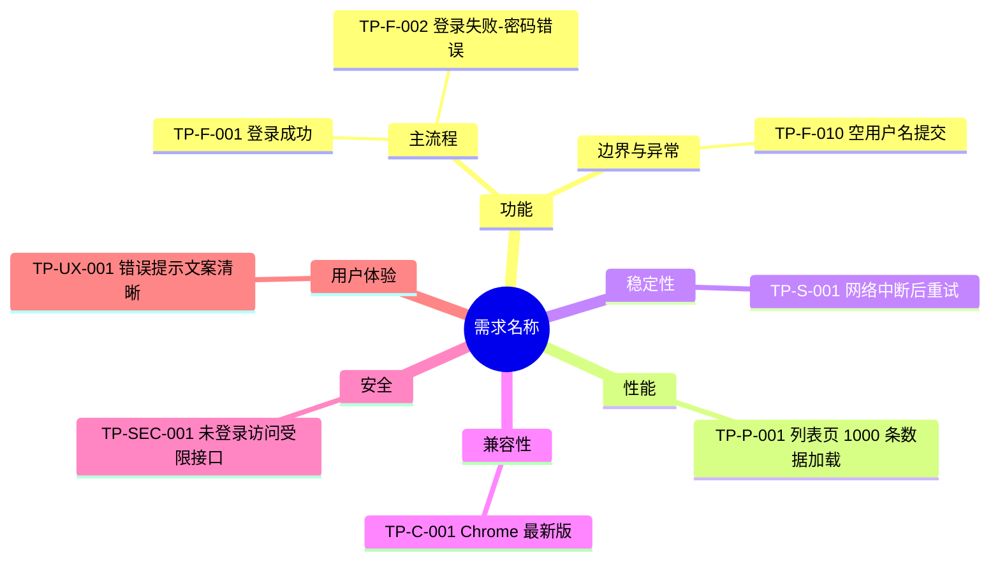

# 高质量测试点与测试用例生成

## 核心原则

1. **仅高质量模式**：所有输入均按高质量流程执行，不提供普通模式
2. **严格分阶段**：不得跳过或合并阶段；每阶段结束必须等待用户确认
3. **基于证据**：所有输出必须可追溯到原文、确认结论或补充材料
4. **先问后写**：不明确的信息先进入待确认问题，不得自行假设
5. **可执行可评审**：输出必须同时满足执行落地和评审追溯

## 工作流总览

```
Phase 0  文档摄入（需求/技术方案/UI/交互）
   ↓
Phase 1  需求分析 + 待确认问题清单  ← 等待用户/产品确认
   ↓
Phase 1.5 需求原子化清单（REQ）    ← 等待用户确认可测范围
   ↓
Phase 2  测试点思维导图（六维度）   ← 等待用户确认测试点
   ↓
Phase 3  测试用例主表 + 附表
   ↓
Phase 4  质量审计（三报告 + 硬门禁）
```

每阶段开始时说明目标，阶段结束时明确提示「请确认后继续」。

---

## Phase 0：文档摄入（扩展输入源）

根据输入类型选择读取方式（详见 [doc-ingest.md](doc-ingest.md)）：

| 输入类型 | 识别特征 | 读取方式 |
|---------|---------|---------|
| 飞书文档 | `feishu.cn` / `larksuite.com` / `doubao.com` 的 `/docx/`、`/wiki/` URL | 切 `lark-doc`：`lark-cli docs +fetch --doc "<url>"` |
| 飞书云盘文件 | `/file/` URL 或本地路径指向已上传文件 | 切 `lark-drive`：`drive +download` 或 `drive +preview` |
| PDF | `.pdf` 后缀或用户声明 | `Read` 工具；不可读时用 `python -m pypdf` 提取文本 |
| Word | `.docx` / `.doc` | `Read` 工具；不可读时用 `python-docx` 提取 |
| 纯文本 | `.txt` / `.md` | `Read` 工具直接读取 |
| 用户粘贴正文 | 聊天中直接给出需求内容 | 直接作为需求原文，标注来源为「用户输入」 |

支持文档内容类型：需求文档、技术方案文档、UI 设计文档、交互文档。

**摄入完成后输出简短摘要**（3-5 条）：文档类型、标题、版本/日期、涉及模块、核心约束。然后进入 Phase 1。

---

## Phase 1：需求分析 + 待确认问题

### 1.1 需求分析

输出结构：

```markdown
## 需求分析摘要

### 背景与目标
[一句话说明需求要解决什么问题]

### 功能范围
| 模块/功能 | 描述 | 来源章节 |
|----------|------|---------|
| ... | ... | ... |

### 用户角色与场景
| 角色 | 典型场景 |
|------|---------|
| ... | ... |

### 业务规则与约束
- [规则 1]（来源：...）
- [规则 2]（来源：...）

### 非功能需求（文档已提及）
- 性能：...
- 兼容性：...
（无则写「文档未提及」）

### 边界与排除范围
- [明确不在本次范围内的内容]
```

### 1.2 待确认问题清单

**必须穷尽**文档中缺失、模糊、矛盾或影响测试设计的信息。按类别组织：

```markdown
## 待确认问题清单

> 请将以下问题与产品/需求方确认后回复，确认完毕再进入测试点设计。

### 功能与业务规则
| # | 问题 | 影响范围 | 建议确认方 |
|---|------|---------|-----------|
| Q1 | ... | 影响 XX 功能用例设计 | 产品 |
| Q2 | ... | ... | 产品 |

### 数据与状态
| # | 问题 | 影响范围 | 建议确认方 |
|---|------|---------|-----------|
| Q3 | ... | ... | 产品/开发 |

### 交互与体验
| # | 问题 | 影响范围 | 建议确认方 |
|---|------|---------|-----------|
| Q4 | ... | ... | 产品/设计 |

### 非功能（性能/兼容/安全等）
| # | 问题 | 影响范围 | 建议确认方 |
|---|------|---------|-----------|
| Q5 | ... | ... | 产品/开发/运维 |

### 环境与依赖
| # | 问题 | 影响范围 | 建议确认方 |
|---|------|---------|-----------|
| Q6 | ... | ... | 开发/测试 |
```

**问题编写要求**：
- 每条问题具体、可回答（避免「是否考虑异常」这类空泛提问）
- 说明「为什么需要确认」和「不确认会导致什么测试盲区」
- 文档完全未提及的维度也要提问（如：目标用户、并发量、支持浏览器、权限模型、失败降级策略等）

**阶段结束语**（固定格式）：

> Phase 1 完成。请与产品确认上述问题后，将答案一并回复（可逐条回复或补充说明）。确认后我将输出需求原子化清单（Phase 1.5）。

**用户仅部分确认时**：已确认部分标注 ✅，未确认部分保留并说明对测试点/用例的影响范围。

---

## Phase 1.5：需求原子化清单（REQ）

**前置条件**：Phase 1 的待确认问题已得到回复，或已明确哪些问题暂不确认。

### 目标

将输入文档拆分为最小可评审、可追溯、可覆盖的需求条目，为后续测试点和用例建立唯一追溯主键。

### 输出要求

必须输出 `REQ` 原子化清单，格式如下：

```markdown
## 需求原子化清单

| REQ-ID | 需求描述 | 来源文档 | 来源章节/段落 | 类型 | 可测性 | 覆盖状态 | 备注 |
|--------|---------|---------|--------------|------|--------|---------|------|
| REQ-001 | 用户可使用账号密码登录 | PRD | 2.1 登录 | 功能 | 可测 | 待覆盖 | - |
| REQ-002 | 登录接口 P95 <= 500ms | 技术方案 | 4.2 性能指标 | 性能 | 可测 | 待覆盖 | - |
| REQ-003 | 是否支持 SSO 登录 | PRD | 2.1 登录 | 功能 | 不可测 | 阻塞 | 待产品确认 |
```

### 规则

1. 每条需求必须有唯一 `REQ-ID`
2. 每条需求必须标注来源文档与章节/段落
3. `可测性` 仅允许：`可测` / `不可测`
4. `覆盖状态` 初始值仅允许：`待覆盖` / `阻塞` / `N/A`
5. 文档中不明确、互相冲突或缺少验收标准的条目，标记为 `不可测`
6. `不可测` 条目不得直接进入正式测试用例，必须先进入待确认问题或标记 `N/A`
7. 「覆盖 100%」仅统计「已确认且可测」的 REQ；`阻塞` / `N/A` 不计入分母，但必须逐条列出原因

### 阶段结束语

> Phase 1.5 完成。请确认需求原子化清单中的可测范围、阻塞项和 N/A 项。确认后我将基于这些 REQ 条目输出测试点思维导图。

---

## Phase 2：测试点思维导图

**前置条件**：用户已确认 REQ 原子化清单中的可测范围。

### 六维度测试点

从以下维度系统性拆解测试点（详见 [templates.md](templates.md) 维度检查清单）：

| 维度 | 关注点 |
|------|--------|
| **功能** | 主流程、分支流程、边界值、异常处理、权限、数据校验 |
| **性能** | 响应时间、吞吐量、并发、大数据量、资源占用 |
| **稳定性** | 长时间运行、异常恢复、重试、幂等、数据一致性 |
| **兼容性** | 浏览器/系统/设备、分辨率、新旧版本、上下游接口 |
| **安全** | 认证授权、越权、注入、敏感数据、审计日志 |
| **用户体验** | 易用性、提示文案、加载/空态/错误态、无障碍、国际化 |

某维度在文档中未提及时：必须在 Phase 1 提问，或在 Phase 1.5 对应维度标 `N/A`（附理由），禁止静默省略。

### 强制设计技法（复杂场景先建模）

命中以下任一场景时，**必须先输出建模产物，再写测试点/用例**：

| 场景类型 | 强制产物 | 未产出时的处理 |
|---------|---------|---------------|
| 多条件组合（权限×状态×角色等） | 判定表 | 阻断进入 Phase 3，或对应 REQ 标阻塞 |
| 状态流转（订单/审批/任务流等） | 状态迁移图（合法 + 非法迁移） | 同上 |
| 端到端主流程 | 用户旅程 / 场景路径 | 同上 |
| 输入校验密集 | 等价类划分表 + 边界值表 | 同上 |

建模产物中的每个可测节点，必须能映射到后续 `TP-ID`。

### REQ 覆盖深度最低标准（强制）

对每个 `可测` 的 REQ，测试点/用例覆盖不得仅有 1 条正向主路径：

| REQ 类型 | 最低覆盖要求 |
|---------|-------------|
| 功能（有输入/校验） | ≥1 正向 + ≥1 反向/异常；可测到数值/长度边界时再加 ≥1 边界 |
| 功能（有状态流转） | 覆盖合法迁移 + 至少 1 条非法迁移 |
| 功能（多条件组合） | 判定表中每条有效规则至少 1 条用例 |
| 性能 / 稳定性 / 兼容 / 安全 / 体验 | ≥1 条对应维度用例，且预期含可判定指标或检查点 |

若因信息不足无法补齐深度覆盖，对应用例标 `Blocked`，并写明解除条件；不得假装“深度已覆盖”。

### 输出格式

使用 Mermaid `mindmap` 语法输出思维导图，根节点为需求名称：



**测试点编号规则**：`TP-{维度缩写}-{序号}`
- 维度缩写：F=功能, P=性能, S=稳定性, C=兼容性, SEC=安全, UX=用户体验

**同时输出测试点汇总表**（便于评审，`关联 REQ-ID` 为必填列）：

| 编号 | 维度 | 测试点描述 | 优先级建议 | 关联 REQ-ID | 关联待确认问题 |
|------|------|-----------|-----------|------------|--------------|
| TP-F-001 | 功能 | ... | P0 | REQ-001 | - |
| TP-P-001 | 性能 | ... | P2 | REQ-002 | Q5 |

**TP ↔ REQ 双向强制规则：**
1. 每个 TP 必须映射 ≥1 个 `REQ-ID`
2. 每个 `可测` 的 REQ 必须映射 ≥1 个 TP
3. 禁止无关联 REQ 的“游离测试点”（衍生/经验补充须在备注标明来源，并挂到最近相关 REQ 或独立 N/A 项）

**阶段结束语**：

> Phase 2 完成。请审阅测试点思维导图与 REQ 关联表，回复「确认」或指出需增删改的测试点。确认后我将输出完整测试用例表。

---

## Phase 3：测试用例主表 + 附表

**前置条件**：用户已确认测试点（或明确指出调整后的最终测试点列表）。

### 用例编写规则

1. **一条测试点可拆多条用例**，但每条用例只验证一个核心检查点
2. **操作步骤**：编号列表，每步可独立执行
3. **预期结果**：可观测、可判定（避免「正常显示」等模糊描述）
4. **风险驱动优先级**（用于主表优先级和附表评审依据）：
   - **P0**：核心主流程、阻塞发布、资金安全/数据安全
   - **P1**：重要分支、高频场景、严重体验问题
   - **P2**：次要功能、边界场景、一般异常
   - **P3**：低频场景、轻微体验、优化类
5. **测试类型**：功能测试 / 接口测试 / 性能测试 / 兼容性测试 / 安全测试 / 稳定性测试 / 用户体验测试
6. **主附表双输出**：主表用于执行，附表用于评审追溯（必须同时输出）
7. **双向追溯**：每条 `可测` 的 `REQ-ID` 至少映射 1 条测试用例，且每条测试用例必须能回溯到 `REQ-ID`
8. **覆盖深度**：每个可测功能 REQ 至少包含正向 + 反向/异常用例（见 Phase 2 最低标准）
9. **用例状态**：附表必须为每条用例标注 `Ready` / `Blocked` / `Draft`；`Blocked` 必须写解除条件

### 输出格式

**主表（执行表）**：表头固定，不得更改：

| 用例序号 | 优先级（P0-P3） | 测试标题 | 测试类型 | 前置条件 | 操作步骤 | 预期结果 |
|---------|----------------|---------|---------|---------|---------|---------|

**附表（评审追溯表）**：用于风险、追溯与执行就绪评审：

| 用例序号 | 关联需求/方案条目 | 关联测试点 | 设计技法 | 测试数据 | 风险等级 | 风险评估依据 | 用例状态 | 解除条件 | 备注 |
|---------|------------------|-----------|---------|---------|---------|-------------|---------|---------|-----|

**追溯矩阵（必须输出）**：

| REQ-ID | TP-ID | TC-ID | 覆盖类型 | 备注 |
|--------|------|------|---------|------|
| REQ-001 | TP-F-001 | TC-LOGIN-001 | 正向 | 主流程 |
| REQ-001 | TP-F-002 | TC-LOGIN-002 | 反向 | 异常处理 |

编号规则：`TC-{模块缩写}-{三位序号}`，如 `TC-LOGIN-001`。

完整模板与示例见 [templates.md](templates.md)。

### 用例状态判定规则

| 状态 | 含义 | 判定条件 |
|------|------|---------|
| Ready | 可直接执行 | 通过执行就绪检查清单全部项，且不依赖未确认问题 |
| Blocked | 暂不可执行 | 依赖未确认问题，或缺少环境/账号/数据/规则支撑 |
| Draft | 草稿 | 字段不全、预期不可判定、或反模式未清完 |

`Blocked` / `Draft` 必须在「解除条件」列写明如何变为 Ready（如：确认 Q3；补充测试账号矩阵）。

### 执行就绪检查清单（逐条用例）

任一项不通过 → 不得标 `Ready`：

- [ ] 入口明确（页面路径 / 接口路径）
- [ ] 测试数据具体（非“合法输入”“正常数据”）
- [ ] 前置可准备（账号、权限、数据可造）
- [ ] 步骤可逐步复现
- [ ] 预期可判定（文案 / 字段 / 状态码 / 量化指标）
- [ ] 不依赖未确认问题（Q）
- [ ] 一案一验（单核心检查点）

### 大批量用例处理

- 用例 ≤ 30 条：直接在对话中输出完整表格
- 用例 > 30 条：按模块分表输出，并写入本地文件 `testcases-{需求名}-{日期}.md`
- 用户要求导出 Excel/飞书表格时，生成 Markdown 后询问是否需要导入飞书（切 `lark-sheets`）

**阶段结束语**：

> Phase 3 完成。已输出主表、附表（含用例状态）和追溯矩阵，共 X 条用例。接下来进入 Phase 4 质量审计。

---

## Phase 4：质量审计（强制）

必须输出以下三份报告，并按硬门禁判断是否允许宣称“高质量最终版”。
口径说明：「需求覆盖 100%」仅指已确认且可测 REQ；「可执行度 100%」仅指全部用例为 Ready。

### 4.1 覆盖率报告（含覆盖深度）

```markdown
## 覆盖率报告
- 可测需求总数：X
- 已覆盖 REQ 数：X
- N/A REQ 数：X（需列原因）
- 未覆盖 REQ 数：X（需逐条列出）
- 覆盖率：X%
- 深度达标 REQ 数：X
- 深度未达标 REQ 数：X（需逐条列出缺失的正向/反向/边界类型）
```

规则：
- 每个 `可测` 的 `REQ-ID` 必须映射 ≥1 个 `TP-ID` 和 ≥1 个 `TC-ID`
- 每个 `TP-ID` 必须映射 ≥1 个 `REQ-ID`
- 功能类 REQ 须满足 Phase 2 覆盖深度最低标准
- 若 `未覆盖 REQ 数 > 0` 或 `深度未达标 REQ 数 > 0`，禁止宣称“需求覆盖 100%”

### 4.2 可执行性报告

```markdown
## 可执行性报告
- 用例总数：X
- Ready：X
- Blocked：X（需列原因与解除条件，必须与附表「用例状态」列一致）
- Draft：X
- 可执行率：X%
```

规则：
- Ready / Blocked / Draft 计数必须以附表「用例状态」列为准，禁止口算
- 执行就绪检查清单任一项未过，不得计为 Ready
- 若存在 `Blocked` 或 `Draft`，禁止宣称“用例可执行度 100%”

### 4.3 质量缺陷报告

```markdown
## 质量缺陷报告
- 反模式命中数：X
- 已修复数：X
- 追溯缺口数：X（含 REQ→TP、TP→TC、REQ→TC）
- TP 无 REQ 关联数：X
- 覆盖深度缺口数：X
- 待人工确认数：X
```

### 硬门禁

输出前必须执行以下检查：

1. 反模式扫描（详见 [templates.md](templates.md) 反模式库），发现即改写
2. 主表每条用例是否通过执行就绪检查清单
3. 附表每条用例是否具备 `REQ -> TP -> TC` 追溯、风险评估依据、用例状态与解除条件（Blocked/Draft 必填）
4. 追溯矩阵是否覆盖所有 `可测` 的 `REQ-ID`，且无游离 TP
5. 覆盖深度是否达标（正向/反向/边界等）
6. 复杂场景是否已产出强制建模产物
7. 未确认问题是否明确标注影响范围和阻断对象

只有同时满足以下条件，才可输出“高质量最终版”：
- 未覆盖 REQ 数 = 0
- 深度未达标 REQ 数 = 0
- Blocked 用例数 = 0
- Draft 用例数 = 0
- 反模式命中数已清零
- 追溯缺口数 = 0
- TP 无 REQ 关联数 = 0

**阶段结束语**：

> Phase 4 完成。已输出覆盖率报告（含深度）、可执行性报告和质量缺陷报告。若通过硬门禁，则可标记为高质量最终版；否则需按阻断项修订。

---

## 快捷指令

用户可使用以下短语触发对应阶段：

| 用户说 | 动作 |
|--------|------|
| 「分析需求」「开始分析」 | 从 Phase 0/1 开始 |
| 「问题已确认：...」 | 更新确认答案，进入 Phase 1.5 |
| 「确认 REQ 清单」 | 进入 Phase 2 |
| 「生成测试点」「出思维导图」 | 进入 Phase 2（需已确认问题） |
| 「测试点已确认」 | 进入 Phase 3 |
| 「生成用例」「出测试用例」 | 进入 Phase 3（需已确认测试点） |
| 「输出追溯矩阵」 | 在 Phase 3 追加 REQ-TP-TC 追溯矩阵 |
| 「生成主表和附表」 | 输出执行主表与评审附表（含用例状态） |
| 「给出风险依据」 | 在附表补充风险等级与风险评估依据 |
| 「生成三报告」 | 输出覆盖率（含深度）/可执行性/质量缺陷报告 |
| 「检查覆盖深度」 | 按 Phase 2 最低标准复核正向/反向/边界覆盖 |
| 「重新分析」 | 回到 Phase 1，保留已摄入文档 |

---

## 附加资源

- 文档摄入详解：[doc-ingest.md](doc-ingest.md)
- 输出模板与维度检查清单：[templates.md](templates.md)
