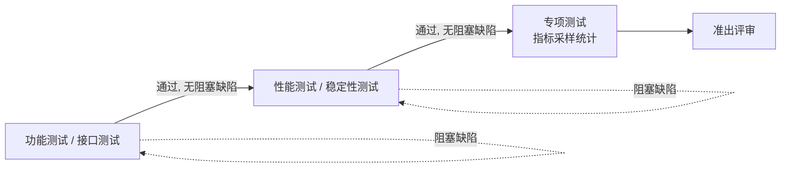
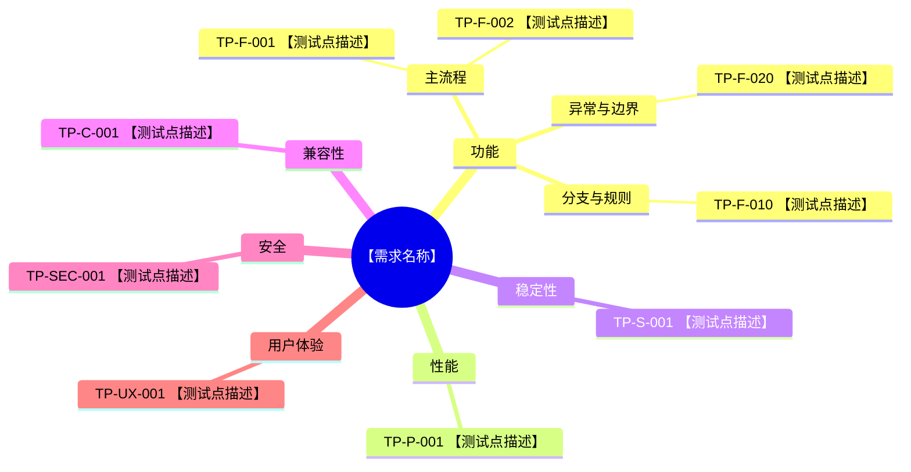

# 输出模板与维度检查清单

> 编号说明：**REQ-ID** = 需求条目（Requirement），**TP-ID** = 测试点（Test Point），**TC-ID** = 测试用例（Test Case）。三者构成追溯链路 `REQ → TP → TC`，完整含义与编号规则见 [SKILL.md](SKILL.md) 「编号体系」。

## 交付形式

- 所有交付件**独立分开**呈现（各占一个 Sheet），禁止把多种交付件合并混在同一张 Sheet。
- **表格类交付件**（需求清单、主表、附表、追溯表、专项测试用例、专项数据采集、质量审计）**最终交付必须是 Excel**，且统一组织为**同一个工作簿的多个 Sheet**（一件一 Sheet），**严禁用 `.md`/`.csv`/`.txt` 或对话内 Markdown 表格作正式交付**；Markdown 表格仅供预览。
- **默认双份交付**：表格类交付件本地一个多 Sheet `.xlsx` + 飞书一个在线电子表格，两套内容/结构/命名一致，交付时同时给出本地路径与飞书链接（用户明确只要一种时除外）。
- **交付件名称必须为中文**：文件名/Sheet 名用中文，如「测试用例主表」「评审追溯表（含风险评估）」「追溯矩阵表（REQ-TP-TC）」。
- **每个 Excel 交付表必须**：首行表头加粗、表头带筛选下拉框、列宽按内容自适应（见下「Excel 交付件格式要求」）。
- **必须产出真正的 `.xlsx` 二进制文件**：本地用 `openpyxl` 真实写盘、飞书用 lark-sheets 建真实表格，使用者可打开/编辑/保存；禁止把 Markdown/CSV 改后缀冒充。生成后告知实际保存路径或链接。
- **测试点思维导图**单独交付为 **Draw.io 文件（`.drawio`）**，可直接导入飞书云文档，模板见下「思维导图 Draw.io 格式」。
- **测试计划**单独交付为 **Markdown（`.md`）文档**，可导入飞书在线文档，含范围目标/策略/资源/进度/准入准出/风险/缺陷流程（留白）/交付物清单，模板见下「测试计划模板」。
- 交付清单与落表方式见 [SKILL.md](SKILL.md) 「交付物规范」。

## Excel 交付件格式要求

每个 Excel 交付表（除思维导图外全部）统一满足：

| 要求 | 飞书电子表格（lark-sheets） | 本地 openpyxl |
|------|---------------------------|--------------|
| 首行表头加粗 | 设置首行单元格样式 `bold` | `cell.font = Font(bold=True)` |
| 表头筛选下拉框 | 对表头行加筛选器/筛选视图 | `ws.auto_filter.ref = "A1:<末列><末行>"` |
| 列宽自适应 | 按列内容调整列宽 | 按各列最长文本估算 `ws.column_dimensions[col].width`（中文≈2 倍宽，封顶 ~60） |
| 名称中文 | Sheet 名用中文交付件名 | `ws.title` / 文件名用中文 |

本地生成参考（openpyxl，列宽自适应 + 表头加粗 + 筛选）：

```python
from openpyxl import Workbook
from openpyxl.styles import Font
from openpyxl.utils import get_column_letter

def dump_sheet(ws, headers, rows):
    ws.append(headers)
    for r in rows:
        ws.append(r)
    # 首行加粗
    for c in ws[1]:
        c.font = Font(bold=True)
    # 筛选下拉框（覆盖表头+数据）
    ws.auto_filter.ref = f"A1:{get_column_letter(len(headers))}{ws.max_row}"
    # 列宽自适应（中文按 2 倍宽度估算，封顶 60）
    for i, _ in enumerate(headers, 1):
        col = get_column_letter(i)
        width = 0
        for cell in ws[col]:
            v = "" if cell.value is None else str(cell.value)
            w = sum(2 if ord(ch) > 255 else 1 for ch in v)
            width = max(width, w)
        ws.column_dimensions[col].width = min(width + 2, 60)

# 一个工作簿多 Sheet：每个交付件一个 Sheet，Sheet 名用中文
wb = Workbook()
wb.remove(wb.active)  # 移除默认空 Sheet
for sheet_name, headers, rows in [
    ("需求原子化清单", req_headers, req_rows),
    ("测试用例主表", tc_headers, tc_rows),
    ("评审追溯表（含风险评估）", ext_headers, ext_rows),
    ("追溯矩阵表（REQ-TP-TC）", matrix_headers, matrix_rows),
    # 有专项测试再加：("专项测试用例表", ...), ("专项数据采集表", ...)
    ("质量审计报告", audit_headers, audit_rows),
]:
    dump_sheet(wb.create_sheet(title=sheet_name), headers, rows)
wb.save("测试交付件-{需求名}-{日期}.xlsx")
```

> 飞书侧：切 `lark-sheets` 建一个电子表格，用同样的中文名建多个 Sheet 并写入同样内容，返回链接。默认本地与飞书两套都要生成。

## 思维导图 Draw.io 格式（完全适配飞书在线思维导图）

思维导图正式交付为 Draw.io 文件 `测试点思维导图.drawio`（mxGraphModel XML）。**必须使用飞书在线思维导图的树状模板样式，不能是普通流程图**——否则导入飞书后会呈现为「一堆黑色箭头指向节点」，视觉很差。适配要点（强制）：

1. **用思维导图树布局，不是有向流程图**：`mxGraphModel` 设 `arrows="0"`；根节点用 `treeRoot=1`，整体作为一棵思维导图树。
2. **连线无箭头、平滑分支线**：每条 edge 样式用 `edgeStyle=entityRelationEdgeStyle;rounded=1;endArrow=none;startArrow=none;html=1;`（`endArrow=none` 去掉黑色箭头，改成飞书思维导图那种圆滑分支线）。
3. **节点用圆角气泡 + 分维度配色**（不要默认黑框白底）：根节点、各维度、各维度下测试点分别用不同 `fillColor`/`strokeColor`，如功能=蓝、性能=橙、稳定性=绿、兼容性=青、安全=红、用户体验=紫。
4. 层级与 Mermaid 一致：根=需求名 → 维度 → 测试点，测试点节点文本以 `TP-ID` 开头，可追溯回追溯表。

结构骨架（`arrows="0"`、edge 无箭头、节点带配色）：

```xml
<mxfile host="app.diagrams.net">
  <diagram name="测试点思维导图">
    <mxGraphModel dx="800" dy="600" grid="0" fold="1" arrows="0" connect="1">
      <root>
        <mxCell id="0"/>
        <mxCell id="1" parent="0"/>
        <!-- 根节点：需求名（思维导图根，圆角气泡） -->
        <mxCell id="root" value="【需求名称】" style="rounded=1;whiteSpace=wrap;html=1;treeRoot=1;fillColor=#111827;fontColor=#FFFFFF;strokeColor=none;" vertex="1" parent="1"><mxGeometry x="360" y="40" width="180" height="44" as="geometry"/></mxCell>
        <!-- 维度节点（按维度配色） -->
        <mxCell id="dim_f" value="功能" style="rounded=1;whiteSpace=wrap;html=1;fillColor=#DBEAFE;strokeColor=#3B82F6;" vertex="1" parent="1"><mxGeometry x="120" y="140" width="120" height="40" as="geometry"/></mxCell>
        <!-- 测试点节点（文本以 TP-ID 开头，浅色气泡） -->
        <mxCell id="tp_f_001" value="TP-F-001 登录成功" style="rounded=1;whiteSpace=wrap;html=1;fillColor=#EFF6FF;strokeColor=#93C5FD;" vertex="1" parent="1"><mxGeometry x="40" y="220" width="200" height="40" as="geometry"/></mxCell>
        <mxCell id="tp_f_002" value="TP-F-002 登录失败-密码错误" style="rounded=1;whiteSpace=wrap;html=1;fillColor=#EFF6FF;strokeColor=#93C5FD;" vertex="1" parent="1"><mxGeometry x="40" y="270" width="200" height="40" as="geometry"/></mxCell>
        <!-- 分支线：无箭头、圆滑（飞书思维导图样式） -->
        <mxCell id="e1" edge="1" parent="1" source="root" target="dim_f" style="edgeStyle=entityRelationEdgeStyle;rounded=1;endArrow=none;startArrow=none;html=1;strokeColor=#3B82F6;"><mxGeometry relative="1" as="geometry"/></mxCell>
        <mxCell id="e2" edge="1" parent="1" source="dim_f" target="tp_f_001" style="edgeStyle=entityRelationEdgeStyle;rounded=1;endArrow=none;startArrow=none;html=1;strokeColor=#93C5FD;"><mxGeometry relative="1" as="geometry"/></mxCell>
        <mxCell id="e3" edge="1" parent="1" source="dim_f" target="tp_f_002" style="edgeStyle=entityRelationEdgeStyle;rounded=1;endArrow=none;startArrow=none;html=1;strokeColor=#93C5FD;"><mxGeometry relative="1" as="geometry"/></mxCell>
      </root>
    </mxGraphModel>
  </diagram>
</mxfile>
```

要求：六维度中该需求涉及的都要建维度节点并配色；每个测试点建独立节点连到所属维度；所有 edge 必须 `endArrow=none`（无黑箭头）；节点文本以 `TP-ID` 开头，层级与 Mermaid 一致。交付前自检：在 drawio/飞书中打开确认是「思维导图树状彩色气泡」而非「黑箭头流程图」。

## 测试计划模板（可导入飞书在线文档的 `.md`）

正式交付一份 `测试计划.md`，用 Markdown 标题分节，飞书在线文档可直接导入。**缺陷管理流程**一节留白占位（后续手动贴链接/附件），其余各节结合本需求写实质内容。

```markdown
# 【需求名称】测试计划

## 1. 测试范围与目标
- 测试范围：本次覆盖的模块/功能/接口清单（对应已确认 REQ）
- 不在范围：明确排除项
- 测试目标：需求覆盖率、可执行率、质量门禁目标

## 2. 测试策略与方案概述
- 测试类型与分层：功能/接口/性能/兼容/安全/稳定/体验/专项如何分配
- 设计方法：等价类/边界值/判定表/状态迁移/场景法/错误推测的使用场景
- 专项测试方案（如有）：指标、采样量 N、统计口径、合格阈值
- **按测试类型的优先级排序执行**：先保证「功能测试、接口测试」通过，再进入「性能测试、稳定性测试」，最后执行「专项测试」；前一阶段未通过（有阻塞级缺陷）不进入下一阶段。流程如下：



## 3. 资源安排
| 角色 | 人员 | 职责 |
|------|------|------|
| 测试负责人 | - | 计划/评审/发布决策 |
| 测试执行 | - | 用例执行/缺陷跟踪 |
| 环境/数据 | - | 环境准备、测试数据 |

## 4. 进度计划
| 阶段 | 时间 | 里程碑/交付物 |
|------|------|--------------|
| 用例设计 | - | 主表/附表/追溯表 |
| 执行 | - | 执行结果、缺陷 |
| 回归/验收 | - | 准出结论 |

## 5. 准入标准
- 需求/方案已确认，REQ 清单已冻结
- 测试环境、账号、数据就绪
- 用例通过评审、Blocked/Draft 已清零

## 6. 准出标准
- 用例执行率 100%
- 无阻塞级缺陷
- 遗留缺陷均已经过评审，且有处理结论或应对方案
- 需求覆盖率、覆盖深度达标（硬门禁通过）
- 专项指标达标（如有）

## 7. 风险分析与应对
| 风险 | 影响 | 概率 | 应对措施 |
|------|------|------|---------|
| 需求变更 | 高 | 中 | 冻结基线、变更走评审 |
| 环境不稳定 | 中 | 中 | 备用环境、提前联调 |

## 8. 缺陷管理流程
> 待补充（后续手动贴上缺陷管理流程链接或附件）

## 9. 交付物清单
- 需求原子化清单（Excel）
- 测试点思维导图（Draw.io）
- 测试用例主表 / 评审追溯表（含风险评估）/ 追溯矩阵表（REQ-TP-TC）（Excel）
- 专项测试用例表 / 专项数据采集表（如有，Excel）
- 质量审计报告（Excel）
- 本测试计划（Markdown）
```

## 主表与附表

- 主表：测试执行使用，要求步骤清晰、预期可判定
- 附表：评审追溯使用，要求来源可追溯、风险有依据、状态可对账
- 主表与附表是**两张独立的表**，通过 `用例序号` 一一对应关联，不得拼成一张宽表
- 附表「用例状态」是 Phase 4 可执行性报告的唯一计数来源

## REQ 原子化清单

在生成测试点之前，必须先输出 `REQ` 原子化清单，作为覆盖率计算与双向追溯的唯一基础。

| REQ-ID | 需求描述 | 来源文档 | 来源章节/段落 | 类型 | 可测性 | 覆盖状态 | 备注 |
|--------|---------|---------|--------------|------|--------|---------|------|

字段说明：

| 列 | 规范 |
|----|------|
| REQ-ID | 唯一编号，格式建议 `REQ-001` |
| 需求描述 | 单条、原子化、可独立理解 |
| 来源文档 | PRD / 技术方案 / UI / 交互文档名称 |
| 来源章节/段落 | 尽量精确到章节、标题或段落 |
| 类型 | 功能 / 性能 / 稳定性 / 兼容性 / 安全 / 用户体验 |
| 可测性 | 仅允许 `可测` / `不可测` |
| 覆盖状态 | 初始值仅允许 `待覆盖` / `阻塞` / `N/A` |
| 备注 | 说明阻塞原因、N/A 原因或补充说明 |

---

## 六维度检查清单

设计测试点时，逐维度过一遍以下检查项；文档未涉及且用户未确认的，在 Phase 1 提问。

### 功能

- [ ] 主流程（Happy Path）逐步覆盖
- [ ] 各分支条件（if/else 业务分支）
- [ ] 输入校验（必填、格式、长度、特殊字符）
- [ ] 边界值（最小/最大/零/空）
- [ ] 异常与错误处理（网络失败、超时、服务不可用）
- [ ] 权限与角色差异（不同角色看到/能操作的内容）
- [ ] 状态流转（创建→编辑→提交→审核→完成/作废）
- [ ] 并发操作（同时编辑、重复提交）
- [ ] 数据联动（A 字段变化影响 B 字段/模块）

### 性能

- [ ] 页面/接口响应时间（常规与峰值）
- [ ] 列表分页与大数据量（如 1k/10k 条）
- [ ] 并发用户数 / QPS 目标
- [ ] 批量操作（导入/导出/批量删除）
- [ ] 资源占用（内存、CPU、存储增长）

### 稳定性

- [ ] 长时间运行 / 定时任务
- [ ] 断网/弱网恢复
- [ ] 服务重启后数据一致性
- [ ] 重试与幂等（重复请求不重复生效）
- [ ] 降级与熔断（依赖服务不可用时的表现）

### 兼容性

- [ ] 浏览器（Chrome / Edge / Safari / 飞书内置浏览器）
- [ ] 操作系统（Windows / macOS / 移动端 iOS/Android）
- [ ] 屏幕分辨率 / 响应式布局
- [ ] 新旧版本共存（升级后数据迁移、接口兼容）
- [ ] 上下游系统/第三方集成

### 安全

- [ ] 登录态与 Session 过期
- [ ] 水平/垂直越权
- [ ] 敏感数据脱敏与传输加密
- [ ] 注入（SQL/XSS/命令注入）
- [ ] 操作审计日志
- [ ] 文件上传类型与大小限制

### 用户体验

- [ ] 首次使用引导
- [ ] 加载态 / 空态 / 错误态展示
- [ ] 提示文案准确、可操作
- [ ] 操作反馈（成功/失败 Toast、进度条）
- [ ] 快捷键 / 无障碍（如适用）
- [ ] 多语言 / 时区（如适用）

某维度文档未提及：Phase 1 提问，或 REQ 标 `N/A`（附理由），禁止静默省略。

---

## 强制设计技法触发表

| 场景类型 | 强制产物 | 说明 |
|---------|---------|------|
| 多条件组合 | 判定表 | 权限×状态×角色等交叉条件 |
| 状态流转 | 状态迁移图 | 覆盖合法迁移 + 非法迁移 |
| 端到端主流程 | 用户旅程 / 场景路径 | 串联关键节点 |
| 输入校验密集 | 等价类表 + 边界值表 | 先分类再出用例 |

无建模产物，不得对对应 REQ 批量输出 Ready 用例。

---

## REQ 覆盖深度最低标准

| REQ 类型 | 最低要求 |
|---------|---------|
| 功能（有输入/校验） | ≥1 正向 + ≥1 反向/异常；可测边界再加 ≥1 边界 |
| 功能（状态流转） | 合法迁移 + ≥1 非法迁移 |
| 功能（多条件组合） | 判定表每条有效规则 ≥1 用例 |
| 非功能（性能/稳定/兼容/安全/体验） | ≥1 对应维度用例，预期含可判定检查点 |
| 专项（算法/整机性能指标） | ≥1 条专项用例（统计指标达标）**且** ≥1 条功能测试用例（只验证功能可用，不判指标）；二者缺一视为深度未达标 |

---

## 测试点汇总表模板

| 编号 | 维度 | 测试点描述 | 优先级建议 | 关联 REQ-ID | 关联待确认问题 |
|------|------|-----------|-----------|------------|--------------|

规则：每个 TP 必须有关联 REQ-ID；每个可测 REQ 必须有 ≥1 个 TP。

---

## 测试点思维导图模板



---

## 测试用例表模板

### 表头（固定，不得更改）

| 用例序号 | 优先级（P0-P3） | 测试标题 | 测试类型 | 前置条件 | 操作步骤 | 预期结果 |
|---------|----------------|---------|---------|---------|---------|---------|

### 附表（评审追溯表）

| 用例序号 | 关联需求/方案条目 | 关联测试点 | 设计技法 | 测试数据 | 风险等级 | 风险评估依据 | 优先级评估 | 用例状态 | 解除条件 | 备注 |
|---------|------------------|-----------|---------|---------|---------|-------------|-----------|---------|---------|-----|

### 追溯矩阵

| REQ-ID | TP-ID | TC-ID | 覆盖类型 | 备注 |
|--------|------|------|---------|------|

### 填写规范

| 列 | 规范 |
|----|------|
| 用例序号 | `TC-{模块}-{三位序号}`，模块名大写英文缩写 |
| 优先级 | 仅 P0 / P1 / P2 / P3 |
| 测试标题 | 简洁说明验证什么，≤ 30 字 |
| 测试类型 | 功能测试 / 接口测试 / 性能测试 / 兼容性测试 / 安全测试 / 稳定性测试 / 用户体验测试 / 专项测试（专项测试用例改用「专项测试用例模板」，不填此普通主表） |
| 前置条件 | 执行前必须满足的状态；**必须用编号列表逐点写清 `1. … 2. … 3. …`（多条件时每点独立成条），严禁用分号 `；`/`;` 把多个条件堆在一行**；无则写「无」 |
| 操作步骤 | 编号列表：`1. ... 2. ... 3. ...`，每步可独立执行 |
| 预期结果 | 编号列表，与操作步骤**逐条一一对应、条数相等**（第 n 步对应第 n 条预期）；严禁多步骤只写 1 条预期；无结果的步骤写「无明显变化」 |

### 附表字段规范

| 列 | 规范 |
|----|------|
| 关联需求/方案条目 | 优先写 `REQ-ID`，可附章节名 |
| 关联测试点 | 对应 `TP-*` 编号，可多项 |
| 设计技法 | 等价类 / 边界值 / 判定表 / 状态迁移 / 场景法 / 错误推测（含义见下「设计技法说明」） |
| 测试数据 | 必须给出具体值，不可写“合法数据” |
| 风险等级 | 高 / 中 / 低（与主表 P0-P3 对应） |
| 风险评估依据 | 至少包含“业务影响 + 发生概率 + 可检测性”中的两项 |
| 优先级评估 | **必填**：解释该用例为何定为 P0/P1/P2/P3，须结合业务影响/发生概率/可检测性说明定级理由（判定基准见「优先级评估规范」） |
| 用例状态 | 仅允许 `Ready` / `Blocked` / `Draft`；为 Phase 4 唯一计数来源 |
| 解除条件 | `Blocked`/`Draft` 必填；`Ready` 可写「无」 |

### 设计技法说明（附表须附此说明）

「评审追溯表（含风险评估）」交付时，须在同 Sheet 顶部或附带说明区解释所用设计技法的含义：

| 设计技法 | 含义 | 适用场景 |
|---------|------|---------|
| 等价类 | 将输入域划分为若干等价类，每类取代表值，减少冗余用例 | 输入取值范围广、可分类 |
| 边界值 | 取等价类边界（最小/最大/刚好越界值）设计用例，缺陷高发于边界 | 数值/长度/数量有范围限制 |
| 判定表 | 将多个条件与动作组合成规则表，覆盖每条有效规则 | 多条件组合、复杂业务规则 |
| 状态迁移 | 基于状态机覆盖合法迁移与非法迁移 | 有明确状态流转的对象 |
| 场景法 | 按用户真实业务流程串联步骤设计端到端用例 | 主流程、端到端业务 |
| 错误推测 | 依据经验推测易错点补充异常/负向用例 | 异常处理、历史缺陷高发点 |

### 用例状态与执行就绪

| 状态 | 含义 |
|------|------|
| Ready | 通过执行就绪检查清单全部项 |
| Blocked | 依赖未确认问题或缺少环境/数据/账号/规则 |
| Draft | 字段不全、预期不可判定、反模式未清完 |

执行就绪检查清单：
- [ ] 入口明确（页面/接口）
- [ ] 测试数据具体
- [ ] 前置可准备
- [ ] 步骤可逐步复现
- [ ] 预期可判定
- [ ] 步骤与预期一一对应、条数相等（无多步骤对一预期）
- [ ] 不依赖未确认问题
- [ ] 一案一验

### 追溯矩阵字段规范

| 列 | 规范 |
|----|------|
| REQ-ID | 来自已确认的 REQ 原子化清单 |
| TP-ID | 对应测试点编号，可多行展开，不建议同单元格塞太多值 |
| TC-ID | 对应测试用例编号 |
| 覆盖类型 | 正向 / 反向 / 边界 / 异常 / 性能 / 安全 / 兼容性 / 体验 / 专项 |
| 备注 | 说明是否为衍生场景、经验补充或交叉覆盖 |

---

## 专项测试用例模板

**适用范围**：测试类型为「专项测试」的用例，即算法性能、整机性能等需**多次采样统计**才能判定的指标类测试项，例如：识别类准确率、整机任务达成率、避障成功率、召回率/误检率、定位精度、续航达成率等。

**核心区别**：普通用例一次执行给出「通过/不通过」；专项用例需在**每个场景/维度下重复执行 N 次**，采集单次结果并汇总为统计指标（如准确率 = 成功次数 / N），再与合格阈值比对判定。因此专项测试**不使用普通主表**，改用下列两张表。

### 编号规则

`TC-SP-{模块缩写}-{三位序号}`，如 `TC-SP-OBST-001`（避障专项）、`TC-SP-OCR-001`（识别专项）。

### 专项用例主表（指标定义表）

定义「测什么指标、在什么场景/维度下测、测几次、怎么算合格」：

| 用例序号 | 优先级 | 专项指标 | 场景/维度 | 前置条件 | 单次操作步骤 | 单次判定标准 | 采样次数 N | 统计口径 | 合格阈值 |
|---------|-------|---------|----------|---------|-------------|-------------|-----------|---------|---------|

字段规范：

| 列 | 规范 |
|----|------|
| 专项指标 | 被统计的指标名，如「避障成功率」「OCR 识别准确率」 |
| 场景/维度 | 数据分层的维度，如「白天/夜间」「静态/动态障碍物」「距离 0.5m/1m/2m」；一条用例只固定一组场景/维度 |
| 单次操作步骤 | 编号列表，描述**一次**采样如何执行，可逐步复现 |
| 单次判定标准 | 单次结果如何判「成功/失败」（可观测、可判定），如「机器人在障碍物前 ≥30cm 停止或绕行记为成功」 |
| 采样次数 N | 该场景下重复执行的次数，须为具体数字（如 50、100），不可写「多次」 |
| 统计口径 | 汇总公式，如 `成功率 = 成功次数 / N`、`平均误差 = Σ误差 / N`、`P95 耗时` |
| 合格阈值 | 判定该指标通过的门槛，须含比较符与具体值，如 `≥ 95%`、`≤ 3cm`、`≥ 98%` |

### 专项数据采集表（每用例一张，用于统计 N 次结果）

每条专项主表用例对应一张采集表，逐次记录原始数据，末尾汇总：

| 序次 | 输入/条件 | 单次结果（原始值） | 单次判定 | 备注 |
|------|----------|------------------|---------|------|
| 1 | ... | ... | 成功/失败 | ... |
| 2 | ... | ... | 成功/失败 | ... |
| ... | ... | ... | ... | ... |
| N | ... | ... | 成功/失败 | ... |

汇总行（表末固定）：

| 汇总项 | 值 |
|-------|----|
| 采样次数 N | 100 |
| 成功次数 | 96 |
| 统计结果 | 成功率 96% |
| 合格阈值 | ≥ 95% |
| 结论 | 达标 / 不达标 |

规则：
1. 专项用例的附表（评审追溯表）与追溯矩阵仍需覆盖，`覆盖类型` 填「专项」，`设计技法` 可填「场景法 / 正交实验 / 分层抽样」
2. `单次判定标准`、`统计口径`、`合格阈值` 三者缺一即为反模式（指标不可判定），对应用例不得标 `Ready`
3. 采样次数 N 与场景/维度未确定（依赖产品/算法给出目标值）时，用例标 `Blocked`，解除条件写明「确认 XX 指标目标值与采样量」
4. 多个场景/维度对同一指标测试时，拆成多条专项用例（每条固定一组场景），便于分层统计与对比
5. **必须配套功能可用性用例（强制）**：每个被专项测试覆盖的 REQ，除专项用例外，功能测试里还必须补 ≥1 条基础功能用例（进普通主表，测试类型「功能测试」），只验证「功能能正常触发、有正常反馈、流程走通」，**不判指标是否达标**。目的是把「功能是否可用」与「指标是否达标」解耦——即使专项指标未达标或被 Blocked，功能可用性仍应独立验证。此类功能用例照常写在普通主表，编号用常规 `TC-{模块}-{序号}`

### 配套功能用例示例（对应 TC-SP-OCR-001 的识别率专项）

进**普通主表**，只验证功能可用，不关注准确率数值：

| 用例序号 | 优先级（P0-P3） | 测试标题 | 测试类型 | 前置条件 | 操作步骤 | 预期结果 |
|---------|----------------|---------|---------|---------|---------|---------|
| TC-OCR-001 | P0 | 送入标准样本能返回识别结果 | 功能测试 | 1. 识别服务 `v1.5` 可用<br>2. 准备 1 张清晰印刷体样本图 `sample.png` | 1. 调用识别接口上传 `sample.png`<br>2. 查看返回 | 1. 接口返回 200<br>2. 响应含 `text` 字段且非空<br>3. 结构符合约定 schema（不校验识别内容对错） |

> 说明：TC-OCR-001（功能）验证「识别功能能用」，TC-SP-OCR-001（专项）统计「识别准确率达标」，两条都挂到同一识别 REQ，缺任一条即深度未达标。

### 专项测试用例示例

主表：

| 用例序号 | 优先级 | 专项指标 | 场景/维度 | 前置条件 | 单次操作步骤 | 单次判定标准 | 采样次数 N | 统计口径 | 合格阈值 |
|---------|-------|---------|----------|---------|-------------|-------------|-----------|---------|---------|
| TC-SP-OBST-001 | P0 | 避障成功率 | 静态障碍物·光照正常 | 1. 整机固件 `v2.3.0`<br>2. 标准测试场地，静态障碍物（纸箱 40cm）置于路径中点 | 1. 机器人从起点 A 沿预设路径行驶至终点 B<br>2. 记录是否碰撞障碍物 | 未接触障碍物且到达 B 记为成功；发生碰撞记为失败 | 100 | 成功率 = 成功次数 / 100 | ≥ 98% |
| TC-SP-OCR-001 | P0 | 识别准确率 | 印刷体·标准光照 | 1. 识别服务 `v1.5`<br>2. 标注好的印刷体样本集 500 张 | 1. 逐张送入识别接口<br>2. 比对识别结果与标注真值 | 识别结果与真值完全一致记为正确 | 500 | 准确率 = 正确数 / 500 | ≥ 99% |

采集表（对应 TC-SP-OBST-001，节选）：

| 序次 | 输入/条件 | 单次结果（原始值） | 单次判定 | 备注 |
|------|----------|------------------|---------|------|
| 1 | 纸箱 40cm@中点 | 绕行通过，最近距离 32cm | 成功 | - |
| 2 | 纸箱 40cm@中点 | 轻微剐蹭 | 失败 | 转向偏晚 |
| ... | ... | ... | ... | ... |

| 汇总项 | 值 |
|-------|----|
| 采样次数 N | 100 |
| 成功次数 | 98 |
| 统计结果 | 成功率 98% |
| 合格阈值 | ≥ 98% |
| 结论 | 达标 |

---

### 示例

| 用例序号 | 优先级（P0-P3） | 测试标题 | 测试类型 | 前置条件 | 操作步骤 | 预期结果 |
|---------|----------------|---------|---------|---------|---------|---------|
| TC-LOGIN-001 | P0 | 正确账号密码登录成功 | 功能测试 | 1. 账号 `test_user` 已注册且状态正常<br>2. 使用 Chrome 最新稳定版打开测试环境登录页 | 1. 打开登录页 `/login`<br>2. 输入用户名 `test_user`、密码 `Pass@123`<br>3. 点击「登录」 | 1. 跳转首页 `/home`<br>2. 顶部显示昵称 `test_user` |
| TC-LOGIN-002 | P1 | 密码错误时停留登录页并提示 | 功能测试 | 1. 账号 `test_user` 已注册 | 1. 打开登录页 `/login`<br>2. 输入用户名 `test_user`、密码 `Wrong@001`<br>3. 点击「登录」 | 1. 停留 `/login`<br>2. 提示文案「用户名或密码错误」<br>3. 密码框清空 |
| TC-LOGIN-003 | P2 | 连续输错 5 次后锁定账号 | 功能测试 | 1. 账号 `test_user` 已注册<br>2. 锁定策略已确认为 5 次/30 分钟 | 1. 连续 5 次输入错误密码<br>2. 第 6 次输入正确密码 `Pass@123` 尝试登录 | 1. 第 5 次失败后提示「账号已锁定」<br>2. 第 6 次登录失败并提示锁定剩余时间 |
| TC-LOGIN-004 | P1 | 登录接口 P95 响应时间达标 | 性能测试 | 1. 测试环境 `https://test.example.com` 可用<br>2. 压测账号池已准备 100 个有效账号 | 1. 对 `POST /api/login` 发起 100 次请求 | 1. P95 响应时间 ≤ 500ms<br>2. 成功率 100% |
| TC-LOGIN-005 | P1 | Chrome 最新版可完成登录主流程 | 兼容性测试 | 1. Chrome 最新稳定版<br>2. 账号 `test_user` 可用 | 1. 在 Chrome 中执行 TC-LOGIN-001 步骤 | 与 TC-LOGIN-001 预期结果一致 |
| TC-LOGIN-006 | P0 | 未登录访问个人中心被拦截 | 安全测试 | 1. 浏览器无登录态 Cookie/Token | 1. 直接访问 `/profile` | 1. 跳转 `/login`<br>2. 页面不展示用户隐私字段 |

| 用例序号 | 关联需求/方案条目 | 关联测试点 | 设计技法 | 测试数据 | 风险等级 | 风险评估依据 | 优先级评估 | 用例状态 | 解除条件 | 备注 |
|---------|------------------|-----------|---------|---------|---------|-------------|-----------|---------|---------|-----|
| TC-LOGIN-001 | REQ-001 | TP-F-001 | 场景法 | 用户名 `test_user`，密码 `Pass@123` | 高 | 业务影响高（登录不可用阻塞主流程）；发生概率中（高频入口） | P0：登录是核心主流程，失败即阻塞发布，业务影响高、高频触发 | Ready | 无 | 对应主表 P0 |
| TC-LOGIN-002 | REQ-001 | TP-F-002 | 错误推测 | 密码 `Wrong@001` | 中 | 业务影响中；发生概率高 | P1：重要负向分支，高频发生但不阻塞主流程 | Ready | 无 | 反向覆盖 |
| TC-LOGIN-003 | REQ-003 | TP-F-020 | 边界值 | 连续错误 5 次、6 次 | 中 | 业务影响中；可检测性高 | P2：安全边界场景，触发频率较低、影响中等 | Blocked | 产品确认锁定策略 Q1 | 深度覆盖边界 |

| REQ-ID | TP-ID | TC-ID | 覆盖类型 | 备注 |
|--------|------|------|---------|------|
| REQ-001 | TP-F-001 | TC-LOGIN-001 | 正向 | 主流程 |
| REQ-001 | TP-F-002 | TC-LOGIN-002 | 反向 | 错误密码 |
| REQ-003 | TP-F-020 | TC-LOGIN-003 | 边界 | 锁定阈值 |

---

## 风险驱动优先级规则

使用以下准则给主表优先级定级，并将依据写入附表「优先级评估」列：

- **P0 / 高风险**：业务中断、资金或数据安全、阻塞发布
- **P1 / 中高风险**：高频核心路径、关键分支、严重体验缺陷
- **P2 / 中风险**：次要路径、边界与一般异常
- **P3 / 低风险**：低频功能、轻微体验或优化项

建议评估维度：

| 维度 | 说明 |
|------|------|
| 业务影响 | 缺陷造成的业务损失、合规风险、用户影响范围 |
| 发生概率 | 该场景触发频率、历史缺陷密度、实现复杂度 |
| 可检测性 | 是否容易在上线前被发现，是否需要复杂监控才可识别 |

优先级可按经验判断，也可采用简单打分法：高=3、中=2、低=1，总分越高风险越高。

## 优先级评估规范（附表「优先级评估」列必填）

附表每条用例必须解释其优先级定级理由，写入「优先级评估」列：

- **格式**：`{优先级}：{定级理由}`，理由须结合上表「业务影响 / 发生概率 / 可检测性」中至少两项，并说明落到该级而非相邻级的原因。
- **要求**：理由具体到本用例场景，不得只抄级别定义（如仅写「核心流程」不合格，应写「登录是全站入口，失败即无法使用，属核心主流程且高频」）。
- **一致性**：优先级评估结论必须与主表「优先级」列、附表「风险等级」列一致（高↔P0/P1、中↔P2、低↔P3）；不一致即为缺陷，由 Phase 4「优先级合理性评估」拦截。

示例：
- `P0：支付扣款涉及资金安全，缺陷直接造成资损，且为主流程高频操作`
- `P3：仅影响帮助页排版，低频访问、无功能影响，可延后`

---

## 反模式库（强制禁止）

以下写法禁止出现在最终用例中：

| 反模式 | 问题 | 正确写法 |
|--------|------|---------|
| 预期写「显示正常」 | 不可判定 | 写具体 UI 元素、文案、接口字段值 |
| 一步骤验证 3 件事 | 失败难定位 | 拆成 3 条用例 |
| 多条操作步骤只写 1 条预期结果 | 步骤与预期错位、无法逐步判定 | 步骤与预期一一对应、条数相等；无结果的步骤写「无明显变化」或合并 |
| 前置条件写「系统正常」 | 无法执行 | 写清账号、数据、权限、环境 |
| 前置条件用「；」把多个条件堆一行 | 难逐项核对准备 | 用编号列表 `1. … 2. … 3. …` 逐点写清 |
| 操作步骤写「按要求操作」 | 不可复现 | 逐步写清点击路径和输入值 |
| 用例标题是功能名 | 看不出测什么 | 标题 = 条件 + 行为 + 预期 |

输出前执行反模式检查，命中任意一条必须先改写再输出。

---

## Phase 4 质量审计报告（Sheet 组织与模板）

「质量审计报告」Sheet 统一按以下结构组织，**每个检查项既有表格数据、又有可视化图表**，并在 Sheet 顶部放一段**总说明**解释各部分作用。

### 顶部报告说明（必放，Sheet 最上方，单独合并一列）

在 Sheet 最上方用**一个横向合并单元格**（合并覆盖整表宽度）放「报告说明」，标题 `报告说明`，正文按 **1./2./3./4./5. 编号逐项列出**（每项独立成行，**严禁用 `;`/`；` 分隔堆在一行**）：

```
报告说明
1. 覆盖率报告：核对每条可测需求（REQ）是否被测试点和用例覆盖、覆盖深度是否达标，回答「测全了吗」。
2. 可执行性报告：统计用例的 Ready / Blocked / Draft 分布，回答「用例现在能不能执行」。
3. 质量缺陷报告：汇总反模式命中、追溯缺口、深度缺口等质量问题，回答「用例写得好不好」。
4. 优先级合理性评估：核对每条用例优先级定级是否与业务影响/风险一致、分布是否合理，回答「测试策略的资源投入对不对」。
5. 硬门禁：以上全部达标（各项归零/合规）才允许宣称「高质量最终版」，否则输出阻断项清单。
```

实现：飞书表格用合并单元格 + 单元格内换行（`\n`）逐条列出；`openpyxl` 用 `ws.merge_cells` 合并首行区域、`cell.alignment = Alignment(wrapText=True)` 开启自动换行，正文各项用 `\n` 连接。

### 图表要求（每个报告都要有，飞书 Sheet 与本地 Excel 均需生成）

各报告在表格数据之外，**飞书电子表格与本地 `.xlsx` 两套都必须内嵌可视化图表**（飞书表格用 `lark-sheets` 图表；本地 openpyxl 用 `openpyxl.chart`），两套图表类型一致：

| 报告 | 图表 | 数据标签 |
|------|------|---------|
| 覆盖率报告 | 覆盖率柱状（已覆盖 vs 未覆盖 vs N/A）+ 深度达标占比饼图 | 饼图显示占比 xx% |
| 可执行性报告 | **饼图**（Ready/Blocked/Draft 占比） | **必须显示占比 xx% 具体数据** |
| 质量缺陷报告 | 各缺陷类型数量柱状图 | 显示数量 |
| 优先级合理性评估 | **饼图**（各优先级 P0/P1/P2/P3 占比分布）+ 不合理项数量 | **必须显示占比 xx% 具体数据** |

饼图数据标签实现：飞书图表开启数据标签并显示百分比；`openpyxl` 用 `openpyxl.chart.PieChart` + `DataLabelList(showPercent=True)`（如需同时显示数值可再置 `showVal=True`）。

### 覆盖率报告

```markdown
## 覆盖率报告
- 可测需求总数：X
- 已覆盖 REQ 数：X
- N/A REQ 数：X
- 未覆盖 REQ 数：X
- 覆盖率：X%
- 深度达标 REQ 数：X
- 深度未达标 REQ 数：X

### 未覆盖 / 深度未达标 REQ 清单
| REQ-ID | 问题类型 | 缺失覆盖类型 | 建议动作 |
|--------|---------|-------------|---------|
| REQ-00X | 深度未达标 | 反向/边界 | 补充对应 TC |
```
（配图：覆盖率柱状 + 深度达标占比饼图）

### 可执行性报告

```markdown
## 可执行性报告
- 用例总数：X
- Ready：X
- Blocked：X
- Draft：X
- 可执行率：X%

（计数必须与附表「用例状态」列一致）

### Blocked / Draft 清单
| TC-ID | 状态 | 原因 | 解除条件 |
|------|------|------|---------|
| TC-XXX | Blocked | 依赖 Q3 未确认 | 产品确认 Q3 |
```
（配图：Ready/Blocked/Draft 占比饼图，显示占比 xx%；飞书 Sheet 与本地 Excel 均需生成）

### 质量缺陷报告

```markdown
## 质量缺陷报告
- 反模式命中数：X
- 已修复数：X
- 追溯缺口数：X
- TP 无 REQ 关联数：X
- 覆盖深度缺口数：X
- 待人工确认数：X

### 缺陷清单
| 类型 | 对象 | 描述 | 处理状态 |
|------|------|------|---------|
| 追溯缺口 | REQ-XXX | 未映射测试用例 | 待补充 |
| 深度缺口 | REQ-YYY | 仅有正向，缺反向 | 待补充 |
```
（配图：各缺陷类型数量柱状图）

### 优先级合理性评估（关键，直接影响测试策略实施质量）

核对每条用例的优先级定级是否合理、整体分布是否健康。**此项直接决定测试资源投入是否投在了正确的地方**，须与主表「优先级」、附表「风险等级/优先级评估」交叉核对。

```markdown
## 优先级合理性评估
- 用例总数：X
- 各优先级数量：P0 X / P1 X / P2 X / P3 X
- 各优先级占比：P0 X% / P1 X% / P2 X% / P3 X%
- 优先级缺依据数（附表「优先级评估」列为空/仅抄级别定义）：X
- 优先级与风险不一致数（如标 P0 但风险等级为低）：X
- 定级不合理数：X

### 不合理项清单
| TC-ID | 当前优先级 | 风险等级 | 问题 | 建议优先级 | 理由 |
|------|-----------|---------|------|-----------|------|
| TC-XXX | P2 | 高 | 高风险却定 P2，与业务影响不符 | P0/P1 | 涉及资金安全，应上调 |
| TC-YYY | P0 | 低 | 低风险却定 P0，挤占核心测试资源 | P2/P3 | 帮助页排版，可下调 |
```

判定基准（不满足即计入「定级不合理数」）：
1. 每条用例「优先级评估」列必须有具体定级理由（结合业务影响/发生概率/可检测性≥两项），不得为空或只抄级别定义。
2. 优先级须与风险等级一致：高↔P0/P1、中↔P2、低↔P3；错档即不合理。
3. 分布须健康：P0 占比不宜过高（核心用例过多说明定级失焦）也不宜为 0（可能漏判关键路径）；异常分布需在报告中说明原因。
（配图：各优先级 P0/P1/P2/P3 占比饼图，显示占比 xx% + 不合理项数量标注；飞书 Sheet 与本地 Excel 均需生成）

### 硬门禁判定

只有以下条件全部满足，才可宣称“高质量最终版”：

- [ ] 未覆盖 REQ 数 = 0
- [ ] 深度未达标 REQ 数 = 0
- [ ] Blocked 用例数 = 0
- [ ] Draft 用例数 = 0
- [ ] 反模式命中数 = 0
- [ ] 追溯缺口数 = 0
- [ ] TP 无 REQ 关联数 = 0
- [ ] 优先级缺依据数 = 0
- [ ] 优先级定级不合理数 = 0

若任一条件不满足，必须输出阻断项清单，不得宣称“100% 覆盖”或“100% 可执行”。

---

## 待确认问题示例

`需求文档位置` 用于回原文核对：写清对应章节，缺失写「文档未提及」，矛盾写清冲突两处。

| # | 问题 | 需求文档位置 | 影响范围 | 建议确认方 |
|---|------|-------------|---------|-----------|
| Q1 | 密码错误几次后锁定账号？锁定时长？ | 文档未提及 | 影响登录异常类用例 | 产品 |
| Q2 | 是否支持手机号+验证码登录？ | PRD 2.1 登录 | 影响登录主流程用例 | 产品 |
| Q3 | 登录接口 P95 响应时间 SLA 是多少？ | 技术方案 4.2 性能指标 | 影响性能测试用例阈值 | 产品/开发 |
| Q4 | 需兼容哪些浏览器及最低版本？ | 文档未提及 | 影响兼容性测试矩阵 | 产品/开发 |
| Q5 | Session 有效期多长？是否支持「记住我」？ | PRD 2.1 与 技术方案 4.3 表述不一致 | 影响安全与稳定性用例 | 产品/开发 |
