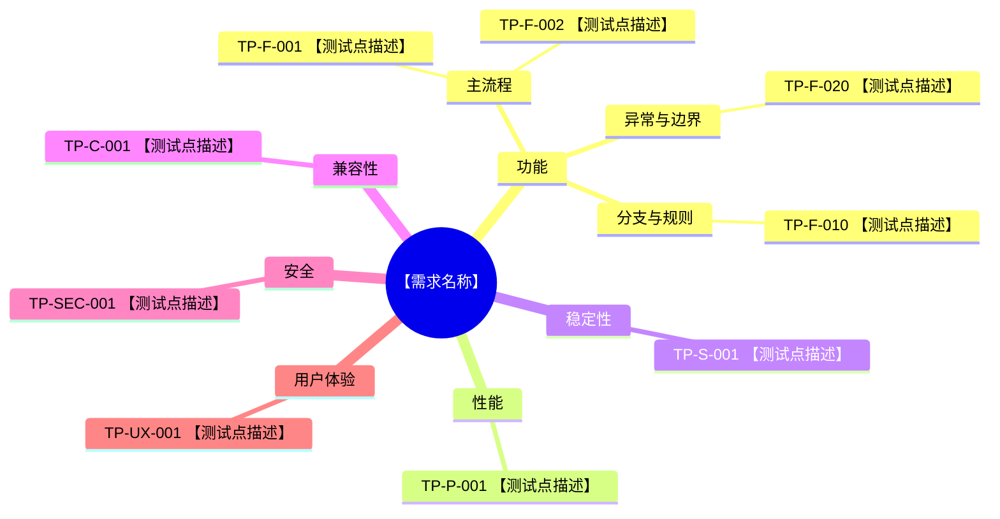

# 输出模板与维度检查清单

## 主表与附表

- 主表：测试执行使用，要求步骤清晰、预期可判定
- 附表：评审追溯使用，要求来源可追溯、风险有依据、状态可对账
- 两张表必须同时输出，且通过 `用例序号` 一一对应
- 附表「用例状态」是 Phase 4 可执行性报告的唯一计数来源

## REQ 原子化清单

在生成测试点之前，必须先输出 `REQ` 原子化清单，作为覆盖率计算与双向追溯的唯一基础。

| REQ-ID | 需求描述 | 来源文档 | 来源章节/段落 | 类型 | 可测性 | 覆盖状态 | 备注 |
|--------|---------|---------|--------------|------|--------|---------|------|

字段说明：

| 列 | 规范 |
|----|------|
| REQ-ID | 唯一编号，格式建议 `REQ-001` |
| 需求描述 | 单条、原子化、可独立理解 |
| 来源文档 | PRD / 技术方案 / UI / 交互文档名称 |
| 来源章节/段落 | 尽量精确到章节、标题或段落 |
| 类型 | 功能 / 性能 / 稳定性 / 兼容性 / 安全 / 用户体验 |
| 可测性 | 仅允许 `可测` / `不可测` |
| 覆盖状态 | 初始值仅允许 `待覆盖` / `阻塞` / `N/A` |
| 备注 | 说明阻塞原因、N/A 原因或补充说明 |

---

## 六维度检查清单

设计测试点时，逐维度过一遍以下检查项；文档未涉及且用户未确认的，在 Phase 1 提问。

### 功能

- [ ] 主流程（Happy Path）逐步覆盖
- [ ] 各分支条件（if/else 业务分支）
- [ ] 输入校验（必填、格式、长度、特殊字符）
- [ ] 边界值（最小/最大/零/空）
- [ ] 异常与错误处理（网络失败、超时、服务不可用）
- [ ] 权限与角色差异（不同角色看到/能操作的内容）
- [ ] 状态流转（创建→编辑→提交→审核→完成/作废）
- [ ] 并发操作（同时编辑、重复提交）
- [ ] 数据联动（A 字段变化影响 B 字段/模块）

### 性能

- [ ] 页面/接口响应时间（常规与峰值）
- [ ] 列表分页与大数据量（如 1k/10k 条）
- [ ] 并发用户数 / QPS 目标
- [ ] 批量操作（导入/导出/批量删除）
- [ ] 资源占用（内存、CPU、存储增长）

### 稳定性

- [ ] 长时间运行 / 定时任务
- [ ] 断网/弱网恢复
- [ ] 服务重启后数据一致性
- [ ] 重试与幂等（重复请求不重复生效）
- [ ] 降级与熔断（依赖服务不可用时的表现）

### 兼容性

- [ ] 浏览器（Chrome / Edge / Safari / 飞书内置浏览器）
- [ ] 操作系统（Windows / macOS / 移动端 iOS/Android）
- [ ] 屏幕分辨率 / 响应式布局
- [ ] 新旧版本共存（升级后数据迁移、接口兼容）
- [ ] 上下游系统/第三方集成

### 安全

- [ ] 登录态与 Session 过期
- [ ] 水平/垂直越权
- [ ] 敏感数据脱敏与传输加密
- [ ] 注入（SQL/XSS/命令注入）
- [ ] 操作审计日志
- [ ] 文件上传类型与大小限制

### 用户体验

- [ ] 首次使用引导
- [ ] 加载态 / 空态 / 错误态展示
- [ ] 提示文案准确、可操作
- [ ] 操作反馈（成功/失败 Toast、进度条）
- [ ] 快捷键 / 无障碍（如适用）
- [ ] 多语言 / 时区（如适用）

某维度文档未提及：Phase 1 提问，或 REQ 标 `N/A`（附理由），禁止静默省略。

---

## 强制设计技法触发表

| 场景类型 | 强制产物 | 说明 |
|---------|---------|------|
| 多条件组合 | 判定表 | 权限×状态×角色等交叉条件 |
| 状态流转 | 状态迁移图 | 覆盖合法迁移 + 非法迁移 |
| 端到端主流程 | 用户旅程 / 场景路径 | 串联关键节点 |
| 输入校验密集 | 等价类表 + 边界值表 | 先分类再出用例 |

无建模产物，不得对对应 REQ 批量输出 Ready 用例。

---

## REQ 覆盖深度最低标准

| REQ 类型 | 最低要求 |
|---------|---------|
| 功能（有输入/校验） | ≥1 正向 + ≥1 反向/异常；可测边界再加 ≥1 边界 |
| 功能（状态流转） | 合法迁移 + ≥1 非法迁移 |
| 功能（多条件组合） | 判定表每条有效规则 ≥1 用例 |
| 非功能（性能/稳定/兼容/安全/体验） | ≥1 对应维度用例，预期含可判定检查点 |

---

## 测试点汇总表模板

| 编号 | 维度 | 测试点描述 | 优先级建议 | 关联 REQ-ID | 关联待确认问题 |
|------|------|-----------|-----------|------------|--------------|

规则：每个 TP 必须有关联 REQ-ID；每个可测 REQ 必须有 ≥1 个 TP。

---

## 测试点思维导图模板



---

## 测试用例表模板

### 表头（固定，不得更改）

| 用例序号 | 优先级（P0-P3） | 测试标题 | 测试类型 | 前置条件 | 操作步骤 | 预期结果 |
|---------|----------------|---------|---------|---------|---------|---------|

### 附表（评审追溯表）

| 用例序号 | 关联需求/方案条目 | 关联测试点 | 设计技法 | 测试数据 | 风险等级 | 风险评估依据 | 用例状态 | 解除条件 | 备注 |
|---------|------------------|-----------|---------|---------|---------|-------------|---------|---------|-----|

### 追溯矩阵

| REQ-ID | TP-ID | TC-ID | 覆盖类型 | 备注 |
|--------|------|------|---------|------|

### 填写规范

| 列 | 规范 |
|----|------|
| 用例序号 | `TC-{模块}-{三位序号}`，模块名大写英文缩写 |
| 优先级 | 仅 P0 / P1 / P2 / P3 |
| 测试标题 | 简洁说明验证什么，≤ 30 字 |
| 测试类型 | 功能测试 / 接口测试 / 性能测试 / 兼容性测试 / 安全测试 / 稳定性测试 / 用户体验测试 |
| 前置条件 | 执行前必须满足的状态；无则写「无」 |
| 操作步骤 | 编号列表：`1. ... 2. ... 3. ...` |
| 预期结果 | 可观测结果；多结果用编号对应步骤 |

### 附表字段规范

| 列 | 规范 |
|----|------|
| 关联需求/方案条目 | 优先写 `REQ-ID`，可附章节名 |
| 关联测试点 | 对应 `TP-*` 编号，可多项 |
| 设计技法 | 等价类 / 边界值 / 判定表 / 状态迁移 / 场景法 / 错误推测 |
| 测试数据 | 必须给出具体值，不可写“合法数据” |
| 风险等级 | 高 / 中 / 低（与主表 P0-P3 对应） |
| 风险评估依据 | 至少包含“业务影响 + 发生概率 + 可检测性”中的两项 |
| 用例状态 | 仅允许 `Ready` / `Blocked` / `Draft`；为 Phase 4 唯一计数来源 |
| 解除条件 | `Blocked`/`Draft` 必填；`Ready` 可写「无」 |

### 用例状态与执行就绪

| 状态 | 含义 |
|------|------|
| Ready | 通过执行就绪检查清单全部项 |
| Blocked | 依赖未确认问题或缺少环境/数据/账号/规则 |
| Draft | 字段不全、预期不可判定、反模式未清完 |

执行就绪检查清单：
- [ ] 入口明确（页面/接口）
- [ ] 测试数据具体
- [ ] 前置可准备
- [ ] 步骤可逐步复现
- [ ] 预期可判定
- [ ] 不依赖未确认问题
- [ ] 一案一验

### 追溯矩阵字段规范

| 列 | 规范 |
|----|------|
| REQ-ID | 来自已确认的 REQ 原子化清单 |
| TP-ID | 对应测试点编号，可多行展开，不建议同单元格塞太多值 |
| TC-ID | 对应测试用例编号 |
| 覆盖类型 | 正向 / 反向 / 边界 / 异常 / 性能 / 安全 / 兼容性 / 体验 |
| 备注 | 说明是否为衍生场景、经验补充或交叉覆盖 |

### 示例

| 用例序号 | 优先级（P0-P3） | 测试标题 | 测试类型 | 前置条件 | 操作步骤 | 预期结果 |
|---------|----------------|---------|---------|---------|---------|---------|
| TC-LOGIN-001 | P0 | 正确账号密码登录成功 | 功能测试 | 1. 账号 `test_user` 已注册且状态正常<br>2. 使用 Chrome 最新稳定版打开测试环境登录页 | 1. 打开登录页 `/login`<br>2. 输入用户名 `test_user`、密码 `Pass@123`<br>3. 点击「登录」 | 1. 跳转首页 `/home`<br>2. 顶部显示昵称 `test_user` |
| TC-LOGIN-002 | P1 | 密码错误时停留登录页并提示 | 功能测试 | 1. 账号 `test_user` 已注册 | 1. 打开登录页 `/login`<br>2. 输入用户名 `test_user`、密码 `Wrong@001`<br>3. 点击「登录」 | 1. 停留 `/login`<br>2. 提示文案「用户名或密码错误」<br>3. 密码框清空 |
| TC-LOGIN-003 | P2 | 连续输错 5 次后锁定账号 | 功能测试 | 1. 账号 `test_user` 已注册<br>2. 锁定策略已确认为 5 次/30 分钟 | 1. 连续 5 次输入错误密码<br>2. 第 6 次输入正确密码 `Pass@123` 尝试登录 | 1. 第 5 次失败后提示「账号已锁定」<br>2. 第 6 次登录失败并提示锁定剩余时间 |
| TC-LOGIN-004 | P1 | 登录接口 P95 响应时间达标 | 性能测试 | 1. 测试环境 `https://test.example.com` 可用<br>2. 压测账号池已准备 100 个有效账号 | 1. 对 `POST /api/login` 发起 100 次请求 | 1. P95 响应时间 ≤ 500ms<br>2. 成功率 100% |
| TC-LOGIN-005 | P1 | Chrome 最新版可完成登录主流程 | 兼容性测试 | 1. Chrome 最新稳定版<br>2. 账号 `test_user` 可用 | 1. 在 Chrome 中执行 TC-LOGIN-001 步骤 | 与 TC-LOGIN-001 预期结果一致 |
| TC-LOGIN-006 | P0 | 未登录访问个人中心被拦截 | 安全测试 | 1. 浏览器无登录态 Cookie/Token | 1. 直接访问 `/profile` | 1. 跳转 `/login`<br>2. 页面不展示用户隐私字段 |

| 用例序号 | 关联需求/方案条目 | 关联测试点 | 设计技法 | 测试数据 | 风险等级 | 风险评估依据 | 用例状态 | 解除条件 | 备注 |
|---------|------------------|-----------|---------|---------|---------|-------------|---------|---------|-----|
| TC-LOGIN-001 | REQ-001 | TP-F-001 | 场景法 | 用户名 `test_user`，密码 `Pass@123` | 高 | 业务影响高（登录不可用阻塞主流程）；发生概率中（高频入口） | Ready | 无 | 对应主表 P0 |
| TC-LOGIN-002 | REQ-001 | TP-F-002 | 错误推测 | 密码 `Wrong@001` | 中 | 业务影响中；发生概率高 | Ready | 无 | 反向覆盖 |
| TC-LOGIN-003 | REQ-003 | TP-F-020 | 边界值 | 连续错误 5 次、6 次 | 中 | 业务影响中；可检测性高 | Blocked | 产品确认锁定策略 Q1 | 深度覆盖边界 |

| REQ-ID | TP-ID | TC-ID | 覆盖类型 | 备注 |
|--------|------|------|---------|------|
| REQ-001 | TP-F-001 | TC-LOGIN-001 | 正向 | 主流程 |
| REQ-001 | TP-F-002 | TC-LOGIN-002 | 反向 | 错误密码 |
| REQ-003 | TP-F-020 | TC-LOGIN-003 | 边界 | 锁定阈值 |

---

## 风险驱动优先级规则

使用以下准则给主表优先级定级，并将依据写入附表：

- **P0 / 高风险**：业务中断、资金或数据安全、阻塞发布
- **P1 / 中高风险**：高频核心路径、关键分支、严重体验缺陷
- **P2 / 中风险**：次要路径、边界与一般异常
- **P3 / 低风险**：低频功能、轻微体验或优化项

建议评估维度：

| 维度 | 说明 |
|------|------|
| 业务影响 | 缺陷造成的业务损失、合规风险、用户影响范围 |
| 发生概率 | 该场景触发频率、历史缺陷密度、实现复杂度 |
| 可检测性 | 是否容易在上线前被发现，是否需要复杂监控才可识别 |

优先级可按经验判断，也可采用简单打分法：高=3、中=2、低=1，总分越高风险越高。

---

## 反模式库（强制禁止）

以下写法禁止出现在最终用例中：

| 反模式 | 问题 | 正确写法 |
|--------|------|---------|
| 预期写「显示正常」 | 不可判定 | 写具体 UI 元素、文案、接口字段值 |
| 一步骤验证 3 件事 | 失败难定位 | 拆成 3 条用例 |
| 前置条件写「系统正常」 | 无法执行 | 写清账号、数据、权限、环境 |
| 操作步骤写「按要求操作」 | 不可复现 | 逐步写清点击路径和输入值 |
| 用例标题是功能名 | 看不出测什么 | 标题 = 条件 + 行为 + 预期 |

输出前执行反模式检查，命中任意一条必须先改写再输出。

---

## Phase 4 三报告模板

### 覆盖率报告

```markdown
## 覆盖率报告
- 可测需求总数：X
- 已覆盖 REQ 数：X
- N/A REQ 数：X
- 未覆盖 REQ 数：X
- 覆盖率：X%
- 深度达标 REQ 数：X
- 深度未达标 REQ 数：X

### 未覆盖 / 深度未达标 REQ 清单
| REQ-ID | 问题类型 | 缺失覆盖类型 | 建议动作 |
|--------|---------|-------------|---------|
| REQ-00X | 深度未达标 | 反向/边界 | 补充对应 TC |
```

### 可执行性报告

```markdown
## 可执行性报告
- 用例总数：X
- Ready：X
- Blocked：X
- Draft：X
- 可执行率：X%

（计数必须与附表「用例状态」列一致）

### Blocked / Draft 清单
| TC-ID | 状态 | 原因 | 解除条件 |
|------|------|------|---------|
| TC-XXX | Blocked | 依赖 Q3 未确认 | 产品确认 Q3 |
```

### 质量缺陷报告

```markdown
## 质量缺陷报告
- 反模式命中数：X
- 已修复数：X
- 追溯缺口数：X
- TP 无 REQ 关联数：X
- 覆盖深度缺口数：X
- 待人工确认数：X

### 缺陷清单
| 类型 | 对象 | 描述 | 处理状态 |
|------|------|------|---------|
| 追溯缺口 | REQ-XXX | 未映射测试用例 | 待补充 |
| 深度缺口 | REQ-YYY | 仅有正向，缺反向 | 待补充 |
```

### 硬门禁判定

只有以下条件全部满足，才可宣称“高质量最终版”：

- [ ] 未覆盖 REQ 数 = 0
- [ ] 深度未达标 REQ 数 = 0
- [ ] Blocked 用例数 = 0
- [ ] Draft 用例数 = 0
- [ ] 反模式命中数 = 0
- [ ] 追溯缺口数 = 0
- [ ] TP 无 REQ 关联数 = 0

若任一条件不满足，必须输出阻断项清单，不得宣称“100% 覆盖”或“100% 可执行”。

---

## 待确认问题示例

| # | 问题 | 影响范围 | 建议确认方 |
|---|------|---------|-----------|
| Q1 | 密码错误几次后锁定账号？锁定时长？ | 影响登录异常类用例 | 产品 |
| Q2 | 是否支持手机号+验证码登录？ | 影响登录主流程用例 | 产品 |
| Q3 | 登录接口 P95 响应时间 SLA 是多少？ | 影响性能测试用例阈值 | 产品/开发 |
| Q4 | 需兼容哪些浏览器及最低版本？ | 影响兼容性测试矩阵 | 产品/开发 |
| Q5 | Session 有效期多长？是否支持「记住我」？ | 影响安全与稳定性用例 | 产品/开发 |
