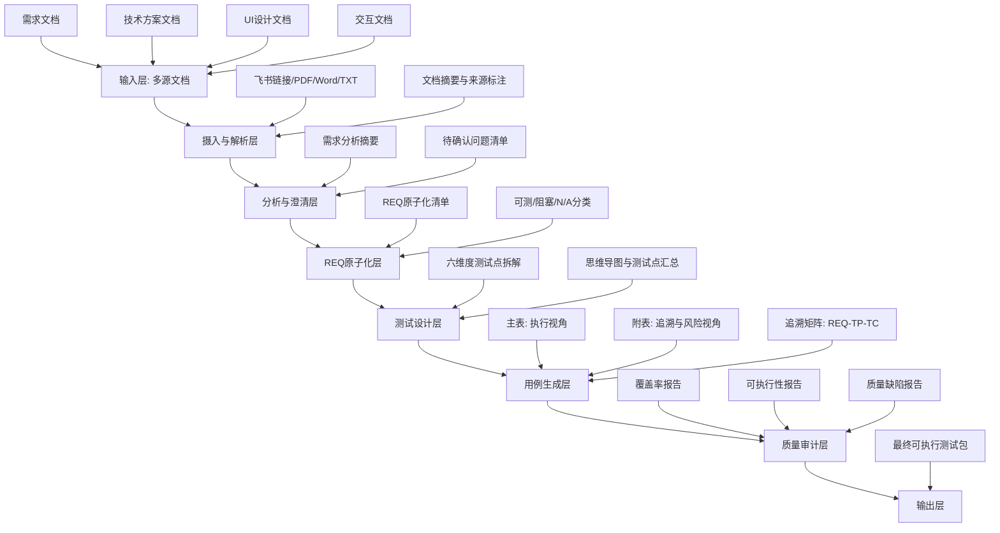
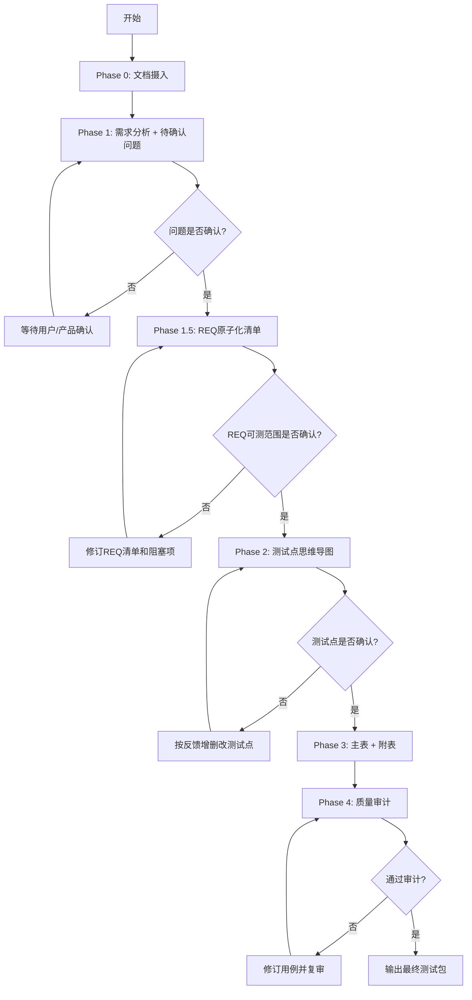

# req-testcase-generator Skill 总览文档

## 1. 文档目的

本文档用于总结 `req-testcase-generator` 的整体设计，包括：
- 架构分层
- 端到端流程
- 输出规范（主表 + 附表）
- 风险驱动优先级
- 反模式约束
- 使用说明与落地建议

适用对象：测试工程师、测试负责人、产品、研发、评审参与者。

---

## 2. Skill 定位

`req-testcase-generator` 是一个高质量测试设计 Skill。  
它接收多源文档输入（需求、技术方案、UI、交互），通过分阶段流程输出：

1. 需求原子化清单（REQ）
2. 测试点思维导图（六维度）
3. 测试用例主表（执行）
4. 测试用例附表（评审追溯）
5. 质量审计结果（三报告 + 硬门禁）

该 Skill **仅保留高质量模式**，所有输入统一按高标准执行。

所有正式交付件以 **Excel 形式独立分开**呈现（需求清单、测试用例、用例附表、追溯表、专项测试用例、专项数据采集、质量审计各自独立成表），不得混在同一张表。详见 `SKILL.md` 「交付物规范」。

---

## 3. 架构设计

### 3.1 分层架构

### 3.2 关键组件与职责

| 组件 | 职责 | 输出 |
|------|------|------|
| 文档摄入组件 | 解析输入来源并抽取正文 | 文档摘要、来源映射 |
| 需求分析组件 | 提炼目标、范围、约束、角色、边界 | 需求分析摘要 |
| 澄清问题组件 | 枚举文档缺失项和矛盾项 | 待确认问题清单 |
| REQ 原子化组件 | 将需求拆成最小可追溯条目 | REQ 清单、可测范围 |
| 测试点设计组件 | 基于六维度生成测试点和编号 | 思维导图、测试点表 |
| 用例生成组件 | 按固定规范生成主表、附表、追溯矩阵 | 主表、附表、追溯矩阵 |
| 质量审计组件 | 检查反模式、覆盖率、可执行性、追溯完整性 | 三报告与阻断项 |

---

## 4. 端到端流程

### 4.1 流程图

### 4.2 阶段说明

| 阶段 | 输入 | 核心动作 | 输出 |
|------|------|---------|------|
| Phase 0 | 需求/技术/UI/交互文档 | 摄入、摘要、来源标注 | 文档摘要 |
| Phase 1 | 文档摘要 + 原文 | 需求分析、提问澄清 | 待确认问题清单 |
| Phase 1.5 | 已确认问题 | 需求原子化、可测性分类 | REQ 清单 |
| Phase 2 | 已确认 REQ 范围 | 六维度拆解 + 强制建模 + 深度覆盖 | 思维导图 + 测试点汇总（含 REQ） |
| Phase 3 | 已确认测试点 | 生成主表、附表（含状态）、追溯矩阵 | 主表 + 附表 + 追溯矩阵 |
| Phase 4 | 主表 + 附表 + 追溯矩阵 | 三报告（含深度）+ 硬门禁 | 最终可发布版本或阻断清单 |

---

## 5. 输出设计规范

### 5.1 主表（测试执行）

用途：测试执行、回归执行、任务分发。  
固定表头：

| 用例序号 | 优先级（P0-P3） | 测试标题 | 测试类型 | 前置条件 | 操作步骤 | 预期结果 |
|---------|----------------|---------|---------|---------|---------|---------|

约束：
- 用例一案一验（每条验证一个核心检查点）
- 步骤可复现
- 预期可观测、可判定

### 5.2 附表（评审追溯）

用途：评审会追溯、风险讨论、执行就绪与发布决策依据。  
表头：

| 用例序号 | 关联需求/方案条目 | 关联测试点 | 设计技法 | 测试数据 | 风险等级 | 风险评估依据 | 用例状态 | 解除条件 | 备注 |
|---------|------------------|-----------|---------|---------|---------|-------------|---------|---------|-----|

约束：
- 与主表通过 `用例序号` 一一对应
- 必须写明风险评估依据（至少两项：业务影响/发生概率/可检测性）
- 测试数据需具体值，不可抽象描述
- `用例状态` 仅允许 Ready / Blocked / Draft，且为可执行性报告唯一计数来源
- Blocked / Draft 必须填写解除条件

### 5.3 专项测试用例（多次采样统计模板）

用途：算法性能、整机性能等需**多次采样统计**才能判定的指标类测试项（如识别准确率、整机任务达成率、避障成功率）。测试类型为「专项测试」的用例不进 5.1 普通主表，改用独立的两张表：

- **专项用例主表（指标定义表）**：定义专项指标、场景/维度、单次操作步骤、单次判定标准、采样次数 N、统计口径、合格阈值
- **专项数据采集表**：每条专项用例一张，逐次记录 N 次原始结果与单次判定，末尾汇总统计结果并对照阈值给出达标结论

约束：
- 编号规则 `TC-SP-{模块缩写}-{三位序号}`
- 单次判定标准 / 统计口径 / 合格阈值 三者缺一即不可判定，不得标 Ready
- 附表与追溯矩阵仍需覆盖，`覆盖类型` 填「专项」
- 完整模板见 `templates.md`「专项测试用例模板」

### 5.3 追溯矩阵

用途：验证需求覆盖率、深度覆盖与双向追溯完整性。  
表头：

| REQ-ID | TP-ID | TC-ID | 覆盖类型 | 备注 |
|--------|------|------|---------|------|

约束：
- 每个 `可测` 的 `REQ-ID` 至少映射 1 个 `TP-ID` 和 1 条 `TC-ID`
- 每个 `TP-ID` 必须映射 ≥1 个 `REQ-ID`
- 每条 `TC-ID` 必须能回溯到 `REQ-ID`
- 功能类 REQ 须满足覆盖深度最低标准（正向 + 反向/异常等）
- 未映射或深度未达标项必须进入 Phase 4 覆盖率报告

---

## 6. 六维度测试点框架

测试点必须覆盖以下维度：

1. 功能：主流程、分支、边界、异常、权限、数据校验
2. 性能：响应时间、吞吐、并发、数据量、资源占用
3. 稳定性：长稳、恢复、重试、幂等、一致性
4. 兼容性：浏览器、系统、设备、分辨率、版本
5. 安全：认证授权、越权、注入、敏感数据、审计
6. 用户体验：提示、状态、易用性、无障碍、国际化

某维度文档未提及时，须提问或标 N/A，禁止静默省略。

复杂场景强制先建模：判定表 / 状态迁移图 / 用户旅程 / 等价类+边界值表。

功能类 REQ 覆盖深度最低标准：≥1 正向 + ≥1 反向/异常（可测边界再加边界）。

---

## 7. 风险驱动优先级

主表优先级和附表风险等级需联动：

- P0 / 高风险：主流程中断、资金/数据安全、阻塞发布
- P1 / 中高风险：高频核心路径、关键分支、严重体验问题
- P2 / 中风险：次要路径、边界场景、一般异常
- P3 / 低风险：低频功能、轻微体验、优化项

推荐评估维度：
- 业务影响
- 发生概率
- 可检测性

---

## 8. REQ 覆盖与可执行性门禁

为了支持“需求覆盖 100%”与“可执行度 100%”的判断，Skill 在 Phase 4 强制输出三份报告：

1. 覆盖率报告（含覆盖深度）
2. 可执行性报告（基于附表用例状态列）
3. 质量缺陷报告

口径：
- 「覆盖 100%」仅统计已确认且可测 REQ，且须深度达标
- 「可执行 100%」要求全部用例为 Ready

只有满足以下条件，才可宣称“高质量最终版”：

- 未覆盖 REQ 数 = 0
- 深度未达标 REQ 数 = 0
- Blocked 用例数 = 0
- Draft 用例数 = 0
- 反模式命中数 = 0
- 追溯缺口数 = 0
- TP 无 REQ 关联数 = 0

否则必须输出阻断项清单，不得宣称“100% 覆盖”或“100% 可执行”。

---

## 9. 反模式库（强制禁止）

以下写法禁止出现在最终输出：

| 反模式 | 问题 | 正确写法 |
|--------|------|---------|
| 预期写「显示正常」 | 不可判定 | 写具体 UI 元素、文案、接口字段值 |
| 一步骤验证 3 件事 | 失败难定位 | 拆成 3 条用例 |
| 前置条件写「系统正常」 | 无法执行 | 写清账号、数据、权限、环境 |
| 操作步骤写「按要求操作」 | 不可复现 | 逐步写清点击路径和输入值 |
| 用例标题是功能名 | 看不出测什么 | 标题 = 条件 + 行为 + 预期 |

---

## 10. 使用说明

### 10.1 推荐使用步骤

1. 提供文档（飞书链接、PDF、Word、TXT，或直接粘贴）
2. 确认 Phase 1 待确认问题
3. 确认 Phase 1.5 REQ 原子化清单
4. 确认 Phase 2 测试点思维导图
5. 获取 Phase 3 主表 + 附表 + 追溯矩阵
6. 查看 Phase 4 三报告与硬门禁结果

### 10.2 常用触发语

- `分析需求`
- `问题已确认：...`
- `确认 REQ 清单`
- `生成测试点`
- `测试点已确认`
- `生成主表和附表`
- `输出追溯矩阵`
- `给出风险依据`
- `生成三报告`
- `检查覆盖深度`

### 10.3 典型输入示例

- “根据这份 PRD 和技术方案，生成测试点和测试用例”
- “这是 UI 稿和交互说明，请补充体验与兼容性用例”
- “测试点已确认，输出主表和附表，并附风险依据”

---

## 11. 文件位置与维护建议

当前 Skill 关键文件：
- `d:\P_TestCase\.cursor\skills\req-testcase-generator\SKILL.md`
- `d:\P_TestCase\.cursor\skills\req-testcase-generator\doc-ingest.md`
- `d:\P_TestCase\.cursor\skills\req-testcase-generator\templates.md`

建议维护策略：
- 业务域变化时优先更新 `templates.md` 的反模式与风险规则
- 新增输入格式时先补 `doc-ingest.md`
- 流程变更统一在 `SKILL.md` 更新后同步本总览文档

