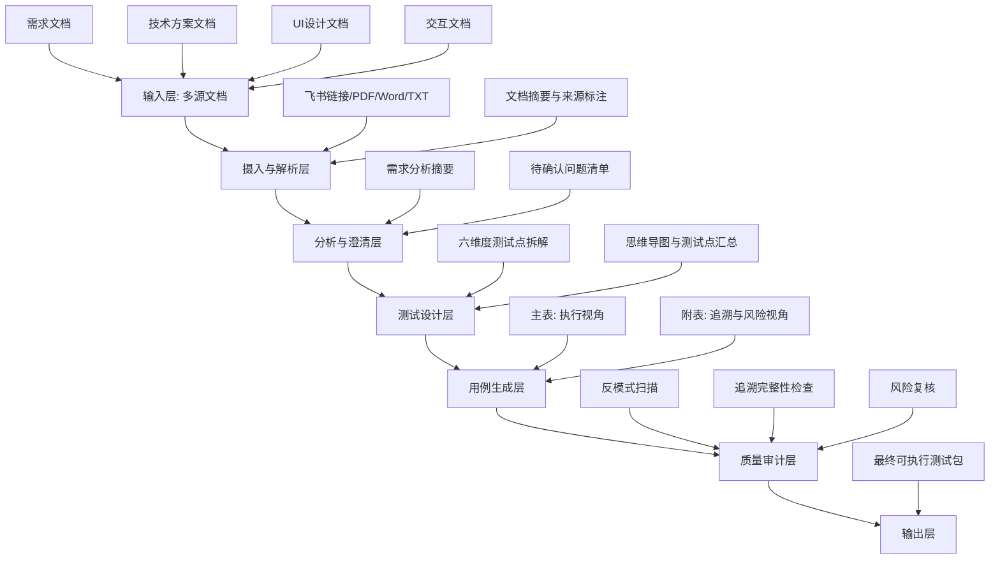
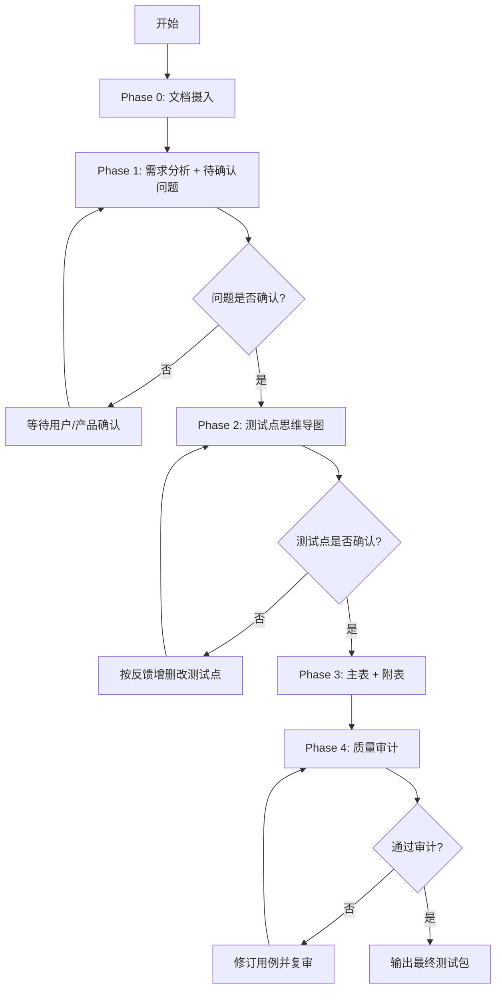

# req-testcase-generator Skill 总览文档

## 1. 文档目的

本文档用于总结 `req-testcase-generator` 的整体设计，包括：
- 架构分层
- 端到端流程
- 输出规范（主表 + 附表）
- 风险驱动优先级
- 反模式约束
- 使用说明与落地建议

适用对象：测试工程师、测试负责人、产品、研发、评审参与者。

---

## 2. Skill 定位

`req-testcase-generator` 是一个高质量测试设计 Skill。  
它接收多源文档输入（需求、技术方案、UI、交互），通过分阶段流程输出：

1. 测试点思维导图（六维度）
2. 测试用例主表（执行）
3. 测试用例附表（评审追溯）
4. 质量审计结果（反模式与覆盖复核）

该 Skill **仅保留高质量模式**，所有输入统一按高标准执行。

---

## 3. 架构设计

## 3.1 分层架构

## 3.2 关键组件与职责

| 组件 | 职责 | 输出 |
|------|------|------|
| 文档摄入组件 | 解析输入来源并抽取正文 | 文档摘要、来源映射 |
| 需求分析组件 | 提炼目标、范围、约束、角色、边界 | 需求分析摘要 |
| 澄清问题组件 | 枚举文档缺失项和矛盾项 | 待确认问题清单 |
| 测试点设计组件 | 基于六维度生成测试点和编号 | 思维导图、测试点表 |
| 用例生成组件 | 按固定规范生成主表与附表 | 主表、附表 |
| 质量审计组件 | 检查反模式、可执行性、可追溯性 | 审计结果与修订建议 |

---

## 4. 端到端流程

## 4.1 流程图

## 4.2 阶段说明

| 阶段 | 输入 | 核心动作 | 输出 |
|------|------|---------|------|
| Phase 0 | 需求/技术/UI/交互文档 | 摄入、摘要、来源标注 | 文档摘要 |
| Phase 1 | 文档摘要 + 原文 | 需求分析、提问澄清 | 待确认问题清单 |
| Phase 2 | 已确认问题 | 六维度拆解测试点 | 思维导图 + 测试点汇总 |
| Phase 3 | 已确认测试点 | 生成执行主表与追溯附表 | 用例主表 + 附表 |
| Phase 4 | 主表 + 附表 | 反模式与风险复核 | 最终可发布版本 |

---

## 5. 输出设计规范

## 5.1 主表（测试执行）

用途：测试执行、回归执行、任务分发。  
固定表头：

| 用例序号 | 优先级（P0-P3） | 测试标题 | 测试类型 | 前置条件 | 操作步骤 | 预期结果 |
|---------|----------------|---------|---------|---------|---------|---------|

约束：
- 用例一案一验（每条验证一个核心检查点）
- 步骤可复现
- 预期可观测、可判定

## 5.2 附表（评审追溯）

用途：评审会追溯、风险讨论、发布决策依据。  
表头：

| 用例序号 | 关联需求/方案条目 | 关联测试点 | 设计技法 | 测试数据 | 风险等级 | 风险评估依据 | 备注 |
|---------|------------------|-----------|---------|---------|---------|-------------|-----|

约束：
- 与主表通过 `用例序号` 一一对应
- 必须写明风险评估依据（至少两项：业务影响/发生概率/可检测性）
- 测试数据需具体值，不可抽象描述

---

## 6. 六维度测试点框架

测试点必须覆盖以下维度：

1. 功能：主流程、分支、边界、异常、权限、数据校验
2. 性能：响应时间、吞吐、并发、数据量、资源占用
3. 稳定性：长稳、恢复、重试、幂等、一致性
4. 兼容性：浏览器、系统、设备、分辨率、版本
5. 安全：认证授权、越权、注入、敏感数据、审计
6. 用户体验：提示、状态、易用性、无障碍、国际化

---

## 7. 风险驱动优先级

主表优先级和附表风险等级需联动：

- P0 / 高风险：主流程中断、资金/数据安全、阻塞发布
- P1 / 中高风险：高频核心路径、关键分支、严重体验问题
- P2 / 中风险：次要路径、边界场景、一般异常
- P3 / 低风险：低频功能、轻微体验、优化项

推荐评估维度：
- 业务影响
- 发生概率
- 可检测性

---

## 8. 反模式库（强制禁止）

以下写法禁止出现在最终输出：

| 反模式 | 问题 | 正确写法 |
|--------|------|---------|
| 预期写「显示正常」 | 不可判定 | 写具体 UI 元素、文案、接口字段值 |
| 一步骤验证 3 件事 | 失败难定位 | 拆成 3 条用例 |
| 前置条件写「系统正常」 | 无法执行 | 写清账号、数据、权限、环境 |
| 操作步骤写「按要求操作」 | 不可复现 | 逐步写清点击路径和输入值 |
| 用例标题是功能名 | 看不出测什么 | 标题 = 条件 + 行为 + 预期 |

---

## 9. 使用说明

## 9.1 推荐使用步骤

1. 提供文档（飞书链接、PDF、Word、TXT，或直接粘贴）
2. 确认 Phase 1 待确认问题
3. 确认 Phase 2 测试点思维导图
4. 获取 Phase 3 主表 + 附表
5. 查看 Phase 4 质量审计结果

## 9.2 常用触发语

- `分析需求`
- `问题已确认：...`
- `生成测试点`
- `测试点已确认`
- `生成主表和附表`
- `给出风险依据`

## 9.3 典型输入示例

- “根据这份 PRD 和技术方案，生成测试点和测试用例”
- “这是 UI 稿和交互说明，请补充体验与兼容性用例”
- “测试点已确认，输出主表和附表，并附风险依据”

---

## 10. 文件位置与维护建议

当前 Skill 关键文件：
- `d:\P_TestCase\.cursor\skills\req-testcase-generator\SKILL.md`
- `d:\P_TestCase\.cursor\skills\req-testcase-generator\doc-ingest.md`
- `d:\P_TestCase\.cursor\skills\req-testcase-generator\templates.md`

建议维护策略：
- 业务域变化时优先更新 `templates.md` 的反模式与风险规则
- 新增输入格式时先补 `doc-ingest.md`
- 流程变更统一在 `SKILL.md` 更新后同步本总览文档

