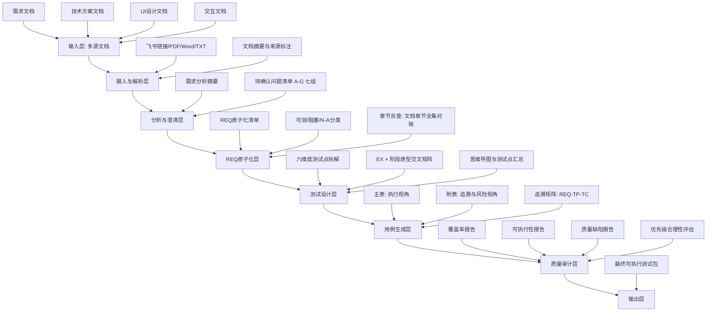
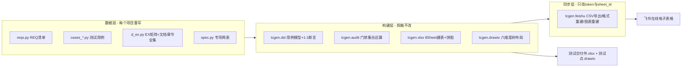
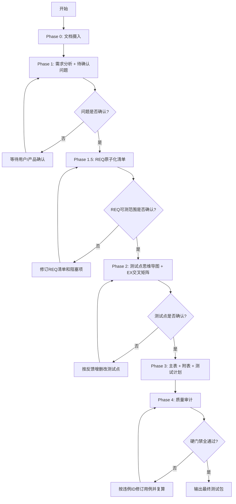

# req-testcase-generator Skill 总览文档

> 本文档随 Skill 演进同步更新，最后一次重写：2026-09-07（新增交付件构建管道、EX 异常注入库、
> 功能安全门禁、审计三铁律，并更新文件位置为「单一真源 + junction」布局）。

## 1. 文档目的

本文档用于总结 `req-testcase-generator` 的整体设计，包括：
- 架构分层（含交付件构建管道）
- 端到端流程
- 输出规范（主表 + 附表 + 追溯矩阵 + 异常交叉矩阵）
- 风险驱动优先级
- 质量审计门禁与反造假约束
- 使用说明与落地建议

适用对象：测试工程师、测试负责人、产品、研发、评审参与者。

---

## 2. Skill 定位

`req-testcase-generator` 是一个高质量测试设计 Skill。
它接收多源文档输入（需求、技术方案、UI、交互），通过分阶段流程输出：

1. 需求原子化清单（REQ）
2. 测试点思维导图（六维度）
3. 异常交叉适用性矩阵（如有通用异常事件纳入）
4. 测试用例主表（执行）
5. 评审追溯表（含风险评估）
6. 追溯矩阵表（REQ-TP-TC）
7. 专项测试用例表 + 专项数据采集表（如有专项测试）
8. 测试计划
9. 质量审计报告（四报告 + 硬门禁）

该 Skill **仅保留高质量模式**，所有输入统一按高标准执行。

所有正式交付件**独立分开**呈现，不得混在一起：**表格类交付件**一律以 **Excel** 独立成 Sheet
并汇入同一个工作簿；**测试点思维导图**单独交付为 **Draw.io（`.drawio`）文件**，可直接导入
飞书云文档；**测试计划**单独交付为 **Markdown（`.md`）文档**，可导入飞书在线文档。
详见 `SKILL.md`「交付物规范」。

两条贯穿全流程的强约束：

- **审计三铁律**（Phase 4，优先于该阶段其他所有规则）：禁止裸报零、违例必列 ID、交付前贴自查回执。
- **交付件构建管道强制复用**（Phase 3/4）：禁止现场重写建表、审计运算、思维导图与飞书同步代码。

---

## 3. 架构设计

### 3.1 流程分层


```mermaid
flowchart TB
    A[输入层: 多源文档] --> B[摄入与解析层]
    B --> C[分析与澄清层]
    C --> D[REQ原子化层]
    D --> E[测试设计层]
    E --> F[用例生成层]
    F --> G[质量审计层]
    G --> H[输出层]

    A1[需求文档] --> A
    A2[技术方案文档] --> A
    A3[UI设计文档] --> A
    A4[交互文档] --> A

    B1[飞书链接/PDF/Word/TXT] --> B
    B2[文档摘要与来源标注] --> B

    C1[需求分析摘要] --> C
    C2[待确认问题清单 A-G 七组] --> C

    D1[REQ原子化清单] --> D
    D2[可测/阻塞/N-A分类] --> D
    D3[章节反查: 文档章节全集对账] --> D

    E1[六维度测试点拆解] --> E
    E2[EX × 阶段原型交叉矩阵] --> E
    E3[思维导图与测试点汇总] --> E

    F1[主表: 执行视角] --> F
    F2[附表: 追溯与风险视角] --> F
    F3[追溯矩阵: REQ-TP-TC] --> F

    G1[覆盖率报告] --> G
    G2[可执行性报告] --> G
    G3[质量缺陷报告] --> G
    G4[优先级合理性评估] --> G

    H1[最终可执行测试包] --> H
```

### 3.2 交付件构建管道分层（Phase 3/4 落地）

交付件不再手写代码生成，而是复用 Skill 自带的 `scripts/` 管道。分三层，**只有数据层随项目变**：


```mermaid
flowchart LR
    subgraph P[数据层 - 每个项目重写]
        P1[reqs.py REQ清单]
        P2[cases_*.py 测试用例]
        P3[d_ex.py EX矩阵+文档章节全集]
        P4[spec.py 专项两表]
    end
    subgraph B[构建层 - 照搬不改]
        B1[tcgen.dsl 用例模型+1:1断言]
        B2[tcgen.audit 门禁集合运算]
        B3[tcgen.xlsx 8Sheet建表+饼图]
        B4[tcgen.drawio 六维度树布局]
    end
    subgraph S[同步层 - 只改token与sheet_id]
        S1[tcgen.feishu CSV导出/格式重建/图表重建]
    end
    P --> B --> O1[测试交付件.xlsx + 测试点.drawio]
    B --> S --> O2[飞书在线电子表格]
```

**分层判据**：凡与业务无关的（表格样式、门禁算法、六维度配色、饼图重建）都在 `tcgen/`；
凡业务专有的（REQ 正文、用例正文、飞书 token、业务阈值）都在项目侧。
**严禁**把项目专有常量写进 `tcgen/`。

现场重写的后果：配色、审计口径、列宽规则、图表行号解析逐项漂移，
同一 Skill 在不同项目产出不同范式的交付件——这正是本管道要消灭的问题。

### 3.3 关键组件与职责

| 组件 | 职责 | 输出 |
|------|------|------|
| 文档摄入组件 | 解析输入来源并抽取正文 | 文档摘要、来源映射 |
| 需求分析组件 | 提炼目标、范围、约束、角色、边界 | 需求分析摘要 |
| 澄清问题组件 | 按 A-G 七组固定模板枚举缺失项与矛盾项 | 待确认问题清单 |
| REQ 原子化组件 | 将需求拆成最小可追溯条目，并与文档章节全集对账 | REQ 清单、可测范围 |
| 测试点设计组件 | 基于六维度生成测试点和编号 | 思维导图、测试点表 |
| 异常交叉建模组件 | `EX × 阶段原型` 逐格判定适用性并选点 | 异常交叉适用性矩阵 |
| 用例生成组件 | 按固定规范生成主表、附表、追溯矩阵 | 主表、附表、追溯矩阵 |
| 质量审计组件 | 由数据遍历算出全部门禁数并列违例 ID | 四报告（含总说明与图表）与阻断项 |
| 构建管道组件 | 从数据层派生全部交付件，落盘并打印门禁结论 | `.xlsx`、`.drawio`、飞书表格 |

---

## 4. 端到端流程

### 4.1 流程图


```mermaid
flowchart TD
    S[开始] --> P0[Phase 0: 文档摄入]
    P0 --> P1[Phase 1: 需求分析 + 待确认问题]
    P1 --> C1{问题是否确认?}
    C1 -- 否 --> U1[等待用户/产品确认]
    U1 --> P1
    C1 -- 是 --> P15[Phase 1.5: REQ原子化清单]
    P15 --> C15{REQ可测范围是否确认?}
    C15 -- 否 --> U15[修订REQ清单和阻塞项]
    U15 --> P15
    C15 -- 是 --> P2[Phase 2: 测试点思维导图 + EX交叉矩阵]
    P2 --> C2{测试点是否确认?}
    C2 -- 否 --> U2[按反馈增删改测试点]
    U2 --> P2
    C2 -- 是 --> P3[Phase 3: 主表 + 附表 + 测试计划]
    P3 --> P4[Phase 4: 质量审计]
    P4 --> C3{硬门禁全通过?}
    C3 -- 否 --> R[按违例ID修订用例并复算]
    R --> P4
    C3 -- 是 --> E[输出最终测试包]
```

### 4.2 阶段说明

| 阶段 | 输入 | 核心动作 | 输出 |
|------|------|---------|------|
| Phase 0 | 需求/技术/UI/交互文档 | 摄入、摘要、来源标注 | 文档摘要 |
| Phase 1 | 文档摘要 + 原文 | 需求分析、按 A-G 七组提问澄清 | 待确认问题清单 |
| Phase 1.5 | 已确认问题 | 需求原子化、可测性分类、章节反查对账 | REQ 清单 |
| Phase 2 | 已确认 REQ 范围 | 六维度拆解 + 强制建模 + EX 交叉选点 + 深度覆盖 | 思维导图（Draw.io）+ 测试点汇总 + EX 交叉矩阵 |
| Phase 3 | 已确认测试点 | 复用管道生成主表、附表、追溯矩阵、专项两表、测试计划 | 交付件工作簿 + 测试计划（.md） |
| Phase 4 | 交付件工作簿 | 四报告 + 硬门禁（由脚本遍历算出，非肉眼核对） | 最终可发布版本或阻断清单 |

---

## 5. 输出设计规范

### 5.0 交付件清单

| 交付件（中文名称） | 对应阶段 | 形式 |
|------------------|---------|------|
| 需求原子化清单 | Phase 1.5 | Excel |
| 测试点思维导图（`XX项目测试点`） | Phase 2 | Draw.io（可导入飞书） |
| 异常交叉适用性矩阵（如有 EX 纳入） | Phase 2 | Excel |
| 测试计划（`XX项目测试计划`） | Phase 3 | Markdown（可导入飞书） |
| 测试用例主表 | Phase 3 | Excel |
| 评审追溯表（含风险评估） | Phase 3 | Excel |
| 追溯矩阵表（REQ-TP-TC） | Phase 3 | Excel |
| 专项测试用例表（如有专项） | Phase 3 | Excel |
| 专项数据采集表（如有专项） | Phase 3 | Excel |
| 质量审计报告 | Phase 4 | Excel |

Excel 类交付件统一汇入**一个工作簿多 Sheet**，文件名 `测试交付件-{需求名}-{日期}.xlsx`。
主表、附表、追溯矩阵三张表统一按 `(REQ-ID, TP-ID, TC-ID)` 排序，使同一需求下的
正向/反向/异常/边界用例连续聚合、三表顺序一致。

### 5.1 需求原子化清单

固定字段序（管道按位置取值，不得改顺序）：

| REQ-ID | 需求描述 | 来源文档 | 来源章节/段落 | 类型 | 可测性 | 覆盖状态 | 备注 |
|--------|---------|---------|--------------|------|-------|---------|------|

约束：
- `类型` 仅允许 功能 / 性能 / 稳定性 / 兼容性 / 安全 / 用户体验 六值
- **安全类一律填 `安全`，子域（信息安全 / 功能安全）写进备注**——填成「功能安全」会因含
  「功能」二字被误判为功能类 REQ，叠加正向+反向深度要求，造成双重判定
- `可测性` 仅允许 可测 / 不可测；`覆盖状态` 仅允许 待覆盖 / 阻塞 / N/A
- 编号 `REQ-001` 起连续，不得断号重号；不可测项用 `REQ-N01` 起单独编号
- `来源章节` 必须与文档章节全集（`d_ex.DOC_SECTIONS`）字符串完全一致，否则章节反查报缺口

### 5.2 主表（测试执行）

用途：测试执行、回归执行、任务分发。固定表头：

| 用例序号 | 优先级（P0-P3） | 测试标题 | 测试类型 | 前置条件 | 操作步骤 | 预期结果 | 测试结果（PASS/FAIL） | 备注 |
|---------|----------------|---------|---------|---------|---------|---------|---------------------|------|

约束：
- 用例一案一验（每条验证一个核心检查点）
- 步骤可复现，预期可观测、可判定
- **操作步骤与预期结果逐条一一对应、条数相等**（严禁多步骤对一条预期）——管道在
  `tcgen.dsl.C()` 用 assert 在构建期强制，不满足直接构建失败
- 前置条件用编号列表 `1. … 2. … 3. …` 逐点写清，严禁用「；」堆一行

### 5.3 附表（评审追溯）

用途：评审会追溯、风险讨论、执行就绪与发布决策依据。表头：

| 关联需求/方案条目 | 关联测试点 | 用例序号 | 设计技法 | 测试数据 | 风险等级 | 风险评估依据 | 优先级评估 | 用例状态 | 解除条件 | 备注 |
|-----------------|-----------|---------|---------|---------|---------|-------------|-----------|---------|---------|-----|

约束：
- 与主表通过 `用例序号` 一一对应；相同 REQ / TP 的连续行合并单元格归组
- 必须写明风险评估依据（至少两项：业务影响 / 发生概率 / 可检测性）
- 测试数据需具体值，不可抽象描述
- **设计技法列须在该 Sheet 附「设计技法说明」**（等价类/边界值/判定表/状态迁移/场景法/错误推测）
- **优先级评估列必填**：逐条解释为何定为 P0/P1/P2/P3，须与风险等级一致
  （管道由优先级派生风险，保证 高↔P0/P1、中↔P2、低↔P3）
- `用例状态` 仅允许 Ready / Blocked / Draft，且为可执行性报告唯一计数来源
- Blocked / Draft 必须填写解除条件

### 5.4 追溯矩阵

| REQ-ID | TP-ID | TC-ID | 覆盖类型 | 备注 |
|--------|------|------|---------|------|

约束：
- 每个 `可测` 的 REQ 至少映射 1 个 TP 和 1 条 TC
- 每个 TP 必须映射 ≥1 个 REQ，且至少有 1 条专属 TC
- **一条 TC 只挂一个 REQ 和一个 TP**（防一对多坍缩，管道建 `TC→TP`、`TC→REQ` 两张映射校验）
- 功能类 REQ 须满足覆盖深度最低标准（见第 8 节）
- 未映射或深度未达标项必须进入 Phase 4 覆盖率报告

### 5.5 异常交叉适用性矩阵

用途：Phase 2 建模产物，是交叉用例的**唯一选点依据**。

| EX-ID | 事件名称 | 阶段原型 | 代表业务场景 | 适用性 | 判定依据 | 升级为功能安全 | 落地 TP-ID | 落地 TC-ID |
|-------|---------|---------|-------------|-------|---------|--------------|-----------|-----------|

约束：
- `适用性` 仅允许 必测 / 选测 / 不适用；标「必测/选测」的格才写交叉用例，
  标「不适用」的格不补用例、不计覆盖缺口
- 适用性判定须同时满足三条（缺一即不适用）：① 时机可达；② 机制有耦合（该阶段有待中断/
  保存/释放/回滚/联锁的东西）；③ 有独立可观测差异（预期与其他格不同）
- `判定依据` 须为机制层面理由，出现「不重要/概率低/影响小/没必要」判为缺依据
- **标「必测」的格，落地 TC-ID 必须真实存在**且编号一致，否则算必测缺口——矩阵不能是空头承诺
- 维度按后果判：失效即伤人/损机 → 安全（功能安全）；失效仅任务失败/数据不一致 → 稳定性
- 交叉用例编号 `TC-EX-{模块缩写}-{三位序号}`，备注固定前缀
  `交叉基线：ST-{n} {阶段名} / {业务REQ-ID}`

EX 库与阶段原型（可按项目形态裁剪，裁剪须在矩阵说明中写明依据）：

| EX 库 | 阶段原型 ST |
|-------|------------|
| EX-001 急停触发 | ST-1 空闲/待机 |
| EX-002 低电量 | ST-2 运动/导航中 |
| EX-003 定位丢失 | ST-3 夹持工件中 |
| | ST-4 任务执行中 |
| | ST-5 数据写入/上报中 |
| | ST-6 恢复/复位过程中 |

完整规则见 `exception-library.md`。

### 5.6 专项测试用例（多次采样统计模板）

用途：需**多次采样统计**才能判定的指标类测试项（识别准确率、整机任务达成率、避障成功率等）。
测试类型为「专项测试」的用例不进普通主表，改用独立两张表：

- **专项测试用例表（指标定义表）**：指标、场景/维度、单次操作步骤、单次判定标准、
  采样次数 N、统计口径、合格阈值
- **专项数据采集表**：逐次记录 N 次原始结果与单次判定，末尾汇总统计并对照阈值给结论

约束：
- 编号规则 `TC-SP-{模块缩写}-{三位序号}`
- 单次判定标准 / 统计口径 / 合格阈值 三者缺一即不可判定，不得标 Ready
- 采样次数 N 与指标目标值未确定时标 Blocked，解除条件写明「确认 XX 指标目标值与采样量」，
  **不自拟数值**
- **必须配套功能可用性用例（强制）**：每个被专项覆盖的 REQ，除专项用例外还须在普通主表补
  ≥1 条功能用例，只验证「功能能正常触发、有反馈、流程走通」，**不判指标是否达标**——
  把「功能是否可用」与「指标是否达标」解耦
- 附表与追溯矩阵仍需覆盖，`覆盖类型` 填「专项」
- 完整模板见 `templates.md`「专项测试用例模板」

### 5.7 测试计划

用途：定义测试范围、策略、资源与进度，作为评审与执行的纲领性文档。Phase 3 产出。
交付形式：**默认只交付飞书在线文档一份**；**仅当用户明确要求本地文件时才额外生成本地 `.md`**。
**命名 `XX项目测试计划`**。

必含章节（结合本需求写实质内容，不得空泛套模板）：

1. 测试范围与目标
2. 测试策略与方案概述
3. 资源安排
4. 进度计划
5. 准入标准
6. 准出标准
7. 风险分析与应对
8. 缺陷管理流程
9. 交付物清单

约束：
- **文档最上方必须有「修订记录」表**（版本号 / 修订日期 / 修订人 / 审核人 / 修订内容 / 备注），
  每次修订追加一行，不得删改历史行
- **测试策略与方案概述用表格呈现**，并按测试类型排优先级：功能/接口测试先通过 →
  性能/稳定性测试 → 专项测试 → 回归测试；前一阶段有阻塞级缺陷不进入下一阶段
- **必须规划回归测试阶段**：放在所有测试项完成且 BUG 收敛之后，主要覆盖 P0 与部分 P1 用例
- **准出标准须为**：用例执行率 100%、无阻塞级缺陷、遗留缺陷均经过评审且有处理结论或应对方案
  （另含覆盖/深度达标、专项指标达标如有）
- **缺陷管理流程**一节可留白（占位，后续手动贴链接/附件）；其余各节须写实质内容
- **流程图用第三方画图 skill 生成的图片/图形直接嵌入文档**（导出 PNG/SVG），
  替代 Markdown 版 Mermaid 源码块（Mermaid 仅在对话预览用）
- 完整模板见 `templates.md`「测试计划模板」

---

## 6. 六维度测试点框架

测试点必须覆盖以下维度，TP 编号前缀与维度绑定：

| 维度 | TP 前缀 | 关注点 |
|------|--------|-------|
| 功能 | `TP-F` | 主流程、分支、边界、异常、权限、数据校验 |
| 性能 | `TP-P` | 响应时间、吞吐、并发、数据量、资源占用 |
| 稳定性 | `TP-S` | 长稳、恢复、重试、幂等、一致性 |
| 兼容性 | `TP-C` | 浏览器、系统、设备、分辨率、版本 |
| 安全 | `TP-SEC` | 认证授权、越权、注入、敏感数据、审计；功能安全 |
| 用户体验 | `TP-UX` | 提示、状态、易用性、无障碍、国际化 |

**安全维度的两个子域**（编号分段区分，不引入新前缀、不破坏按前缀取维度的逻辑）：

- `TP-SEC-001~099` 信息安全
- `TP-SEC-101~199` 功能安全（急停/光幕/碰撞保护/联锁等）

> 匹配顺序上 `TP-SEC` 必须先于 `TP-S`，否则安全测试点会被归进稳定性维度。
> 管道的 `dsl.DIM_PREFIX_ORDER` 与 `drawio` 模块已保证该顺序。

某维度文档未提及时，须提问或标 N/A，禁止静默省略。

复杂场景强制先建模：判定表 / 状态迁移图 / 用户旅程 / 等价类+边界值表。

---

## 7. 风险驱动优先级

主表优先级和附表风险等级需联动：

- P0 / 高风险：主流程中断、资金/数据安全、阻塞发布
- P1 / 高风险：高频核心路径、关键分支、严重体验问题
- P2 / 中风险：次要路径、边界场景、一般异常
- P3 / 低风险：低频功能、轻微体验、优化项

一致性口径：高↔P0/P1，中↔P2，低↔P3。

推荐评估维度：业务影响、发生概率、可检测性。

**功能安全类用例（`TP-SEC-101~199`）按安规天然多为 P0**，单列统计、
不计入「P0 约 10%」的分布约束；但其「须有定级依据」与「须与风险一致」两项照常校验。

---

## 8. 质量审计门禁

### 8.1 审计三铁律（优先于 Phase 4 其他所有规则）

1. **禁止裸报零（反造假核心）**：每个统计数都必须由对数据的真实遍历得出
2. **违例必列 ID，归零必报口径**：统计数 >0 时逐条列出 REQ-ID / TP-ID / TC-ID；
   =0 时必须写明判定口径，不得只写「0」
3. **交付前贴自查回执**：审计报告底部对每个门禁数写清计算方式（用到哪两个集合、做什么运算）。
   **回执与数字对不上即视为审计无效，必须重算**

> 落地方式（强制）：直接用管道的 `tcgen.audit.compute()` 算出全部门禁数与违例 ID，
> `build.py` 跑完即打印硬门禁结论，审计报告「自查回执」分区自动写明每个数字的计算口径。
> 禁止手工遍历或肉眼核对。

### 8.2 四份报告

Phase 4 在「质量审计报告」Sheet 强制输出（含顶部总说明，每项既有表格数据又有可视化饼图）：

1. 覆盖率报告（含覆盖深度）
2. 可执行性报告（基于附表用例状态列）
3. 质量缺陷报告
4. 优先级合理性评估

口径：「覆盖 100%」仅统计已确认且可测非阻塞 REQ，且须深度达标；
「可执行 100%」要求全部用例为 Ready。

### 8.3 覆盖深度最低标准

- **功能类 REQ**：≥1 正向类（正向/主流程）+ ≥1 非正向类（反向/异常/边界）。
  **按 REQ 逐条判**——不是「REQ-001 写正向、REQ-002 写反向」就算覆盖全
- **被专项覆盖的 REQ**：≥1 条专项用例（统计指标）+ ≥1 条功能用例（只验功能可用），缺一即未达标
- **功能安全类 REQ**：≥1 条触发用例（预期含停止时限 + 状态上报）+ ≥1 条解除/恢复用例
  （复位方式、是否需二次确认、解除后所处状态）；多触发源（面板/外部回路/软件）每源 ≥1 条；
  缺触发或缺恢复即未达标
- 信息不足无法补齐时，对应用例标 `Blocked` 并写解除条件，**不得假装「深度已覆盖」**

### 8.4 硬门禁（全部由脚本遍历算出）

| # | 门禁项 |
|---|-------|
| 1 | 未覆盖 REQ = 0 |
| 2 | 深度未达标 = 0 |
| 3 | 一对多坍缩 = 0 且 TP 无专属 TC = 0 |
| 4 | 反模式（步骤预期错位）= 0 |
| 5 | 专项 REQ 配套功能用例齐全 |
| 6 | TP 维度与用例维度错配 = 0 |
| 7 | REQ 清单结构性完整（章节反查差集 / 编号连续 / 字段枚举 / 分母自洽 四项） |
| 8 | 功能安全深度达标（触发 + 恢复，多触发源，预期三要素） |
| 9 | EX 交叉五项全通过（本体用例 / 未评估格 / 缺依据 / 必测缺口 / EX-ID 非法） |
| 10 | 优先级与风险一致 |

另需 `Blocked = 0` 且 `Draft = 0` 才可宣称「高质量最终版」；
存在 Blocked/Draft 时结论为「质量达标但含 Blocked/Draft（非最终版）」，
并须在附表写明解除条件。任一硬门禁未通过则输出阻断项清单，
不得宣称「100% 覆盖」或「100% 可执行」。

### 8.5 REQ 清单完整性（防「整条需求遗漏」）

- **A 组 结构性完整（硬门禁）**：章节反查差集 = 文档章节全集 − REQ 已引用章节 − 已标 N/A 章节；
  编号连续无断号重号；必填字段齐全且枚举合法；可测/不可测分母自洽
- **B 组 语义性完整（软提示）**：疑似未拆需求候选，仅列清单计入「待人工确认数」，不阻断放行，
  且必须标注「需人工确认，非自动判定完整」，**严禁据此宣称「REQ 全集已完整」**

---

## 9. 反模式库（强制禁止）

| 反模式 | 问题 | 正确写法 |
|--------|------|---------|
| 预期写「显示正常」 | 不可判定 | 写具体 UI 元素、文案、接口字段值 |
| 一步骤验证 3 件事 | 失败难定位 | 拆成 3 条用例 |
| 前置条件写「系统正常」 | 无法执行 | 写清账号、数据、权限、环境 |
| 操作步骤写「按要求操作」 | 不可复现 | 逐步写清点击路径和输入值 |
| 用例标题是功能名 | 看不出测什么 | 标题 = 条件 + 行为 + 预期 |
| 步骤 5 条对应预期 3 条 | 无法逐步判定 | 步骤与预期条数相等、逐条对应 |

---

## 10. 使用说明

### 10.1 推荐使用步骤

1. 提供文档（飞书链接、PDF、Word、TXT，或直接粘贴）
2. 确认 Phase 1 待确认问题（A-G 七组）
3. 确认 Phase 1.5 REQ 原子化清单与可测范围
4. 确认 Phase 2 测试点思维导图与 EX 交叉矩阵
5. 获取 Phase 3 交付件工作簿 + 测试计划
6. 查看 Phase 4 四报告与硬门禁结果

### 10.2 交付件落地（Phase 3/4，强制复用管道）

```bash
cp <skill>/scripts/project_template/*.py ./   # 1. 复制模板到项目目录
# 2. 只改数据层 reqs.py / cases_*.py / d_ex_*.py / spec.py，与 build.py 顶部 CONFIG
python build.py                                # 3. 产出 xlsx + drawio，并打印硬门禁结论
python sync_feishu.py export                   # 4. 导出同源 CSV，核对行列数与 sheet_id
python sync_feishu.py all                      # 5. 飞书格式与饼图重建
```

管道自带一份门禁全通过的样例数据，改动管道后跑一遍应输出「硬门禁: 全部通过」。
用法与全部易错点见 `pipeline.md`。

### 10.3 常用触发语

- `分析需求`
- `问题已确认：...`
- `确认 REQ 清单`
- `生成测试点`
- `测试点已确认`
- `生成主表和附表`
- `输出追溯矩阵`
- `给出风险依据`
- `生成质量审计报告`
- `检查覆盖深度`

### 10.4 典型输入示例

- “根据这份 PRD 和技术方案，生成测试点和测试用例”
- “这是 UI 稿和交互说明，请补充体验与兼容性用例”
- “测试点已确认，输出主表和附表，并附风险依据”

---

## 11. 文件位置与维护建议

### 11.1 单一真源 + junction 布局（2026-09-07 确立）

**唯一一份真实内容**（改动只改这里，或经任一 junction 改，等效）：

```
D:\P_TestCase\.agents\skills\req-testcase-generator\
  SKILL.md              流程与门禁规范（主文件）
  templates.md          输出模板与维度检查清单
  exception-library.md  通用异常注入库（EX）与交叉选点规则
  doc-ingest.md         文档摄入详解
  pipeline.md           交付件构建管道用法与易错点
  scripts/tcgen/        构建层 + 同步层（dsl/audit/xlsx/drawio/feishu），照搬不改
  scripts/project_template/  项目侧模板，复制后只改数据层
```

其余 4 处均为 Windows **junction** 指向真源，任一处编辑都直接落到真源，不会再分叉：

| 挂载点 | 用途 |
|--------|------|
| `D:\P_TestCase\.cursor\skills\` | Cursor 编辑入口 |
| `D:\P_TestCase\.claude\skills\` | P_TestCase 项目级 |
| `D:\Cc_Project\.claude\skills\` | Cc_Project 项目级 |
| `%USERPROFILE%\.claude\skills\` | **用户级，任何目录任何项目都可用**（新项目靠此兜底） |

27 个 `lark-*` skill 同样从 `.agents/skills/` junction 到用户级，
因此换项目后飞书交付仍能按 skill 走。

> 历史坑位：早先 `.cursor`（Cursor 编辑）与 `.claude`（Claude Code 加载）两份真实副本并存且不同步，
> `.claude` 那份停在 2026-07-17，缺失审计三铁律 / 功能安全 / EX 交叉矩阵全部新门禁——
> 交付件看着正常，实际漏了整类检查。junction 化即为根治该问题。

### 11.2 维护策略

- **流程或门禁变更**：先改 `SKILL.md`，再同步本总览文档
- **表结构 / 字段校验规则变更**：改 `templates.md`
- **新增输入格式**：先补 `doc-ingest.md`
- **新增通用异常事件**：只改 `exception-library.md`（EX 表加一行 + 矩阵加一行 + 按矩阵补用例），
  `SKILL.md` 与 `templates.md` 不用动
- **管道代码变更**：改 `scripts/tcgen/`，然后跑模板自检确认「硬门禁: 全部通过」；
  **严禁把项目专有常量写进 `tcgen/`**
- **文档内引用其他 skill**：用纯 skill 名（如 `` `lark-sheets` skill ``），
  不要写 `../../../` 相对路径——那种路径只在原目录树下有效，跨挂载点即失效
