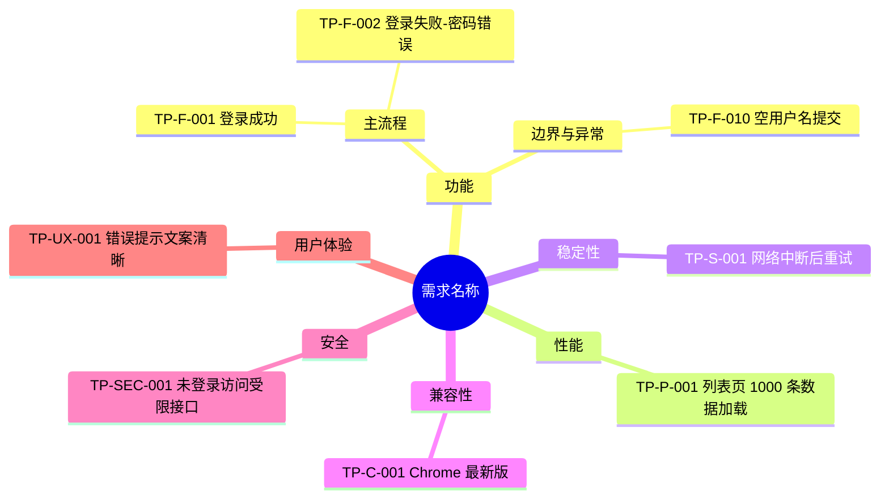

# 高质量测试点与测试用例生成

## 怎么读这份文档

按需跳读，不必通读。**每个 Phase 的强制规则都在该 Phase 段内**，放行条件汇总在 Phase 4 末尾。

### 新增规则该写到哪（**加规则前先读这条**）

这份 skill 会持续加规则。**放错位置会让本文件无限膨胀**，而它每次调用都要整份进上下文——
膨胀到一定程度，模型读不完前面的强制规则，先前那些门禁就等于不存在了。
所以位置不是风格问题，是有效性问题。按下表归位：

| 规则的性质 | 写到哪 | 判据 |
|-----------|-------|------|
| **动手前必须知道**，否则会做错 | 本文件对应 Phase 段 | 不知道它就会产出错误交付件 |
| **机器能算的判定** | `tcgen/` 代码 + 本文件门禁表**一行** | 能写成集合运算/正则就不要写成散文 |
| 判定的详细口径、踩坑经过、故障注入记录 | [pipeline.md](pipeline.md) | 是「排查时才查」而非「动手前要背」 |
| 输出格式、模板、反模式示例 | [templates.md](templates.md) | 是「照着抄」的东西 |
| 通用异常事件与交叉选点 | [exception-library.md](exception-library.md) | 与具体项目无关的事件库 |

**两条硬性约束**：

1. **门禁正文只写「查什么 + 判据」，不写「怎么踩过的」**。踩坑经过一律进 pipeline.md
   的「易错点」，本文件只留一行指针。理由：踩坑记录是给排查的人看的，而门禁是给
   执行的人看的，混在一起两边都读不快。
2. **能进代码的不要留在文档里**。写进 `tcgen.audit.gates()` 的判定，本文件只需在
   门禁表里占一行；文档重复一遍代码逻辑，等于给自己造了第二个真源——
   代码改了文档不会跟着改，两处判定必然分叉（本 skill 已因此踩过两次）。

| 我要做什么 | 看哪节 |
|-----------|--------|
| 摄入文档 / **被测系统可访问时怎么摄入** | [Phase 0](#phase-0文档摄入扩展输入源) |
| 输出需求分析与待确认问题（A–G 七组固定模板） | [Phase 1](#phase-1需求分析--待确认问题) |
| 拆 REQ、**先逐行核对需求全集** | [Phase 1.5](#phase-15需求原子化清单req) |
| 出测试点、六维度、覆盖深度标准 | [Phase 2](#phase-2测试点思维导图) |
| 写用例、**防坍缩与防 1:1 退化**、组合遍历 | [Phase 3](#phase-3测试用例主表--附表) |
| **专项测试同步采 CPU/内存**（资源观测专项项，有专项即强制） | [Phase 3 资源观测专项项](#资源观测专项项有专项测试即强制硬门禁-19) |
| 质量审计、**放行条件（A 组脚本判 / B 组人工判）** | [Phase 4](#phase-4质量审计强制) |
| 交付件形式、命名、思维导图分组方式 | [交付物规范](#交付物规范强制) |
| 跑构建管道、飞书推送（**表格与画板两条链路**）、踩过的坑 | [pipeline.md](pipeline.md) |
| 输出模板、反模式库、组合遍历规范 | [templates.md](templates.md) |
| 通用异常事件（EX）与交叉选点 | [exception-library.md](exception-library.md) |

**最容易漏的六件事**（均为真实踩过，详见各 Phase）：

1. **需求全集没逐行核对** → 整条需求漏测，且章节反查也发现不了（Phase 1.5）
2. **只读需求文档、没读被测系统** → 用例写成文档描述的样子而非实际操作方式（Phase 0）
3. **测试点与用例 1:1 退化** → 测试点层只是复读用例标题，评审看不出测了哪些方面（Phase 3）
4. **多参数需求没遍历组合** → 凭直觉挑典型值，必漏（templates.md）
5. **有专项测试却没同步采 CPU/内存** → 整机长跑是资源问题唯一暴露窗口，
   跑完才发现没采只能重跑（Phase 3 资源观测专项项 / 门禁 19）
6. **只推了表格、没推画板** → 本地 `.mmd` 重建成功便宣称「导图已更新」，
   而线上画板停在上一版，用户打开文档才发现（门禁 18 / `sync_board.py`）

## 核心原则

1. **仅高质量模式**：所有输入均按高质量流程执行，不提供普通模式
2. **严格分阶段**：不得跳过或合并阶段；每阶段结束必须等待用户确认
3. **基于证据**：所有输出必须可追溯到原文、确认结论或补充材料
4. **先问后写**：不明确的信息先进入待确认问题，不得自行假设
5. **可执行可评审**：输出必须同时满足执行落地和评审追溯

## 工作流总览

```
Phase 0  文档摄入（需求/技术方案/UI/交互）
   ↓
Phase 1  需求分析 + 待确认问题清单  ← 等待用户/产品确认
   ↓
Phase 1.5 需求原子化清单（REQ）    ← 等待用户确认可测范围
   ↓
Phase 2  测试点思维导图（六维度）   ← 等待用户确认测试点
   ↓
Phase 3  测试用例主表 + 附表
   ↓
Phase 4  质量审计（四报告 + 硬门禁）
```

每阶段开始时说明目标，阶段结束时明确提示「请确认后继续」。

## 交付件构建管道（强制复用）

Phase 3/4 落地交付件时**必须复用 `scripts/` 下的现成管道**，详见 [pipeline.md](pipeline.md)。
**禁止**现场重写 openpyxl 建表、审计集合运算、drawio 拼 XML、飞书格式与图表重建这些代码。

`$SKILL` 为本 skill 目录（Windows 如 `D:/P_TestCase/skills/req-testcase-generator`，
Ubuntu 如 `~/P_TestCase/skills/req-testcase-generator`）。**Windows 与 Ubuntu 用同一套命令**：

```bash
cp $SKILL/scripts/project_template/*.py ./     # 1. 复制模板到项目目录
echo "$SKILL" > .tcgen_home                    # 2. 指明 skill 位置（项目在 skill 仓库内可省）
#    换机器只改这一个文件；写各自系统的绝对路径即可
# 3. 只改数据层 reqs.py / cases_*.py / d_ex_*.py / spec.py，与 build.py 顶部 CONFIG
python build.py                                # 4. 产出 xlsx + drawio，并打印硬门禁结论
python sync_feishu.py all                      # 5. 飞书格式与饼图重建（先回填 sheet_id）
```

**跨平台**：管道在 Windows 与 Ubuntu 上通用，只需 Python 3 + `openpyxl`；飞书交付件另需
`npm i -g lark-cli && lark-cli auth login`（**授权凭据存在用户目录下，不随 skill 目录复制，
换机器必须重新登录**）。lark-cli 装在非 PATH 位置时设环境变量 `TCGEN_LARK_CLI` 指向可执行文件，
不要改代码。路径定位与编码差异统一收在 `tcgen/plat.py`，**严禁在代码里写死绝对路径**
（写死后换机器只有飞书那半边失效，本地 xlsx/drawio 照常产出，极易误判为网络或授权问题）。

分层原则：**数据层**（REQ 正文、用例正文、飞书 token、业务阈值）每个项目重写，这是测试设计
本身；**构建层与同步层**（`tcgen/`）照搬不改，且严禁把项目专有常量写进 `tcgen/`。现场重写会让
配色、审计口径、列宽规则、图表行号解析逐项漂移，同一 skill 在不同项目产出不同范式的交付件。

## 编号体系（三级追溯主键）

全流程通过三级 ID 建立双向追溯链路 `REQ → TP → TC`，含义与编号规则如下：

| ID | 全称 | 含义 | 产生阶段 | 编号规则 | 示例 |
|----|------|------|---------|---------|------|
| **REQ-ID** | Requirement ID（需求条目） | 从输入文档拆分出的最小可测需求条目，是覆盖率计算与追溯的唯一基础 | Phase 1.5 | `REQ-{三位序号}` | `REQ-001` |
| **TP-ID** | Test Point ID（测试点） | 针对某条 REQ、从六维度拆解出的测试关注点，是用例设计的中间抽象 | Phase 2 | `TP-{维度缩写}-{序号}`（维度缩写：F 功能 / P 性能 / S 稳定性 / C 兼容性 / SEC 安全 / UX 用户体验） | `TP-F-001` |
| **TC-ID** | Test Case ID（测试用例） | 可直接执行的具体测试用例，一案一验 | Phase 3 | 普通 `TC-{模块缩写}-{三位序号}`；专项 `TC-SP-{模块缩写}-{三位序号}` | `TC-LOGIN-001`、`TC-SP-OBST-001` |

**追溯关系**：一条 REQ 可拆多个 TP，一个 TP 可拆多条 TC；反向每个 TP 必须挂 ≥1 个 REQ、每条 TC 必须回溯到 REQ。三者的映射由追溯矩阵（`REQ-ID → TP-ID → TC-ID`）统一记录。

## 交付物规范（强制）

所有正式交付件必须**独立分开呈现，一个交付件一个文件，禁止把多种交付件混在一起**。**表格类交付件一律用 Excel 形式**；**测试点思维导图**单独交付为**可直接导入飞书云文档的 Draw.io（`.drawio`）格式**；**测试计划**单独交付为**可导入飞书在线文档的 `.md` 文档**。最终交付清单如下：

**交付件名称必须使用中文**（文件名 / Sheet 名 / 工作簿标题一律用中文，禁止英文或拼音）。最终交付清单如下：

| 交付件（中文名称） | 内容 | 对应阶段 | 形式 |
|------------------|------|---------|------|
| 需求原子化清单 | REQ 条目表 | Phase 1.5 | Excel |
| 测试点思维导图 | 需求名 → 六维度 →〔模块〕→ 测试点 → 测试用例，命名 `XX项目测试点` | Phase 2 | Draw.io（`.drawio`，导入飞书云文档）／Mermaid（`.mmd`，写入飞书画板） |
| 异常交叉适用性矩阵 | `EX × 阶段原型` 逐格适用性判定（如有通用异常事件纳入） | Phase 2 | Excel |
| 测试计划 | 范围目标/策略/资源/进度/准入准出/风险/缺陷流程/交付物清单，命名 `XX项目测试计划` | Phase 3 | Markdown（`.md`，可导入飞书在线文档） |
| 测试用例主表 | 执行用例，固定表头 | Phase 3 | Excel |
| 评审追溯表（含风险评估） | 评审追溯、风险、用例状态 | Phase 3 | Excel |
| 追溯矩阵表（REQ-TP-TC） | `REQ → TP → TC` 追溯矩阵 | Phase 3 | Excel |
| 专项测试用例表 | 专项指标定义表（如有专项测试） | Phase 3 | Excel |
| 专项数据采集表 | 每条专项用例 N 次采样统计（如有专项测试） | Phase 3 | Excel |
| 质量审计报告 | 覆盖率/可执行性/质量缺陷/优先级合理性四报告 + 总说明 + 图表 | Phase 4 | Excel |

规则：

1. **一件一 Sheet，汇入同一个工作簿（强制）**：**表格类交付件**（除思维导图、测试计划外）组织为**同一个 Excel 工作簿内的多个独立 Sheet**（一个交付件 = 一个 Sheet），便于统一管理。主表与附表分开、追溯表单独成 Sheet，**不得把多种交付件合并列拼在同一张 Sheet 里**。Sheet 顺序建议按上表交付清单顺序排列。
2. **Excel 交付件（强制）**：**表格类交付件**（除思维导图、测试计划外）的最终交付形式**必须是 Excel（飞书电子表格或本地 `.xlsx`），严禁以 `.md`、`.csv`、`.txt` 或对话内 Markdown 表格作为正式交付**。Markdown 表格仅用于对话中预览，确认后必须落成 Excel。
   - 统一为**一个工作簿多 Sheet**：本地 `openpyxl` 生成单一 `.xlsx`（多 Sheet），文件名 `测试交付件-{需求名}-{日期}.xlsx`；飞书切 `lark-sheets` skill 建**一个电子表格**、每个交付件一个 Sheet。Sheet 名用上表中文名称。不得用 `.md`/`.csv` 顶替。
3. **Excel 交付件名称必须为中文（强制）**：文件名、Sheet 名、工作簿标题一律使用上表的中文名称（如「测试用例主表」「评审追溯表（含风险评估）」「追溯矩阵表（REQ-TP-TC）」），禁止用英文、拼音或代号。
4. **Excel 表格格式（强制，每个交付表都要满足）**：
   - **首行（表头）字体加粗**；
   - 表头所在行**默认带筛选下拉框**（飞书表格用筛选视图/筛选器；`openpyxl` 用 `ws.auto_filter.ref` 覆盖表头+数据区域）；
   - **列宽自适应内容**：按每列（含表头与数据）的最大文本长度自动调整列宽，保证内容不被截断（飞书表格调整列宽；`openpyxl` 按各列最长字符估算 `column_dimensions[col].width`，中文字符按≈2 倍宽度估算，可设上限如 60）。
5. **默认只交付飞书在线电子表格；本地 `.xlsx` 按需生成**：表格类交付件（除思维导图、测试计划外），**默认只生成飞书在线电子表格一套**（多 Sheet、格式与中文命名齐全），**仅当用户明确要求本地文件时才额外生成本地 `.xlsx`**，以减少重复生成、加快交付：
   - **默认（飞书一份）**：切 `lark-sheets` skill 建**一个在线电子表格**（每个交付件一个 Sheet），并返回可访问链接。
   - **按需（本地一份）**：用户明确要本地交付件时，用 `openpyxl`（或 `pandas` + `openpyxl` 引擎）真实写盘生成**一个多 Sheet 的 `.xlsx` 二进制文件**，使用者可用 Excel/WPS 打开、编辑、保存；**不得**把 Markdown/CSV 改后缀冒充或只贴文本让用户自行转换；生成后**告知文件的实际保存路径**。
   - 若两套都出，建议同名（本地文件名与飞书表格标题一致），交付时同时给出**飞书链接**与**本地路径**。
   - 交付前自检：飞书表格链接可访问（如另出本地则文件确为 `.xlsx`、可编辑保存）；交付件均满足各交付件独立成 Sheet、表头加粗+筛选+列宽自适应、名称为中文。
6. **思维导图交付件（Draw.io，完全适配飞书在线思维导图）**：
   - 对话中用 Mermaid `mindmap` 预览；正式交付**另出一份 Draw.io 文件**，**命名 `XX项目测试点`**（如 `咖啡机项目饮品APP测试点.drawio`）。
   - **必须适配飞书思维导图连线**：左→右树布局、节点分列不重叠、edge 用正交圆角无箭头样式（`orthogonalEdgeStyle;endArrow=none;` 父右→子左），避免导入后连线错乱/黑箭头。
   - **必须出到用例层（强制）**：根=需求名 → 维度 →〔模块〕→ 测试点 → **测试用例**。评审时要能照图说明「测哪些维度 → 哪些模块 → 哪些测试点 → 每个测试点具体测哪些方面」，只到测试点层看不出覆盖了哪些方面，不合格。TC 节点文本 = `TC-ID [覆盖类型·优先级] 用例标题`（如 `TC-SAVE-006 [异常·P1] 保存过程中失败时配置不生效并提示`），一眼可见该测试点是否正反向都覆盖了。
   - **单一维度 TP 数 ≥12 时必须插入「模块」层（强制，防标签跑出屏幕）**：思维导图（尤其飞书画板的原生自动布局）把父节点摆在其**整个子块的垂直中心**。某维度独占大半测试点时（实测功能维度占 79 个 TP 中的 56 个），其子块高达 4000px 以上，维度标签被摆到正中间，读者滚到最上面几行测试点时标签已在屏幕外，**看起来就是「维度丢了、直接显示 TP-TC」**——这不是数据缺失，是布局问题，查画板 `mind_map.parent_id` 树会发现维度节点其实都在。插入模块层后单块高度回落到数百 px，标签始终在其子节点近旁。模块由 `tcgen.drawio` 按 TC-ID 的模块缩写自动分组（`group_min=12`），**模块名必须给中文**（`module_names=`），缺失会回退成英文缩写，违反交付件中文命名要求。TP 数 <12 的维度不分组，否则会被拆成一堆单元素组。
   - 层级与 Mermaid 一致，TP 节点文本以 `TP-ID` 开头、TC 节点以 `TC-ID` 开头，均可追溯回追溯表。模板见 [templates.md](templates.md) 「思维导图 Draw.io 格式」。
   - **需求文档自带编号体系时，顶层改按需求编号分组（推荐）**：产测工具、设备类需求常有
     `F01/F02…` 这类编号，读者关心的是「**F17 要测哪些方面**」，而不是「功能维度下有哪些测试点」。
     按维度分组会把同一条需求的测试点散到多个维度里，评审时看不出某条需求的测试面是否完整。
     用 `tcgen.drawio` 的 `group_by=`（传入 `用例 → 分组标签` 的函数，标签从 REQ 清单的
     来源章节反推，不另维护映射表）。维度语义不丢：TP 前缀仍带维度，硬门禁 14 照常校验，
     同一需求下可同时出现 `TP-F-xxx` 与 `TP-S-xxx`。普通产品需求（无编号体系）保持默认六维度。
     **需求清单 Sheet 同步在首列加「需求编号」**（见 Phase 1.5 规则 10），两个交付件的组织轴对齐。
   - **状态已确认但当前不可测的需求，也要在导图上留占位节点**：写成
     `[阻塞] {需求名}：{原因}（待 Qxx）` 并不挂用例。否则 12 项需求只看到 9 项，
     评审无法分辨「漏测」与「有意挂起」。可测化之后删掉占位、挂真实用例。
   - **交付目标是飞书画板（whiteboard）时改走 Mermaid**：`.drawio` 只能导入飞书云文档，**飞书画板不认 `.drawio`**。文档里已嵌画板（`docs +fetch` 返回 `<whiteboard token="..."/>`）时，用 `tcgen.drawio.mermaid()` 出 `.mmd`，再经 `whiteboard-cli --to openapi` 管道给 `lark-cli whiteboard +update --overwrite` 原地更新，文档链接不变。两种输出共用 `tcgen.drawio.derive()`，层级天然一致；**严禁手写 Mermaid**，否则与 `.drawio` 各写一份必然漂移。`--overwrite` 会删除画板原有全部节点，执行前先 `+query --output_as raw` 备份。
7. **测试计划交付件（默认飞书在线文档；本地 Markdown 按需）**：
   - **默认只交付飞书在线文档一份**（切 `lark-doc` skill 用 `docs +import`/创建导入为在线文档），返回飞书文档链接；**仅当用户明确要求本地文件时才额外生成本地 `.md`**，交付时给出本地路径。
   - **命名 `XX项目测试计划`**（如 `咖啡机项目饮品APP测试计划.md`），**必须包含**：测试范围与目标、测试策略与方案概述、资源安排、进度计划、准入标准、准出标准、风险分析与应对、缺陷管理流程、交付物清单。
   - **测试策略与方案概述用表格呈现**，并含按测试类型的优先级排序：功能/接口测试先通过 → 性能/稳定性测试 → 专项测试 → 回归测试，前一阶段有阻塞级缺陷不进入下一阶段。
   - **流程图用第三方画图 skill（如 archify）生成的图直接嵌入文档**：正式交付的测试计划里，流程图应直接放**第三方 skill 生成的图片/图形**（导出 PNG/SVG 嵌入文档），**替代 Markdown 版 Mermaid 代码块**（Mermaid 仅在对话预览用）。飞书在线文档里插入该图片，本地 `.md` 里用图片引用（``）指向导出的图，不再保留 ```mermaid 源码块作为正式呈现。
   - **必须规划回归测试阶段**：放在所有测试项完成且 BUG 收敛之后进行，主要覆盖 P0 与部分 P1 用例。
   - **准出标准须为**：用例执行率 100%、无阻塞级缺陷、遗留缺陷均经过评审且有处理结论或应对方案（另含覆盖/深度达标、专项指标达标如有）。
   - **缺陷管理流程**一节可留白（占位，后续手动贴链接/附件）；其余各节须结合本需求写实质内容。
   - 完整模板见 [templates.md](templates.md) 「测试计划模板」。
8. 阶段性说明、建模产物（判定表/状态图等）在对话中呈现，不单独作为交付件，但其信息须能追溯到上述表。
9. 交付前核对：上表中「有专项测试才输出」的两项、以及「异常交叉适用性矩阵」（仅纳入通用异常事件 EX 时输出）按实际情况取舍，其余为必交项。

---

## Phase 0：文档摄入（扩展输入源）

根据输入类型选择读取方式（详见 [doc-ingest.md](doc-ingest.md)）：

| 输入类型 | 识别特征 | 读取方式 |
|---------|---------|---------|
| 飞书文档 | `feishu.cn` / `larksuite.com` / `doubao.com` 的 `/docx/`、`/wiki/` URL | 切 `lark-doc`：`lark-cli docs +fetch --doc "<url>"` |
| 飞书云盘文件 | `/file/` URL 或本地路径指向已上传文件 | 切 `lark-drive`：`drive +download` 或 `drive +preview` |
| PDF | `.pdf` 后缀或用户声明 | `Read` 工具；不可读时用 `python -m pypdf` 提取文本 |
| Word | `.docx` / `.doc` | `Read` 工具；不可读时用 `python-docx` 提取 |
| 纯文本 | `.txt` / `.md` | `Read` 工具直接读取 |
| 用户粘贴正文 | 聊天中直接给出需求内容 | 直接作为需求原文，标注来源为「用户输入」 |

支持文档内容类型：需求文档、技术方案文档、UI 设计文档、交互文档。

### 被测系统可访问时，必须摄入「实现形态」而不只是需求文档（强制）

用户给了可访问的被测系统（工具地址、测试环境、配置接口）时，**它与需求文档同为一等输入**，且在「用例怎么写」这件事上**优先级高于需求文档**——文档说的是要做什么，系统说的是实际怎么用。二者不一致时按 Phase 1.2 的 B 组提问，不要照文档写完就交。

摄入顺序（后一步能纠正前一步的误判，别跳）：

| 步骤 | 做什么 | 为什么 |
|------|--------|--------|
| ① 配置/流程定义 | 找系统的流程或工序定义接口（如 `recipe`、`workflow`、`stages` 配置），取**完整正文** | 这里通常有每个测试项的判定原理、前提条件、操作步骤、预期现象、错误码——**这是可判定预期的主要来源** |
| ② 前端实现 | 读前端 bundle 的控件、参数、枚举、禁用条件 | 组合边界与非法组合防护只能从这里看出来 |
| ③ 只读接口实测 | 调只读接口看真实返回 | 拿到真实数据形态与当前环境状态 |
| ④ 版本核对 | 确认系统当前版本，并记录进用例备注 | 实现形态跟版本绑定，换版本要能快速复查 |

**三条铁律**：

1. **前端兜底常量 ≠ 真实配置**。前端常在后端不可达时回退到内置常量。实测踩过：据前端常量写成「流程 17 个工序」，而后端真实配置是 **30 个**，连首个工序名都不同——用例范围与工序命名全错。判据：**能从后端接口取到配置就用接口的**，前端常量只在无接口时用，且要标注来源。
2. **"文档没写数值"不等于"无法判定"**。用例的预期只需与**判定主体**一致：判定由工具自动做时，预期写「工具判定为 PASS/FAIL + 具体错误码」即可，不必知道阈值。实测踩过：某需求因「精度阈值文档未给」被整条标阻塞，而工具本就是自动判定的，白挂了一轮阻塞。**标阻塞前先问：判定由谁做？**人工判 → 缺阈值确实阻塞；工具判 → 不阻塞，改测「判定结论与错误码是否正确」。
3. **零命中要区分「未交付」与「不在这个系统里」**。某需求在被测工具内检索不到时，先确认它是否落在**另一个系统**（配套 APP、桌面端、嵌入式侧）。实测踩过：一条需求在产测工具内零命中，被判为疑似未交付，实际是在配套桌面端的另一个 APP 里，流程完全存在。判为「未交付」前必须列出已检索的系统范围，并在 Phase 1.2 提问确认落点。

**摄入完成后输出简短摘要**（3-5 条）：文档类型、标题、版本/日期、涉及模块、核心约束；**若摄入了被测系统，另附：系统版本、流程工序数、与需求条目的对应关系（哪些需求能对上工序、哪些对不上）**。然后进入 Phase 1。

---

## Phase 1：需求分析 + 待确认问题

### 1.1 需求分析

输出结构：

```markdown
## 需求分析摘要

### 背景与目标
[一句话说明需求要解决什么问题]

### 功能范围
| 模块/功能 | 描述 | 来源章节 |
|----------|------|---------|
| ... | ... | ... |

### 用户角色与场景
| 角色 | 典型场景 |
|------|---------|
| ... | ... |

### 业务规则与约束
- [规则 1]（来源：...）
- [规则 2]（来源：...）

### 非功能需求（文档已提及）
- 性能：...
- 兼容性：...
（无则写「文档未提及」）

### 边界与排除范围
- [明确不在本次范围内的内容]
```

### 1.2 待确认问题清单（固定模板，强制遵循）

**必须穷尽**文档中缺失、模糊、矛盾或影响测试设计的信息。**表格列与分组规则写死如下，不得改动、不得增删列、不得替换为其他分类维度。**

**固定表头（4 列，顺序固定）**：`# | 待确认问题 | 文档具体位置 | 影响范围 | 我的建议`

**固定分组（按优先级 A→G，七组固定；某组无问题时保留标题并写「（无）」，不得删组或改名）**：

- **A. 范围与版本边界（最优先——决定 REQ 全集）**：版本裁剪、模块是否本期、专项是否纳入、排除项等，任何影响 REQ 全集大小的问题一律进 A 组。**产品形态为机器人/整机/智能硬件时，本组必须固定包含一条「本期纳入哪些通用异常事件（EX）」**（如急停 `EX-001`、低电量 `EX-002`、定位丢失 `EX-003`，库见 [exception-library.md](exception-library.md)），因为它直接决定 REQ 全集大小。
- **B. 文档内部矛盾 / 笔误（影响用例预期）**：编号重复、阈值不自洽、同一规则两处表述冲突、明显笔误等。
- **C. 业务规则待明确（文档提到但没讲清）**：文档已提及但逻辑不完整、缺分支、缺异常处理的规则。
- **D. 阈值 / 参数缺失（测试需要具体数值）**：精度、超时、并发、文件大小、字符长度、错误码清单等测试需要的具体数值。
- **E. 画板 / 素材与正文的关系**：画板、语料包、附件等非正文来源的内容是否纳入 REQ、以何口径纳入。无画板/素材来源时写「（无）」。
- **F. 非功能 / 环境依赖**：权限、上报、存储保留、机型迁移、测试环境/mock 等。**产品形态为机器人/整机/带运动部件的智能硬件时，本组必须固定包含功能安全提问**：是否有急停/安全边界/光幕/碰撞保护要求、停止时限指标（多久内停到什么状态）、解除与恢复方式（是否需二次确认）、失效安全（断电/断气/断网）默认动作。文档未提及也必须问，不得默认「文档未提即不测」。
- **G. 其他/低关联确认项（与测试用例设计和交付件输出关联性不强，仅登记备查）**：与测试点/用例/追溯矩阵/审计门禁**都无直接关联**的项目管理与交付协同类问题，例如：上线时间与发布节奏、硬件是否已正常出货/到货、市场物料与运营口径、跨团队排期对齐、灰度放量策略等。**这类问题只登记备查、不拆成 REQ、不进覆盖率分母、不阻塞任何阶段推进**；即使全部悬而未决，Phase 1.5→Phase 4 仍可照常向前走。若某条 G 组问题在后续讨论中被判定"其实会影响用例设计"，必须**改挂**到 A–F 对应组重新处理，不得留在 G 组绕开规则。

```markdown
## 待确认问题清单

> 请将以下问题与产品/需求方确认后回复，确认完毕再进入测试点设计。

### A. 范围与版本边界（最优先——决定 REQ 全集）
| # | 待确认问题 | 文档具体位置 | 影响范围 | 我的建议 |
|---|-----------|------------|---------|---------|
| Q1 | ... | 《XX文档》七、版本规划 / 或「文档未提及」 | 决定是否覆盖 XX 需求 | 本期只覆盖 V1.0+V2.0，排除 V3.0 |

### B. 文档内部矛盾 / 笔误（影响用例预期）
| # | 待确认问题 | 文档具体位置 | 影响范围 | 我的建议 |
|---|-----------|------------|---------|---------|
| Q2 | ... | 《XX》4.1 表 与 4.2 正文冲突 | 需求编号与追溯映射 | 以正文为准 |

### C. 业务规则待明确（文档提到但没讲清）
| # | 待确认问题 | 文档具体位置 | 影响范围 | 我的建议 |
|---|-----------|------------|---------|---------|
| Q3 | ... | 《XX》4.2.2 | 异常流程用例预期 | 需产品明确；暂按 XX |

### D. 阈值 / 参数缺失（测试需要具体数值）
| # | 待确认问题 | 文档具体位置 | 影响范围 | 我的建议 |
|---|-----------|------------|---------|---------|
| Q4 | ... | 《XX》4.2.1 | 边界值 / 接口用例 | 需开发提供具体数值 |

### E. 画板 / 素材与正文的关系
| # | 待确认问题 | 文档具体位置 | 影响范围 | 我的建议 |
|---|-----------|------------|---------|---------|
| Q5 | ... | 《XX》用户旅程画板（token …） | 是否新增 N 条 REQ | 纳入 REQ 并标注「来源:画板,口径待产品确认」，不阻塞主流程 |

### F. 非功能 / 环境依赖
| # | 待确认问题 | 文档具体位置 | 影响范围 | 我的建议 |
|---|-----------|------------|---------|---------|
| Q6 | ... | 文档未提及 | 是否纳入安全/权限测试 | 需产品确认；文档未提暂不测 |

### G. 其他/低关联确认项（与用例设计和交付件无直接关联，仅登记备查，不阻塞推进）
| # | 待确认问题 | 文档具体位置 | 影响范围 | 我的建议 |
|---|-----------|------------|---------|---------|
| Q7 | 计划上线时间 / 发布节奏是否已定 | 《XX》八、发布计划 / 或「文档未提及」 | 不影响用例设计与交付件，仅供排期参考 | 登记备查，不拆 REQ，不阻塞测试设计 |
| Q8 | 硬件是否已正常出货/到货 | 文档未提及 | 不影响用例内容，仅影响执行时机 | 登记备查，执行前由项目侧确认即可 |
```

**问题编写要求**：
- 每条问题具体、可回答（避免「是否考虑异常」这类空泛提问）
- **`我的建议` 列必填**：给出一个可执行的默认处置（如「本期只覆盖 V1.0+V2.0」「以正文为准」「纳入 REQ 但标注来源画板」「需产品确认，暂不测」），让确认方可直接「同意/否决」而非从零思考
- **`文档具体位置` 必填**：指出该问题对应的文档章节/段落（如 `《咖啡售卖》4.2.3`、`技术方案 4.1 接口设计`），方便人工回原文核对；文档中完全缺失的维度写「文档未提及」，矛盾项写清冲突的两处位置（如 `《咖啡售卖》4.1 表 与 4.2 正文冲突`）
- **全局连续编号**：Q 编号跨组连续递增（A 组 Q1、Q2…接 B 组 Q3…），不在每组内重新从 1 计数

**分组末尾固定附「优先级说明」**（写死，紧跟在最后一组表格后）：

```markdown
**优先级说明**：
- A 组必须先定，直接决定 REQ 全集边界；
- B 组影响用例预期结果，建议一并裁定；
- C/D/E/F 组可标「待产品确认」，将在 REQ 清单中挂「待确认」状态，不阻塞主流程推进；
- G 组与用例设计和交付件无直接关联，仅登记备查、不拆 REQ、不进覆盖率分母、不阻塞任何阶段；若某条后续被判定会影响用例，须改挂到 A–F 组重新处理。
```

**阶段结束语**（固定格式）：

> Phase 1 完成。请与产品确认上述问题后，将答案一并回复（可逐条回复或补充说明）。确认后我将输出需求原子化清单（Phase 1.5）。

**用户仅部分确认时**：已确认部分标注 ✅，未确认部分保留并说明对测试点/用例的影响范围。

---

## Phase 1.5：需求原子化清单（REQ）

**前置条件**：Phase 1 的待确认问题已得到回复，或已明确哪些问题暂不确认。

### 目标

将输入文档拆分为最小可评审、可追溯、可覆盖的需求条目，为后续测试点和用例建立唯一追溯主键。

### 输出要求

必须输出 `REQ` 原子化清单，格式如下：

```markdown
## 需求原子化清单

| REQ-ID | 需求描述 | 来源文档 | 来源章节/段落 | 类型 | 可测性 | 覆盖状态 | 备注 |
|--------|---------|---------|--------------|------|--------|---------|------|
| REQ-001 | 用户可使用账号密码登录 | PRD | 2.1 登录 | 功能 | 可测 | 待覆盖 | - |
| REQ-002 | 登录接口 P95 <= 500ms | 技术方案 | 4.2 性能指标 | 性能 | 可测 | 待覆盖 | - |
| REQ-003 | 是否支持 SSO 登录 | PRD | 2.1 登录 | 功能 | 不可测 | 阻塞 | 待产品确认 |
```

### 需求全集必须逐行核对并回报计数（强制，最先做）

拆 REQ 之前，先把输入文档的**需求条目表逐行过一遍**，按状态列分类计数，并在对话中把这笔账明确回报给用户：

```
需求条目表共 N 行 → 本期范围 X 项（状态列命中纳入标记）
  纳入：F02、F03、F04、…（逐个列出编号）
  排除：F01(⚠️未完成)、F12(❌挂起)、…（逐个列出编号 + 排除依据）
```

**三条铁律**：

1. **不得凭进展描述推断状态**。状态列（如 `完成状态`、`是否本期`）是唯一依据。实测踩过：某需求状态列是 ✅，但「进展与计划」列写着「@某人 BUG修复中」，据此把它读成 ⚠️ 未完成，**整条需求从头到尾没进过 REQ 清单，也没进待确认问题清单**，直到用户核对数量才发现。进展列写什么都不改变状态列的结论；两者矛盾时进 Phase 1.2 的 B 组提问，不要自行裁定。
2. **回报计数，让用户能一眼核对**。只说「覆盖 8 项」用户无法验证；必须给出「文档 N 行 → 纳入 X 项 → 逐个列编号」，用户看一眼就知道数量对不对。**交付时若纳入数 ≠ 文档标记数，必须逐项说明每一项去哪了**（纳入/阻塞/排除各是哪些、依据是什么），不得只报纳入数。
3. **状态解析写进对账表**。把逐行状态解析结果作为 Phase 1.5 的对账凭据保留（哪一行、状态列原值、判定结论），供复核；解析靠正则或人工逐行都可以，但不能只留一个总数。

> 该核对与 4.1.1 A 组的「来源章节反查差集」互补：章节反查查的是「已拆 REQ 是否漏了文档章节」，本条查的是「需求条目表的行是否漏了整条需求」——**一行需求整条没进清单时，它的章节也不会出现在来源列，章节反查同样发现不了**，两者都得做。

### 规则

0. **顶部输入来源行**：Sheet 最上方用一行合并单元格附上本次输入的需求文档/设计稿/原型/技术方案**链接**（注明类型）；**仅当输入是链接时才附**，若输入为本地文档则此行留空或写「本地文档，无链接」，不强制贴路径。
1. 每条需求必须有唯一 `REQ-ID`
2. 每条需求必须标注来源文档与章节/段落。**来源允许两类**：① 输入文档（写文档名 + 章节）；② **通用异常注入库**（`来源文档` 写 `异常注入库`、`来源章节/段落` 写 `EX-00X`，见 [exception-library.md](exception-library.md)）。EX 来源的 REQ 与文档来源的 REQ **地位完全相同**，同样进覆盖率分母、同样受覆盖深度与追溯门禁约束；`EX-ID` 只是来源目录，**不作为第四级追溯主键**，链路仍为 `REQ → TP → TC`
3. `可测性` 仅允许：`可测` / `不可测`
4. `覆盖状态` 初始值仅允许：`待覆盖` / `阻塞` / `N/A`
5. 文档中不明确、互相冲突或缺少验收标准的条目，标记为 `不可测`
6. `不可测` 条目不得直接进入正式测试用例，必须先进入待确认问题或标记 `N/A`
7. 「覆盖 100%」仅统计「已确认且可测」的 REQ；`阻塞` / `N/A` 不计入分母，但必须逐条列出原因
8. **需求文档自带编号体系时，清单首列加「需求编号」**（如 `F17`）：读者能一眼看到「F17 拆出了
   哪几条 REQ」，与按需求编号组织的思维导图对齐。编号从「来源章节」列反推，不另维护映射表。
   **数据层必须把它挂在 REQ 元组末尾（索引 8），不能插在前面**——`tcgen.audit` 全部按固定位置
   读字段（`r[4]` 类型 / `r[5]` 可测性 / `r[6]` 覆盖状态…），插在前面会让所有索引错位，
   而且错得隐蔽：类型列读到可测性、可测性读到覆盖状态，门禁照样跑完只是结论全错、不报异常。
   渲染时由 `tcgen.xlsx.build_req` 自动移到首列，见 `test_xlsx_req_col.py`。

### 阶段结束语

> Phase 1.5 完成。请确认需求原子化清单中的可测范围、阻塞项和 N/A 项。确认后我将基于这些 REQ 条目输出测试点思维导图。

---

## Phase 2：测试点思维导图

**前置条件**：用户已确认 REQ 原子化清单中的可测范围。

### 六维度测试点

从以下维度系统性拆解测试点（详见 [templates.md](templates.md) 维度检查清单）：

| 维度 | 关注点 |
|------|--------|
| **功能** | 主流程、分支流程、边界值、异常处理、权限、数据校验 |
| **性能** | 响应时间、吞吐量、并发、大数据量、资源占用 |
| **稳定性** | 长时间运行、异常恢复、重试、幂等、数据一致性 |
| **兼容性** | 浏览器/系统/设备、分辨率、新旧版本、上下游接口 |
| **安全** | **信息安全**：认证授权、越权、注入、敏感数据、审计日志<br>**功能安全**（机器人/智能硬件）：急停与保护性停止、安全边界/光幕/碰撞保护、危险动作联锁、安全状态的进入与恢复、失效安全（fail-safe）行为 |
| **用户体验** | 易用性、提示文案、加载/空态/错误态、无障碍、国际化 |

某维度在文档中未提及时：必须在 Phase 1 提问，或在 Phase 1.5 对应维度标 `N/A`（附理由），禁止静默省略。

### 安全维度的两个子域（信息安全 + 功能安全）

「安全」维度**同时包含信息安全与功能安全两个子域**，不是只管信息安全。机器人、整机、智能硬件类项目的安全需求主要落在功能安全子域，**必须与信息安全同等看待，不得因文档未写「安全」章节而省略**。

| 子域 | 保护对象 | 典型测试对象 | 判定要素 |
|------|---------|-------------|---------|
| **信息安全**（Security） | 数据与权限不被非法访问 | 认证授权、越权、注入、敏感数据脱敏、审计日志、文件上传限制 | 是否被拒绝/是否脱敏/是否留痕 |
| **功能安全**（Functional Safety） | 人身与设备不被物理伤害 | 急停按钮、安全门/光幕/急停回路、碰撞与力矩保护、速度与工作空间限制、危险动作联锁、断电/断气行为、安全状态恢复 | **停止时限**（多久内停到什么状态）+ **状态上报**（状态码/告警/日志）+ **恢复行为**（如何解除、解除后处于什么状态、是否需二次确认） |

规则：

1. **两个子域共用 `TP-SEC-` 前缀与「安全测试」类型**，维度判定不变（仍归安全维度），因此不影响硬门禁第 14 项的维度一致性校验。
2. **编号分段区分子域**（便于评审时一眼分辨，不引入新前缀、不破坏审计脚本按 `TP-{维度}-` 取前缀的逻辑）：`TP-SEC-001~099` 为信息安全，`TP-SEC-101~199` 为功能安全。REQ 清单「类型」列仍填 `安全`，在备注注明 `信息安全` 或 `功能安全`。
3. **功能安全用例的预期必须写全三要素**（停止时限 + 状态上报 + 恢复行为），只写「急停生效」「机器人停止」属反模式（不可判定），须改写为可观测量，如「≤500ms 内所有关节停止运动且抱闸生效」「状态上报 `ESTOP_ACTIVE`，APP 顶部显示急停告警条」「旋钮复位后需在 APP 点击『确认恢复』才退出急停态，不得自动恢复运动」。
4. **功能安全 ≠ 所有异常事件**。功能安全只覆盖「不做对就会伤人或损坏设备」的保护类需求（急停、光幕、碰撞保护、联锁）；不涉及人身/设备伤害的异常与容错（低电量、定位丢失、通信中断、传感器数据异常、服务重启恢复）仍属**稳定性**维度。判定口径：**该需求失效的直接后果是「伤人/损机」→ 功能安全（安全维度）；后果是「功能不可用/数据不一致/任务失败」→ 稳定性维度。**
5. 文档未提及功能安全但产品形态为机器人/整机/带运动部件的硬件时，**必须在 Phase 1.2 的 F 组提问**（是否有急停/安全边界要求、停止时限指标、恢复方式），不得默认「文档未提即不测」。

### 强制设计技法（复杂场景先建模）

命中「多条件组合 / 状态流转 / 端到端主流程 / 输入校验密集 / **通用异常事件交叉**」任一场景时，**必须先输出建模产物（判定表 / 状态迁移图 / 用户旅程 / 等价类+边界值表 / **异常交叉适用性矩阵**），再写测试点与用例**；未产出则阻断进入 Phase 3，或对应 REQ 标阻塞。建模产物中每个可测节点必须能映射到后续 `TP-ID`。

**纳入通用异常事件（EX）时，Phase 2 必须额外产出「异常交叉适用性矩阵」**（`EX × 阶段原型` 逐格判 `必测/选测/不适用` + 机制依据），作为交叉用例的唯一选点依据；**未出矩阵不得写交叉用例**，也不得凭感觉挑业务场景硬加。矩阵模板、三条适用性判定规则与升级规则见 [exception-library.md](exception-library.md)。

> 完整触发表见 [templates.md](templates.md) 「强制设计技法触发表」。

### REQ 覆盖深度最低标准（强制）

对每个 `可测` 的 REQ，覆盖不得仅有 1 条正向主路径：功能类须 ≥1 正向 + ≥1 反向/异常（可测边界再加边界），状态流转须含 ≥1 非法迁移，多条件组合须覆盖判定表每条有效规则，非功能类须 ≥1 对应维度用例且预期含可判定指标。**被专项测试覆盖的 REQ，须同时有 ≥1 条专项用例（统计指标）+ ≥1 条功能用例（只验证功能可用，不判指标达标），二者缺一即视为深度未达标。** **功能安全类 REQ（急停/光幕/碰撞保护/联锁等，见「安全维度的两个子域」），须同时有 ≥1 条触发用例（预期含停止时限 + 状态上报）+ ≥1 条解除/恢复用例（复位方式、是否需二次确认、解除后所处状态），多触发源（面板/外部回路/软件）每源 ≥1 条；缺触发或缺恢复即视为深度未达标。** 若信息不足无法补齐，对应用例标 `Blocked` 并写解除条件，不得假装”深度已覆盖”。

> 完整分类表见 [templates.md](templates.md) 「REQ 覆盖深度最低标准」。

### 输出格式

使用 Mermaid `mindmap` 语法输出思维导图，根节点为需求名称：



**测试点编号规则**：`TP-{维度缩写}-{序号}`
- 维度缩写：F=功能, P=性能, S=稳定性, C=兼容性, SEC=安全, UX=用户体验

对话中用 Mermaid 预览；**正式交付时另出一份 Draw.io 文件（命名 `XX项目测试点.drawio`），可直接导入飞书云文档**，导入规则见「交付物规范」。**正式交付的 Draw.io 必须比对话预览多一层：根=需求名 → 维度 → 测试点 → 测试用例**，把每个测试点下挂的 TC 逐条列出（`TC-ID [覆盖类型·优先级] 标题`），供评审确认每个测试点覆盖了哪些方面。由 `tcgen.drawio` 从用例集自动派生，不手工维护。

**同时输出测试点汇总表**（便于评审，`关联 REQ-ID` 为必填列）：

| 编号 | 维度 | 测试点描述 | 优先级建议 | 关联 REQ-ID | 关联待确认问题 |
|------|------|-----------|-----------|------------|--------------|
| TP-F-001 | 功能 | ... | P0 | REQ-001 | - |
| TP-P-001 | 性能 | ... | P2 | REQ-002 | Q5 |

**TP ↔ REQ 双向强制规则：**
1. 每个 TP 必须映射 ≥1 个 `REQ-ID`
2. 每个 `可测` 的 REQ 必须映射 ≥1 个 TP
3. 每个 TP 进入 Phase 3 后必须落地 ≥1 条**专属** TC，严禁多个 TP 共用一条 TC（一对多坍缩）
4. 禁止无关联 REQ 的“游离测试点”（衍生/经验补充须在备注标明来源，并挂到最近相关 REQ 或独立 N/A 项）

**TP 前缀维度必须与其下用例的真实维度一致（强制，防维度错配）：**

思维导图与审计常按 `TP-ID` 前缀（F/P/S/C/SEC/UX）自动归入六维度。因此 **TP 的前缀维度必须与挂在它下面的 TC 的实际维度严格一致**，否则思维导图会把用例归错类（如某条纯功能用例挂到 `TP-P-xxx` 上，就会被错误显示在「性能」维度下）。判定与铁律：

- **用例维度以其「测试类型」判定，再归并到六维度**：`功能测试 / 接口测试` 属**功能维度**（挂 `TP-F-xxx`）；`性能测试→性能`、`稳定性测试→稳定性`、`兼容性测试→兼容性`、`安全测试→安全`、`用户体验测试→用户体验`。
- **反向 / 边界 / 异常不是「测试类型」，是「覆盖类型」（设计视角）**，由 `cover` 字段承载。两者是不同的分类轴：**测试类型**答「属于哪类测试活动」（进主表），**覆盖类型**答「从哪个角度设计」（进附表、追溯矩阵、思维导图 TC 节点）。
  两层拦错：`tcgen.dsl.C()` 构建期 assert + 审计门禁 A16。踩坑经过见 [templates.md](templates.md)「测试类型与覆盖类型的分工」。
- **铁律：一条 TC 的维度 ≠ 其所挂 TP 的前缀维度 → 判为「维度错配」，必须修**。两种修法二选一，取决于哪边写错：
  - **TP 挂错**（用例维度是对的）：把该 TC 改挂到正确前缀的 TP（如功能用例从 `TP-P-001` 迁到新建 `TP-F-093`）。
  - **测试类型标错**（TP 是对的）：改这条 TC 的「测试类型」字段使其归入 TP 所属维度。到底改哪边，回原文/REQ 声明类型判断该用例本质在测什么。
- **专项 TP 的排他性**：`TP-P-xxx`/`TP-S-xxx` 等专项指标测试点**只承载专项指标用例本身**；被专项覆盖 REQ 的「配套功能可用性用例」（见覆盖深度标准）属于功能维度，**必须挂到独立的 `TP-F-xxx`**，严禁塞进专项 TP，否则专项测试点会被功能用例标题“污染”、维度也归错。
- **交叉印证**：`TP` 维度、`TC` 测试类型、`REQ` 声明类型三者应能对齐；若某 REQ 声明为「用户体验/安全/性能」等非功能类，其对应 TP 前缀与用例测试类型都应落在同一维度。三者不一致时先回原文定性，再统一三方。
- 该检查在 Phase 4 硬门禁固化为「TP 维度与用例维度错配数 = 0」（见硬门禁）。

**阶段结束语**：

> Phase 2 完成。请审阅测试点思维导图与 REQ 关联表，回复「确认」或指出需增删改的测试点。确认后我将输出完整测试用例表。

---

## Phase 3：测试用例主表 + 附表

**前置条件**：用户已确认测试点（或明确指出调整后的最终测试点列表）。

### 用例编写规则

1. **一条测试点可拆多条用例**，但每条用例只验证一个核心检查点
2. **操作步骤**：编号列表，每步可独立执行
3. **预期结果**：可观测、可判定（避免「正常显示」等模糊描述）
4. **步骤与预期一一对应（强制）**：操作步骤与预期结果必须**逐条一一对应，条数相等**——第 `n` 步操作对应第 `n` 条预期结果。**严禁出现多条操作步骤只对应一条预期结果**（也不允许一条步骤对应多条预期）。若某步操作没有可观测结果，该步预期写「无明显变化」或与前序合并为一步，不得留空错位；若一步操作产生多个待验证结果，须拆成多步或拆成多条用例，保持一一对应。
5. **风险驱动优先级**（用于主表优先级和附表评审依据）：
   - **P0**：核心主流程、阻塞发布、资金安全/数据安全
   - **P1**：重要分支、高频场景、严重体验问题
   - **P2**：次要功能、边界场景、一般异常
   - **P3**：低频场景、轻微体验、优化类
   - **分布比例**：主表整体按 **P0≈10% / P1≈40% / P2≈40% / P3≈10%** 划分（结合实际微调），设计时即按此比例分配；明显偏离须在质量审计「优先级合理性评估」说明原因
6. **测试类型（枚举强制，`tcgen.dsl.TTYPE_OK`）**：功能测试 / 接口测试 / 性能测试 / 兼容性测试 / 安全测试 / 稳定性测试 / 用户体验测试（专项测试另走专项两表，不进普通主表）
   - **只收这七个值**。`反向 / 边界 / 异常`是**覆盖类型**（`cover` 字段），不是测试类型；填错会被构建期 assert 与审计枚举门禁拦下。设计视角在附表、追溯矩阵、思维导图 TC 节点上体现，主表只显示六维度归属。
   - **专项测试**：针对算法性能、整机性能等需多次采样统计的指标类测试项（如识别准确率、整机任务达成率、避障成功率等）。此类用例**不使用**普通主表，必须改用「专项测试用例模板」（见 [templates.md](templates.md) 「专项测试用例模板」），按场景/维度统计每项测试 N 次的数据
   - **专项 REQ 必须同时补功能用例（强制）**：凡是被专项测试覆盖的 REQ，除专项用例外，**功能测试里必须另外补 ≥1 条基础功能可用性用例**，只验证「功能能正常触发、有正常反馈、流程能走通」，**不关注指标是否达标**。例如识别率专项 REQ：专项用例统计各场景 N 次识别率，而功能用例只验证「送入一张标准样本能返回识别结果且格式正确」即可。两类用例都要挂到同一 REQ 上（详见覆盖深度规则）
     - **唯一豁免：资源观测专项项**（`TC-SP-RES-xxx`，见下节）。它没有独立业务功能可验——「能连上机器取到一次样本」属采集工具自检，不是被测产品的功能，硬补一条即 `凑数`，为本规则所禁。故该 REQ 免于配套功能用例，`tcgen.audit` 对其做窄豁免并在审计输出写明豁免理由，防止豁免悄悄扩大到其它专项 REQ。

#### 资源观测专项项（有专项测试即强制，硬门禁 19）

**动机**：整机专项（连续 N 杯、长时导航、批量识别）是资源问题**唯一的暴露窗口**——泄漏、句柄不释放、降频导致的性能衰减都只在长跑中显形。跑完只统计成功率而不看资源，等于放掉了这次长跑最贵的一半信息；事后补采要重跑一遍整机专项，代价极高。

**定位：独立一项专项测试，不与既有专项用例合并。**

- 自成一条 `TC-SP-RES-001`（模块缩写固定 `RES`），有自己的 REQ 与 TP，进「专项测试用例表」与「专项数据采集表」，与成功率/时长/误差等专项项**并列**。
- **操作步骤依附既有专项运行**：不另造工况，写成「在 `TC-SP-xxx` 执行期间同步采集，全程不中断被测流程」。被依附的专项用例编号必须写进前置条件，形成显式依赖。
- 严禁把资源指标塞进既有专项用例的「单次判定标准」——那会让一条用例同时判两件事，违反一案一验。

**采什么**：CPU 与内存两类，指标口径见 [templates.md](templates.md)「资源观测专项用例模板」。最低必采集合——
- CPU：整机占用、**实时线程所在核各自占用**（取最大值，不取均值：控制环被挤是单核事件，均值会摊平）、**隔离核占用**（有 `isolcpus` 时；正常应恒 0，被侵占即告警）、温度与各调频域频率
- 内存：可用内存、匿名页、承诺量与其占总量比、不可回收 slab、页表、CMA 剩余（有 CMA 时）、OOM 累计计数器、主缺页与回收/refault 速率
- 归因：按服务 cgroup 采 `memory.current` 与 `memory.stat` 的 `anon`/`file`、`cpu.stat` 的 `usage_usec`

**判定口径（三类分开，不可混为一谈）**：
1. **瞬时越界**：单样本越界即记（隔离核被侵占、温度触降频跳变点、可用内存过低、CMA 将耗尽）
2. **趋势（判泄漏）**：整段最小二乘斜率 **且** 前后段中位数变化率**同向越界**才成立。只看回归会被两类曲线骗过——缓存「先涨后平」全段回归仍为正；孤立尖峰（短命进程瞬时申请）能把净变化为 0 的序列算出显著正斜率。判为假趋势时降级为提示并写明中位数证据，不得静默丢弃。
3. **状态量**：累计计数器发生变化即判（`oom_kill` 从 0 变非 0 属功能失效，与幅度无关）

**阈值一律从被测机读取，严禁写死在用例里**：实时限流线读 `sched_rt_runtime_us/period_us`、降频点读 `thermal_zone*/trip_point_0_temp`、内存总量与 CMA 读 `/proc/meminfo`。不同项目硬件不同，硬编码数值会把结论带偏。用例的「合格阈值」列写**来源与口径**（如「≥ 本机 trip_point_0_temp」），不写具体数字。

**采集器扰动须自证**：资源采集本身会占 CPU、创建进程。用例预期必须包含「采集器自身开销 ≪ 被测量」的证据（采集器自报 CPU/RSS/fork 数）。若采集手段每样本大量 fork（如 shell 逐项调 `grep`/`awk`），会把 fork 率、上下文切换、slab 等被测指标本身抬高，结论不可用。

**与 `EX-004 资源耗尽` 的分工（两者都要，不可相互替代）**：本项是**伴随观测**，回答「正常工况跑久了会不会漏」；`EX-004` 是**主动注入**，回答「真到资源极限时行为对不对」。前者不进异常交叉矩阵（它不是可注入事件，不满足矩阵规则 2「机制有耦合」）；后者进矩阵并与阶段原型交叉。
7. **主附表双输出**：主表用于执行，附表用于评审追溯（必须同时输出）
8. **双向追溯**：每条 `可测` 的 `REQ-ID` 至少映射 1 条测试用例，且每条测试用例必须能回溯到 `REQ-ID`
9. **禁止一对多坍缩（强制）**：**严禁多个 `TP-ID` 共用同一条 `TC-ID`**，也**严禁一条 TC 同时挂多个 REQ/TP**。每个 `TP-ID` 必须至少有 **1 条自己专属**的 TC；一条 TC 只验证一个 TP 的一个检查点（一案一验）。出现「REQ-004+REQ-006 → TP-F-010+TP-F-014 → 仅 TC-CTRL-001」这类两需求两测试点却只有一条用例的现象，即为坍缩缺陷，必须拆成 TC-CTRL-001 / TC-CTRL-002… 使每个 TP 各有独立用例。追溯矩阵中一行只能有一个 TP 对一个 TC，不得在一格塞多个 TP/TC。

    **反过来也不行：测试点不得与用例 1:1 退化（强制）**。坍缩是「多 TP 挤进一条 TC」，
    退化是「每个 TP 只挂一条 TC 且描述与用例标题同文」——后者不违反上面任何一条，却让
    测试点层完全失去信息量：它没做抽象，只是把用例标题重复了一遍。实测踩过：47 个测试点
    对 47 条用例、描述与标题逐字相同，思维导图里 47 个用例节点全部显示「同测试点主场景」
    （去重逻辑把重复标题省掉了），用例层等于空白，评审看不出每个测试点覆盖了哪些方面。
    - **判据**：`测试点数 / 用例数` 接近 1，或某测试点的描述与其唯一用例的标题相同 → 退化。
    - **正确做法**：测试点写「**该需求要测的一个方面**」（如「归档路径按工厂正确分流」），
      用例写「**这个方面怎么验**」（深圳按钮落深圳路径 / 无锡按钮落无锡路径）。
      一个测试点通常下挂 2~4 条用例，覆盖该方面的正向、反向、边界。
    - **必须显式给测试点名称**，不要依赖「取首条用例标题」的默认派生——那正是同文的来源
      （思维导图侧用 `tp_names=`，见 [pipeline.md](pipeline.md)）。
10. **覆盖深度**：每个可测功能 REQ 至少包含正向 + 反向/异常用例（见 Phase 2 最低标准）
11. **用例状态**：附表必须为每条用例标注 `Ready` / `Blocked` / `Draft`；`Blocked` 必须写解除条件
12. **三表排序统一（强制，防同类用例分散）**：主表、附表、追溯矩阵三张表**必须用同一排序键 `(REQ-ID, TP-ID, TC-ID)` 排序**，使同一需求、同一测试点下的正向/反向/异常/边界用例在表中**连续相邻聚合**，而不是按用例的生成/录入顺序散落。
    - **典型错误**：分批生成用例时（如先写正向主路径，再补反向/异常/边界），若主表直接按录入顺序输出，同一模块的用例会被拆成「前段一批正向、后段一批补充」，中间隔着其它模块几十行（如 `TC-ACT-003` 与同属一个测试点的 `TC-ACT-009` 相隔数十行）。附表/矩阵做了排序而主表没做时，还会造成**三表顺序不一致**、难以交叉核对。
    - **正确做法**：所有交付表在输出前统一 `sort` 到 `(REQ-ID, TP-ID, TC-ID)`；程序化生成时，排序放在写表函数里对全量用例做一次，不依赖录入顺序。
    - **注意**：按此键排序后，同一测试点内的补充用例（编号靠后）会紧跟其正向用例，**`TC` 编号列不再是纯升序**——这是同类聚合的**预期结果**，不是缺陷；不要为「编号好看」改回按 `TC` 编号排序，那样会重新打散同类并与附表/矩阵不一致。
13. **通用异常交叉用例（EX，如急停/低电量/定位丢失）**：完整规则见 [exception-library.md](exception-library.md)，要点如下：
    - **必须先有矩阵**：交叉用例只能按已产出的「异常交叉适用性矩阵」中标 `必测`/`选测` 的格来写，**严禁凭感觉挑几个业务场景硬加**。矩阵中标 `不适用` 且依据充分的格**不补用例、不计缺口**。
    - **不能交互的不写**：判定 `必测/选测` 须同时满足「时机可达 + 机制有耦合 + 有独立可观测差异」三条；三条缺一即标 `不适用` 并写机制层面依据（「该阶段无待中断/待释放资源，处理路径与空闲态一致」），不接受「不重要」「概率低」这类无机制依据的判断。
    - **REQ 主归属异常侧**：交叉用例挂由 EX 实例化的异常 REQ；业务侧场景写进三表各自的**备注列**，固定前缀 `交叉基线：ST-{n} {阶段名} / {业务REQ-ID}`。**严禁把业务 REQ 也填进矩阵 `REQ-ID` 列**（会触发硬门禁第 11 项②「多 REQ 共用一条 TC」）。交叉用例**不计入**业务 REQ 的覆盖深度，业务侧正向/反向仍由业务用例自己满足。
    - **维度按后果判**：失效即伤人/损机 → 安全（功能安全，`TP-SEC-101~199`、`安全测试`）；失效仅任务失败/数据不一致 → 稳定性（`TP-S-xxx`、`稳定性测试`）。**单格可升级**（如夹持中低电量导致工件跌落），升级须在矩阵写明原因。**不新增测试类型、不新增第七维度。**
    - 编号 `TC-EX-{模块缩写}-{三位序号}`；走普通主表；注入时机写前置条件、注入动作写操作步骤独立一步；预期 = EX 预期骨架 + 该阶段特有副作用处置。

### 输出格式

**主表（执行表）**：表头固定，不得更改：

| 用例序号 | 优先级（P0-P3） | 测试标题 | 测试类型 | 前置条件 | 操作步骤 | 预期结果 | 测试结果（PASS/FAIL） | 备注 |
|---------|----------------|---------|---------|---------|---------|---------|---------------------|------|

- **测试结果列**：执行前留空，执行时填 `PASS` / `FAIL`；作为可执行性/缺陷统计的执行侧记录。
- **备注列**：记录缺陷单号、跳过原因、环境差异等补充说明，执行前可留空。
- **行顺序**：按 `(REQ-ID, TP-ID, TC-ID)` 排序（见用例编写规则第 12 条），同一需求/测试点的用例连续聚合，与附表、追溯矩阵顺序一致。

**附表（评审追溯表）**：用于风险、追溯与执行就绪评审。列顺序固定为**需求/方案条目 → 测试点 → 用例序号**在前，直观展现「一条需求→一/多测试点→每测试点一/多用例」：

| 关联需求/方案条目 | 关联测试点 | 用例序号 | 设计技法 | 测试数据 | 风险等级 | 风险评估依据 | 优先级评估 | 用例状态 | 解除条件 | 备注 |
|------------------|-----------|---------|---------|---------|---------|-------------|-----------|---------|---------|-----|

- **合并单元格**：同一「关联需求/方案条目」多行合并该列、同一「关联测试点」多行合并该列，使层级归组更直观。
- 「设计技法」列需在该 Sheet 附「设计技法说明」；「优先级评估」列须逐条解释定为 P0/P1/P2/P3 的理由（判定基准见 [templates.md](templates.md)「优先级评估规范」）。

**追溯矩阵（必须输出）**：相同 `REQ-ID`、相同 `TP-ID` 的连续行须合并单元格，使 `REQ → TP → TC` 一对多层级更直观：

| REQ-ID | TP-ID | TC-ID | 覆盖类型 | 备注 |
|--------|------|------|---------|------|
| REQ-001 | TP-F-001 | TC-LOGIN-001 | 正向 | 主流程 |
| REQ-001 | TP-F-002 | TC-LOGIN-002 | 反向 | 异常处理 |

编号规则：`TC-{模块缩写}-{三位序号}`，如 `TC-LOGIN-001`。

**专项测试用例（单独模板）**：测试类型为「专项测试」的用例**不进普通主表**，必须使用专项测试用例模板输出——按「场景/维度 × 指标」列出评估项，并规划 N 次采样与统计口径（合格阈值、单次判定、汇总统计）。附表与追溯矩阵仍需覆盖这些用例（`REQ → TP → TC` 一致），编号规则为 `TC-SP-{模块缩写}-{三位序号}`，如 `TC-SP-OBST-001`。完整模板与示例见 [templates.md](templates.md) 「专项测试用例模板」。

完整模板与示例见 [templates.md](templates.md)。

### 用例状态与执行就绪

附表每条用例标 `Ready` / `Blocked` / `Draft`：`Ready` 须通过执行就绪检查清单全部项且不依赖未确认问题；`Blocked` 依赖未确认问题或缺少环境/账号/数据/规则；`Draft` 字段不全、预期不可判定或反模式未清完。`Blocked` / `Draft` 必须在「解除条件」列写明如何变为 Ready（如：确认 Q3；补充测试账号矩阵）。

执行就绪检查清单（任一项不通过 → 不得标 `Ready`）：入口明确、测试数据具体、前置可准备、步骤可逐步复现、预期可判定、步骤与预期一一对应（条数相等）、不依赖未确认问题、一案一验。

> 判定表与检查清单完整版见 [templates.md](templates.md) 「用例状态与执行就绪」。

### 交付与大批量用例处理

- 对话中先用 Markdown 表格预览各交付件（主表、附表、追溯表、专项表等**分开呈现**，不混在一起）；预览不算正式交付。
- 正式交付按「交付物规范」**必须落成 Excel**：**每个交付件独立成 Sheet 汇入同一工作簿**，不合并，不得用 `.md`/`.csv` 顶替。
- **默认只交付飞书在线电子表格一套**（多 Sheet），返回飞书链接；**仅当用户明确要求本地文件时才额外生成本地 `.xlsx`** 并给出本地路径。
- 用例 ≤ 30 条：可在对话中输出各表完整预览后再落成 Excel。
- 用例 > 30 条：主表按模块分 Sheet，但主表/附表/追溯表/专项表仍各自独立，不因分模块而混表。

**阶段结束语**：

> Phase 3 完成。已按交付物规范独立输出各交付件（测试用例主表、用例附表、追溯表，如有专项测试另含专项测试用例与专项数据采集表），共 X 条用例，均以 Excel 形式分开呈现。接下来进入 Phase 4 质量审计。

---

## Phase 4：质量审计（强制）

「质量审计报告」以**独立 Sheet** 交付，必须包含以下四份报告，并按硬门禁判断是否允许宣称“高质量最终版”。
口径说明：「需求覆盖 100%」仅指已确认且可测 REQ；「可执行度 100%」仅指全部用例为 Ready。

### 审计三铁律（强制，优先于本阶段其他所有规则）

Phase 4 的所有统计数字，本质是对「需求原子化清单 / 追溯矩阵 / 用例主表与附表」这三份**已生成数据**做集合运算与遍历的结果，**不是模型凭印象填写的结论**。任何审计输出必须遵守：

1. **禁止裸报零（反造假核心）**：覆盖率、深度、坍缩、反模式、追溯缺口等每一个统计数，必须来自对实际数据的逐条遍历。**严禁在未真正遍历数据的情况下直接写「0」「通过」「达标」**。凡写下某个门禁数=0，必须能说明"遍历了哪个集合、如何得出为空"。
2. **违例必列 ID，归零必报口径**：任一统计数 **>0** 时，必须在该行备注或「缺陷清单」中**逐条列出具体的 REQ-ID / TP-ID / TC-ID**，不得只给数字；任一统计数 **=0** 时，必须写明**判定口径**（如「已遍历 69 条可测 REQ 与追溯矩阵 REQ 集合求差，差集为空」），不得只写「0」。
3. **交付前贴自查回执**：审计报告底部附一段「自查口径」区块，对每个门禁数写清**计算方式**（用到哪两个集合、做什么运算）。例如：`未覆盖数 = 可测REQ全集 − 追溯矩阵出现的REQ集合`；`深度未达标 = 每个功能REQ的覆盖类型标签集合不同时含正向类与非正向类的 REQ 数`。回执与数字对不上即视为审计无效，必须重算。

> 落地方式（强制）：直接用 [pipeline.md](pipeline.md) 的 `tcgen.audit.compute()` 算出全部门禁数与违例 ID，`build.py` 跑完即打印硬门禁结论，审计报告的「自查回执」分区自动写明每个数字的计算口径。禁止手工遍历或肉眼核对——这是发现"整条 REQ 遗漏""两 REQ 共用一条 TC""深度只有单方向"等隐蔽缺陷的唯一可靠方式。[templates.md](templates.md)「审计核对脚本（参考）」仅作口径说明，不要照抄重写。

**Sheet 组织要求（强制）**：
- Sheet 最上方用**单独合并一列**放「报告说明」，说明项按 `1./2./3./4./5.` 编号逐项列出（覆盖率/可执行性/质量缺陷/优先级合理性/硬门禁各做什么），**严禁用 `;`/`；` 分隔堆一行**。
- **每个检查项既有表格数据、又配可视化图表**（默认在飞书 Sheet 用 `lark-sheets` 图表生成；仅当用户额外要本地 `.xlsx` 时，用 `openpyxl.chart` 同步生成本地图表）。
- **覆盖率、可执行性、质量缺陷类型、优先级分布、硬门禁均用饼图并显示占比 xx%**（覆盖率=已覆盖/未覆盖/N-A；可执行性=Ready/Blocked/Draft；缺陷=各缺陷类型占比；优先级=P0/P1/P2/P3，叠加建议比例对照；硬门禁=各门禁项通过/未通过占比）——全部为饼图，若两套都出则飞书与本地一致。

完整字段模板、总说明文案与图表建议见 [templates.md](templates.md) 「Phase 4 质量审计报告（Sheet 组织与模板）」。以下为各报告的口径规则：

### 4.1 覆盖率报告（含覆盖深度）

- 每个 `可测` 的 `REQ-ID` 必须映射 ≥1 个 `TP-ID` 和 ≥1 个 `TC-ID`
- 每个 `TP-ID` 必须映射 ≥1 个 `REQ-ID`
- 每个 `TP-ID` 必须映射 ≥1 条**专属** `TC-ID`（TP 与 TC 不得一对多坍缩，见硬门禁第 11 项）
- 功能类 REQ 须满足 Phase 2 覆盖深度最低标准
- **功能安全类 REQ 须同时具备「功能安全-触发」与「功能安全-恢复」两类覆盖**（缺一即深度未达标）
- 若 `未覆盖 REQ 数 > 0` 或 `深度未达标 REQ 数 > 0` 或 `功能安全深度未达标数 > 0`，禁止宣称“需求覆盖 100%”

**未覆盖必须用「差集」核对，不得逐条肉眼看（防整条遗漏）**：

- **未覆盖差集** = `可测REQ全集 − 追溯矩阵中出现过的REQ集合`。此集合**必须为空**；非空则每个元素都是一条被整体漏掉的需求，逐条列入未覆盖清单（如某 V2.0 功能被标可测却从未建 TP/TC，就在此暴露）。禁止用"我看了一遍都覆盖了"代替差集运算。
- **深度按覆盖类型标签逐 REQ 判定**：对每个可测**功能** REQ，收集其在追溯矩阵中所有 TC 的「覆盖类型」标签，必须**同时**出现 ≥1 个正向类（正向/主流程）**和** ≥1 个非正向类（反向/异常/边界）。只有单一方向（哪怕两条都标"边界"或都标"正向"）即判深度不达标，列入清单。

### 4.1.1 REQ 清单完整性（审计 REQ 全集本身是否覆盖全）

> **口径边界（务必分清）**：4.1 的差集运算只能保证「已拆出的 REQ 都被 TP/TC 覆盖」，其前提是 **REQ 全集本身已正确**。本节专门审计「REQ 全集是不是把输入文档里的需求都拆全了」，分**结构性**（可确定性计算，入硬门禁）与**语义性**（启发式召回，仅列候选、不作放行条件）两档。禁止用语义性提示的"通过"冒充完整性证明。

**A. 结构性完整（硬门禁，可算出 0 / 违例 ID，遵守审计三铁律）**：

- **来源章节反查差集** = `输入文档章节全集 − REQ清单「来源章节/段落」列出现过的章节集合`。先把输入文档的章节目录（标题层级）抽成 `文档章节全集`，再求差集：**此集合必须为空**；非空则每个元素是「有一节内容一条 REQ 都没产出」的疑似整节漏拆，逐条列出章节号并要求人工确认（确认确无需求可标 N/A 并记原因，不得默认跳过）。
- **编号连续性** = REQ-001…REQ-NNN 无断号、无重号；断号/重号逐个列出。
- **必填字段完整** = 每条 REQ 的 `来源文档`、`来源章节/段落`、`类型`、`可测性`、`覆盖状态` 均非空且枚举值合法（类型∈{功能,性能,稳定性,兼容性,安全,用户体验}；可测性∈{可测,不可测}；覆盖状态∈{待覆盖,阻塞,N/A}）；**类型=`安全` 时备注必须标注子域 `信息安全` 或 `功能安全`**（功能安全门禁按此标注识别，缺标注即漏检）；缺失/非法逐条列 REQ-ID。
- **分母口径自洽** = `可测数 + 不可测数 = 总数`，且 `阻塞/N-A` 均在备注写明原因；对不上或缺原因即判不通过。

**B. 语义性完整（软提示，仅列候选清单，不作放行条件）**：

- **需求信号句扫描**：扫描输入文档原文中的需求信号句（"必须/应/需/支持/不允许/禁止/当…时/否则/默认/最多/至少"等情态与约束表述），列成候选清单，逐句标注是否已被某条 REQ 的描述/来源引用；命中「未被任何 REQ 引用」的句子 → 列入**「疑似未拆需求」候选**，标注文档位置。
- **六维度覆盖 checklist**：以功能/性能/稳定性/兼容性/安全/用户体验六维度为清单，逐维度标注「文档是否有相关表述、是否已有对应 REQ」；文档有表述但无 REQ 的维度 → 列入候选。
- **明确标注**：以上两项**必须**在报告中标注「需人工确认，非自动判定完整；召回不保证穷尽，可能漏报/误报」。**严禁**据此宣称「REQ 全集已完整」。

规则：结构性 A 组全部计入硬门禁（下方新增门禁项）；语义性 B 组只输出候选数与清单，`疑似未拆需求候选数` 计入「待人工确认数」，不阻断放行。A 组四项（章节反查差集、编号连续、字段枚举、分母自洽）由 [pipeline.md](pipeline.md) 的 `tcgen.audit` 自动计算，章节全集来自项目侧 `d_ex.DOC_SECTIONS` / `SECTION_NA`；B 组需人工确认。

### 4.2 可执行性报告

- Ready / Blocked / Draft 计数必须以附表「用例状态」列为准，禁止口算
- 执行就绪检查清单任一项未过，不得计为 Ready
- 若存在 `Blocked` 或 `Draft`，禁止宣称“用例可执行度 100%”

### 4.3 质量缺陷报告

- 需统计：反模式命中/已修复数、追溯缺口数（含 REQ→TP、TP→TC、REQ→TC）、TP 无 REQ 关联数、**一对多坍缩数（含「多 TP 共用一条 TC」与「多 REQ 共用一条 TC」两类，见硬门禁第 11 项①②③）**、**TP 无专属 TC 数**、**TP 维度与用例维度错配数（用例测试类型所属维度 ≠ 其 TP 前缀维度，见硬门禁第 14 项）**、覆盖深度缺口数、**功能安全深度未达标数（缺触发或缺解除/恢复，见硬门禁第 15 项）**、**异常交叉类：EX 无本体用例数 / 交叉矩阵未评估格数 / 矩阵判定缺依据数 / 必测交叉缺口 / EX-ID 引用非法数（见硬门禁第 16 项，仅纳入 EX 时统计）**、**REQ 清单结构性问题数（来源章节漏拆/断号/字段缺失，见 4.1.1 A）**、**疑似未拆需求候选数（语义性，见 4.1.1 B，计入待人工确认）**、待人工确认数
- 每个 >0 的缺陷数都必须在「缺陷清单」列出对应 ID；每个 =0 的数都必须在自查回执写明遍历口径（审计三铁律）

### 4.4 优先级合理性评估（关键，直接影响测试策略实施质量）

- 核对每条用例优先级定级是否合理，是否与主表「优先级」、附表「风险等级/优先级评估」交叉一致
- 需统计：各优先级数量与占比、优先级缺依据数（附表「优先级评估」为空或仅抄级别定义）、优先级与风险不一致数、定级不合理数，并列不合理项清单与建议优先级
- 判定基准：每条须有具体定级理由；高↔P0/P1、中↔P2、低↔P3 一致；分布健康（P0 不宜过高也不宜为 0）
- **功能安全类用例（`TP-SEC-101~199`，含由交叉格升级而来的）不计入 P0≈10% 的分布约束**：这类用例按安规天然多为 P0，若一并计入会稳定触发「P0 超标/定级不合理」误判。计算分布偏差时**先剔除功能安全类用例**，并在报告中**单列其数量与占比**、说明剔除口径；剔除仅针对分布比例，其「优先级须有具体依据」「与风险等级一致」两项照常校验，不得豁免
- 此项直接决定测试资源是否投在正确的地方，`优先级缺依据数 > 0` 或 `定级不合理数 > 0` 时不得宣称“高质量最终版”

### 硬门禁

输出前必须执行以下检查：

1. 反模式扫描（详见 [templates.md](templates.md) 反模式库），发现即改写
2. 主表每条用例是否通过执行就绪检查清单
3. 附表每条用例是否具备 `REQ -> TP -> TC` 追溯、风险评估依据、用例状态与解除条件（Blocked/Draft 必填）
4. 追溯矩阵是否覆盖所有 `可测` 的 `REQ-ID`，且无游离 TP
5. 覆盖深度是否达标（正向/反向/边界等）
6. 复杂场景是否已产出强制建模产物
7. 未确认问题是否明确标注影响范围和阻断对象
8. 被专项测试覆盖的 REQ 是否同时具备专项用例与配套功能可用性用例（缺一视为深度未达标）
9. 每条用例的操作步骤与预期结果是否逐条一一对应、条数相等（严禁多步骤对一条预期），命中即改写
10. 每条用例优先级是否有具体定级依据，且与风险等级一致、分布合理（优先级合理性评估）
11. **一对多坍缩扫描（强制，双向 + 字段一致性）**：以「每条 TC 被谁引用」为视角遍历追溯矩阵，三种坍缩缺一不可查：
    - ① 一条 `TC-ID` 被 **>1 个 `TP-ID`** 引用（多测试点共用一条用例）；
    - ② 一条 `TC-ID` 被 **>1 个 `REQ-ID`** 引用（多需求共用一条用例——**易漏的对称另一半**，如 REQ-010 与 REQ-011 共用同一条 TC 却只算了一条 REQ 的覆盖）；
    - ③ 一条 TC 在矩阵中的归属 REQ/TP，与该 TC 自身记录的 `req/tp` 字段**不一致**（字段串行/张冠李戴）。
    以上任一命中，或某 `TP-ID` 没有专属 TC，或某一行/单元格塞入多个 TP/TC，即判坍缩，必须拆分为一案一验的独立用例后复审。核对方法：建 `TC → {引用它的TP集合}` 与 `TC → {引用它的REQ集合}` 两张映射，任一集合大小 >1 即命中。
12. **REQ 清单结构性完整检查（强制，见 4.1.1 A 组）**：来源章节反查差集 = 空、REQ 编号无断号/重号、必填字段齐全且枚举合法、分母口径自洽。任一不通过即阻断，违例逐条列 ID/章节号；语义性 B 组（疑似未拆需求、六维度候选）只列候选、不阻断。
13. **交付件排版检查（强制，对实际生成的每一套——默认飞书，若另出本地则本地也查）**：
    - 「需求原子化清单」：输入来源文档链接必须写在**顶栏合并单元格**内，**严禁写进 `REQ-ID` 列或其下方数据单元格**
    - 「质量审计报告」：审计项说明必须写在**顶栏合并单元格**内，**严禁写进报告分区列或其下方数据单元格**
    - 「测试计划」：文档最上方必须有「修订记录」表格（版本号 / 修订日期 / 修订人 / 审核人 / 修订内容 / 备注）
    - **「测试点思维导图」（`.drawio` 与飞书画板两种形态都查）**：
      ① **必须出到用例层**——每个 TP 下都挂出其 TC 节点；无用例的 TP 须能说明原因（如专项用例走专项两表，用 `extra_cases=` 挂上）
      ② **任一维度 TP 数 ≥12 必须有模块层**——否则该维度标签会被自动布局推到屏幕外，评审时看起来「维度丢了、只有 TP-TC」
      ③ **模块名必须中文**——出现英文缩写（`STATE`/`DATA` 等）即未通过
      ④ **同层节点零重叠**——按列取 `(y, y+height)` 区间两两比对，任一相交即未通过
      ⑤ **「模块→测试点」这一层父子距离 ≤600px**——超出说明该模块仍过大，须再拆。
        **根→维度、维度→模块两层豁免**：占大半 TP 的维度其块高由数据决定（实测功能维度 2117px、根 1588px），除拆成多张画板外无法压到 600px 内，故不做阻断；**代价是这类维度的标签仍可能滚出屏幕，靠其下的模块标签兜底**。若要彻底消除，按维度拆分交付多张画板，或让大模块再做二级分组。
      ⑥ **无裸用例节点**——TC 节点不得只剩 `TC-ID [覆盖类型·优先级]` 而无描述文字
      ⑦ **模块顺序与 TP 编号一致**——自上而下取各 TP 号须严格升序；模块按「组内最小 TP 号」排，不按用例数。出现逆序通常是某个跨模块 TP 归属判错了（应按用例模块多数判、平票按号段就近），须回查
      写入飞书画板后须**用 `+query --output_as raw` 回读复验**：按 `mind_map.parent_id` 重建树，核对层级节点数与本地产物一致，并复算 ④⑤。
      **本地 PNG 预览通过不等于画板通过**——画板走自己的原生自动布局，两者布局引擎不同。
    - 命中任一排版问题即视为未通过，必须修复后复检
14. **TP 维度与用例维度错配扫描（强制，防思维导图归错类）**：遍历每条 TC，比对「其测试类型归并出的维度」与「其所挂 `TP-ID` 前缀维度」是否一致（功能/接口/反向/异常/边界均属功能维度，不算错配）。任一不一致即判维度错配，按 Phase 2「TP 前缀维度一致」规则修（改挂 TP 或改测试类型），并连带复核：修完后是否触发新的深度未达标（如某用例从「安全测试」改回「功能测试」后，其 REQ 可能暴露出只剩单方向覆盖，需补反向/异常用例）。

15. **用例标题与类型自洽检查（强制，两项硬门禁 + 一项软提示）**：
    - **标题不得写「验证方法」**：标题写的应是「什么条件下发生什么、预期如何」，不是「用什么手段去验」。
      反例（真实踩过）`试听中不可取消由再次点击验证` —— 「手段介词 + 元动词收尾」是这类错误的语言特征，
      由 `tcgen.audit` 正则判定（只判句末，`用验证码登录成功` 这类元动词作名词的不算），实测零误报，故阻断。
      改法：回到该用例究竟在什么场景下验什么，重写为 `试听中反复点击该语音或其他按钮均不中断播放`。
    - **覆盖类型与测试类型必须同源**：`反向测试↔反向`、`边界测试↔边界`、`异常测试↔异常` 三组绑定。
      抓的是「改了一个字段忘改另一个」——两列自相矛盾时导图、附表、矩阵会各说一套。
      **性能/稳定性/兼容性测试不受此约束**：它们是跨维度类型，覆盖类型由后果归属决定，
      EX 交叉用例「后果=数据不一致」时就是 `稳定性测试 + 异常`（见 [exception-library.md](exception-library.md)），
      把它们也绑定会把合规写法误判成违例。
    - **技法与测试类型相容性 = 软提示**：只列出待人工确认项，不阻断。边界情形确实存在
      （如状态迁移技法配边界测试），会翻出待确认项的规则若用来阻断，会让人习惯性忽略告警，
      反过来削弱其他门禁的可信度。

16. **功能安全覆盖检查（强制，机器人/智能硬件项目适用）**：产品形态含运动部件时，遍历所有功能安全类 REQ（类型=安全 且备注标注「功能安全」），逐条核对：① 是否同时具备「功能安全-触发」与「功能安全-恢复」两类覆盖；② 多触发源（面板急停/外部急停回路/软件急停）是否每源 ≥1 条；③ 预期是否写全停止时限 + 状态上报 + 恢复行为三要素（缺一按反模式计入）。若整个安全维度被标 N/A，必须核对 Phase 1.2 的 F 组确有功能安全提问且已确认确无该类需求，否则判为静默省略。

17. **通用异常交叉检查（强制，仅当本期纳入 EX 时执行）**：见 [exception-library.md](exception-library.md)「审计门禁」。逐项核对：① **EX 无本体用例数 = 0**（每个纳入的 EX 至少一条本体用例）；② **交叉矩阵未评估格数 = 0**（矩阵每格「适用性」均为 `必测/选测/不适用` 三值之一，无空格）；③ **矩阵判定缺依据数 = 0**（每格「判定依据」非空且为机制层面理由，「不重要/概率低」这类无机制依据判为缺依据）；④ **必测交叉缺口 = 0**（矩阵必测格集合 − 追溯矩阵已落 TC 的 `(EX, 阶段原型)` 对，差集须为空）；⑤ **EX-ID 引用非法数 = 0**（用例/REQ 引用的 EX-ID 必须存在于 EX 库）；⑥ 交叉用例占比 >15% 时说明原因（软提示，不阻断）。

    **此门禁只管「每格都评估过且理由充分」，不要求每格都有用例**——标 `不适用` 且依据充分的格不计入缺口。**严禁为凑覆盖率把无耦合的格硬写成用例**：硬凑用例会稀释真实风险、拖长执行时间，比漏测更难发现，审计中发现硬凑（判定依据空泛或预期与其他格完全雷同）应计入「矩阵判定缺依据数」并要求改回 `不适用`。

18. **交付件全链路同步检查（强制，防「只改了想起的那一处」）**：任何**数据层**改动（用例的标题/类型/覆盖/优先级/步骤/预期、TP 归属、REQ 字段）落地后，必须把**全部关联交付件**推到一致，并**用机器逐格比对**证明一致，而不是凭「我刚重建过」下结论。

    **牵动关系表**（改一处要动哪些）：

    | 改动 | 牵动的交付件 |
    |---|---|
    | 用例标题 / 测试类型 / 覆盖类型 / 优先级 / 步骤 / 预期 | 主表、评审追溯表、思维导图（标题与覆盖类型上图）、质量审计报告（计数与门禁结论） |
    | TP 归属（TC 改挂别的 TP） | 主表、评审追溯表、追溯矩阵、思维导图（节点重新分组） |
    | REQ 字段（类型/可测性/状态/来源章节） | 需求原子化清单、追溯矩阵、覆盖统计、质量审计报告、（涉安全则）功能安全相关表 |
    | 新增 / 删除用例 | 上述全部 + 专项表（若属专项）+ 异常交叉矩阵（若属 EX） |
    | **质量审计报告的行数变化**（新增门禁行 / 回执行 / 任何增删行） | **报告里的全部图表对象**——饼图引用的是绝对单元格地址，报告增删行会让 G/H 辅助块整体位移，而引用不会跟着动，结果每个饼图都指向空白区 |

    **执行顺序**：改数据源 → 重建本地（xlsx / 思维导图 / CSV）→ 推送在线交付件 → **回读逐格比对** → **查图表引用** → 两者都为 0 才算完成。

    **十条纪律（详细口径与踩坑经过见 [pipeline.md](pipeline.md)「全链路同步的十条纪律」）**，
    其中三条最常被违反，务必记住：

    - **本地重建 ≠ 在线已更新**。本地 `.xlsx`/`.drawio` 重建成功，与飞书表格、飞书画板上的
      内容是否更新，是三件毫不相干的事。宣称「已同步」前必须回读比对过。
    - **表格与画板是两条独立链路，各自都要推、各自都要复验**。表格推完不等于画板推完
      （实测漏过一次：本地 `.mmd` 重建成功便宣称导图已更新，线上停在上一版）。
      表格用 `sync_feishu.py diff`，画板用 `sync_board.py diff`，两者都须 0 差异。
    - **差异不属于本次改动时，先报用户，不得静默覆盖**。比对会翻出别人在线上手工改的
      内容，整表覆盖会无声抹掉他人编辑。

    **只要动了审计报告的行数，就必须重建图表**——饼图引用绝对地址，增删行后引用不跟着动。

19. **资源观测覆盖检查（强制，有专项测试即执行）**：凡本期含专项测试（存在任一 `TC-SP-*` 用例），必须同时具备资源观测专项项，否则阻断。逐项核对：
    - ① **资源观测专项用例存在**：至少一条 `TC-SP-RES-xxx`，且有自己的 REQ 与 TP，进专项两表
    - ② **依附关系显式**：其前置条件写明依附的专项用例编号（在哪条专项运行期间采集），不另造工况
    - ③ **CPU 与内存两类指标都覆盖**，且各自最低必采项齐全（实时线程核占用取最大值而非均值；有 `isolcpus` 时含隔离核占用；有 CMA 时含 CMA 剩余；含 OOM 累计计数器）
    - ④ **三类判定口径都在**：瞬时越界、趋势（含中位数同向校验）、状态量，缺一即不通过
    - ⑤ **阈值不得硬编码**：合格阈值列写来源与口径（读 `sched_rt_*` / `trip_point_0_temp` / `/proc/meminfo`），出现写死的具体数值即不通过
    - ⑥ **资源判定结论已产出或显式挂起**：采集表有汇总行，结论为 `PASS`/`WARN`/`FAIL` 之一；只采不判视为未完成。**交付阶段用例尚未执行时标 `Blocked` 并写解除条件**（如「TC-SP-STAB-001 执行完毕后出结论」），执行后改实测值——不留这条路，就只能填个假 `PASS` 骗过门禁，那正是门禁造假
    - ⑦ **采集器扰动已自证**：预期含采集器自身开销证据（CPU/RSS/fork 数）
    - ⑧ **不与既有专项用例混合**：既有专项用例的「单次判定标准」里不得出现资源指标（一案一验）

    **豁免边界**：资源观测 REQ 免于门禁 8「专项 REQ 须配套功能用例」，因其无独立业务功能可验（详见 4.1「资源观测专项项」）。该豁免**只对资源观测 REQ 生效**，`tcgen.audit` 在审计输出写明豁免理由；任何其它专项 REQ 缺配套功能用例仍照旧阻断。

    **为什么设为阻断而非建议**：整机专项是资源问题唯一的暴露窗口，长跑跑完才发现没采，只能重跑整机专项。设为建议则必然被跳过——而跳过的代价要到下一次长跑才付得出来。

20. **需求编号分组完整检查（强制，REQ 清单带需求编号时执行）**：需求文档自带编号体系
    （`F01`–`F17` 这类）时，**每个纳入的需求编号必须至少落 1 条用例**——等价于
    「思维导图按需求编号分组时，顶层节点数 = 纳入的需求数」。
    分母只统计「可测 ∧ 非阻塞」，`spec_reqs` 算已覆盖；REQ 清单不带需求编号时
    不适用、恒判通过。
    **盲区**：本门禁基准是 REQ 清单本身，「压根没进清单」的需求它看不见，
    那层由 Phase 1.5 逐行核对兜（放行条件 B2），两者互补缺一不可。
    与门禁 4 的分工、以及为什么单设一项，见 [pipeline.md](pipeline.md)「一、审计门禁口径」。

### 放行条件（输出「高质量最终版」的充要条件）

**先跑脚本，再补人工**：下表 A 组由 `build.py` 自动判定并打印结论，**不要手工核对**；
B 组脚本算不出，必须人工逐项确认并在报告中留痕。**两组全过才可宣称高质量最终版。**

**A 组：脚本自动判定（16 项，`tcgen.audit.gates()`）**

跑 `python build.py`，输出「硬门禁: 全部通过」即本组通过；未通过会直接列出失败项名与违例 ID。

| # | 门禁项 | 判定口径 |
|---|--------|---------|
| A1 | 未覆盖 REQ = 0 | 可测REQ全集 − 追溯矩阵出现的REQ集合 |
| A2 | 深度未达标 = 0 | 每个功能 REQ 各自须含正向类 + 非正向类 |
| A3 | 一对多坍缩 = 0 且 TP 无专属 TC = 0 | TC→TP 与 TC→REQ 两张映射，任一集合 >1 即命中 |
| A4 | 反模式（步骤预期错位）= 0 | 步骤条数 ≠ 预期条数（`dsl.C()` 构建期已 assert） |
| A5 | 专项 REQ 配套功能用例齐全 | 被专项覆盖的 REQ 须另有 ≥1 条功能可用性用例 |
| A6 | TP 维度与用例维度错配 = 0 | 用例测试类型所属维度 ≠ TP 前缀维度 |
| A7 | 标题写验证方法数 = 0 | 正则查「手段介词 + 元动词收尾」 |
| A8 | 覆盖类型与测试类型矛盾 = 0 | 反向↔反向 / 边界↔边界 / 异常↔异常 三组绑定 |
| A9 | REQ 清单结构性完整 | 章节反查差集 + 编号连续 + 字段枚举 + 分母自洽 |
| A10 | **测试点未 1:1 退化** | 唯一用例且未给正式名称 = 退化（须给 `TP_NAMES`） |
| A11 | 功能安全深度达标 | 触发 + 恢复各 ≥1，多触发源每源 ≥1，预期三要素齐全 |
| A12 | EX 交叉五项全通过 | 本体用例 / 未评估格 / 缺依据 / 必测缺口 / EX-ID 合法 |
| A13 | 优先级与风险一致 | 高↔P0/P1、中↔P2、低↔P3 |
| A14 | **资源观测覆盖达标**（有专项即强制） | 有 `TC-SP-*` 时须有 `TC-SP-RES-xxx`：依附关系显式、CPU+内存必采项齐、三类判定齐、阈值读机器不硬编码、结论已出或标 Blocked、扰动自证（见门禁 19） |
| A15 | **需求编号分组完整**（REQ 带需求编号时强制） | 顶层节点数 = 纳入需求数：每个纳入的需求编号须至少落 1 条用例。**盲区**：压根没进 REQ 清单的需求它看不见，那层由 B2 兜（见门禁 20） |
| A16 | **测试类型与覆盖类型枚举合法** | 测试类型只收六维度（`TTYPE_OK`）；`反向/边界/异常`属覆盖类型不是测试类型，混填会让覆盖深度门禁漏检整条需求 |

**B 组：人工确认（脚本算不出，须逐项留痕）**

| # | 条件 | 为什么脚本算不出 |
|---|------|-----------------|
| B1 | Blocked 用例数 = 0、Draft 用例数 = 0 | 状态由人判；`Blocked` 须在附表写解除条件 |
| B2 | **需求全集核对已回报** | 需读输入文档的状态列；须在对话给出「文档 N 行 → 纳入 X 项 → 逐个列编号」，纳入数 ≠ 标记数时逐项说明去向（见 Phase 1.5） |
| B3 | **界面参数组合已遍历** | 有效组合数需从实现读取；判据 `用例数 ≥ 有效组合数`，每条标组合坐标（见 [templates.md](templates.md)） |
| B4 | 复杂场景已产出建模产物 | 判定表 / 状态迁移图 / 等价类表 / 异常交叉矩阵是否齐备 |
| B5 | 未确认问题已标注影响范围与阻断对象 | Phase 1.2 的 A–F 组是否都有处置结论 |
| B6 | 主表每条用例通过执行就绪检查清单 | 入口明确 / 数据具体 / 前置可准备 / 预期可判定等 8 项 |
| B7 | 优先级缺依据数 = 0、定级不合理数 = 0 | 附表「优先级评估」须逐条写理由，不能只抄级别定义 |
| B8 | 交付件排版问题数 = 0 | 顶栏合并、测试计划修订记录、思维导图出到用例层与中文模块层、同层零重叠、无裸用例节点、画板回读复验 |
| B9 | 交付件全链路同步 = 0 差异 | 表格 `sync_feishu.py diff`、**画板 `sync_board.py diff`** 均须 0 差异，+ 图表引用对齐（见门禁 18）。**两条链路独立，表格推了不等于画板推了** |
| B11 | 追溯缺口 = 0、TP 无 REQ 关联 = 0 | `REQ→TP`、`TP→TC`、`REQ→TC` 三段链路无断点、无游离测试点。**`compute()` 目前不单独算这两项**（`tp_no_tc` 只覆盖「TP 无专属 TC」，已归 A3），故需人工核对追溯矩阵；数据层用 `dsl.add()` 时每条用例强制带 `req`/`tp`，结构上已难产生断点 |
| B10 | 每个门禁数均附计算口径、>0 项已列违例 ID | 审计三铁律；`gate_notes()` 出口径，违例 ID 由报告落地 |

> **软提示，不阻断**：技法与测试类型不相容数（边界情形确实存在，如状态迁移配边界测试）；
> 交叉用例占比 >15%（需说明原因）；数值格存成文本（部分环境照样正常渲染，见 [pipeline.md](pipeline.md)）。
> 这三项只列待人工确认项——**会误报的检查若用来阻断，人会习惯性忽略告警，反过来削弱其他门禁的可信度**。

**阶段结束语**：

> Phase 4 完成。已在「质量审计报告」Sheet 输出覆盖率报告（含深度）、可执行性报告、质量缺陷报告和优先级合理性评估，含总说明与图表。若通过硬门禁，则可标记为高质量最终版；否则需按阻断项修订。

---

## 快捷指令

用户可使用以下短语触发对应阶段：

| 用户说 | 动作 |
|--------|------|
| 「分析需求」「开始分析」 | 从 Phase 0/1 开始 |
| 「问题已确认：...」 | 更新确认答案，进入 Phase 1.5 |
| 「确认 REQ 清单」 | 进入 Phase 2 |
| 「生成测试点」「出思维导图」 | 进入 Phase 2（需已确认问题） |
| 「测试点已确认」 | 进入 Phase 3 |
| 「生成用例」「出测试用例」 | 进入 Phase 3（需已确认测试点） |
| 「输出追溯矩阵」 | 在 Phase 3 追加 REQ-TP-TC 追溯矩阵 |
| 「生成主表和附表」 | 输出执行主表与评审附表（含用例状态） |
| 「生成测试计划」 | 输出 `XX项目测试计划.md`（范围/策略(表格)/资源/进度/准入准出/风险/缺陷流程留白/交付物清单，含回归测试阶段） |
| 「导出思维导图」「出 Draw.io」 | 输出 `XX项目测试点.drawio`，适配飞书思维导图连线 |
| 「出异常交叉矩阵」「异常注入选点」 | 输出「异常交叉适用性矩阵」（`EX × 阶段原型` 逐格判定 + 机制依据），见 [exception-library.md](exception-library.md) |
| 「新增异常事件 EX-XXX」 | 按 [exception-library.md](exception-library.md)「新增一个 EX 的操作步骤」扩库：EX 表加一节 + 矩阵加一行 + 按必测格补用例 |
| 「给出风险依据」 | 在附表补充风险等级与风险评估依据 |
| 「生成质量审计报告」「生成四报告」 | 输出覆盖率（含深度）/可执行性/质量缺陷/优先级合理性报告（含总说明与图表） |
| 「检查覆盖深度」 | 按 Phase 2 最低标准复核正向/反向/边界覆盖 |
| 「重新分析」 | 回到 Phase 1，保留已摄入文档 |

---

## 附加资源

- 文档摄入详解：[doc-ingest.md](doc-ingest.md)
- 输出模板与维度检查清单：[templates.md](templates.md)
- 通用异常注入库（EX）与交叉选点规则：[exception-library.md](exception-library.md)
- **交付件构建管道（强制复用，含易错点）：[pipeline.md](pipeline.md)** — 代码在 `scripts/`：
  `tcgen/` 为构建层与同步层（照搬不改），`project_template/` 为项目侧模板（复制后改数据层）
