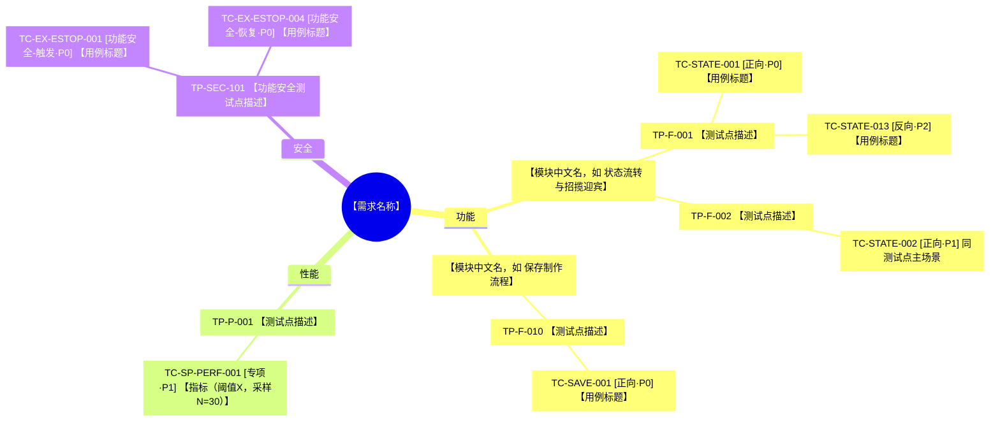

# 输出模板与维度检查清单

> 编号说明：**REQ-ID** = 需求条目（Requirement），**TP-ID** = 测试点（Test Point），**TC-ID** = 测试用例（Test Case）。三者构成追溯链路 `REQ → TP → TC`，完整含义与编号规则见 [SKILL.md](SKILL.md) 「编号体系」。

## 交付形式

- 所有交付件**独立分开**呈现（各占一个 Sheet），禁止把多种交付件合并混在同一张 Sheet。
- **表格类交付件**（需求清单、主表、附表、追溯表、专项测试用例、专项数据采集、质量审计）**最终交付必须是 Excel**，且统一组织为**同一个工作簿的多个 Sheet**（一件一 Sheet），**严禁用 `.md`/`.csv`/`.txt` 或对话内 Markdown 表格作正式交付**；Markdown 表格仅供预览。
- **默认只交付飞书在线电子表格一套**（多 Sheet），返回飞书链接；**仅当用户明确要求本地文件时才额外生成本地多 Sheet `.xlsx`** 并给出本地路径。两套都出时内容/结构/命名一致。
- **交付件名称必须为中文**：文件名/Sheet 名用中文，如「测试用例主表」「评审追溯表（含风险评估）」「追溯矩阵表（REQ-TP-TC）」。
- **每个 Excel 交付表必须**：首行表头加粗、表头带筛选下拉框、列宽按内容自适应（见下「Excel 交付件格式要求」）。
- **必须产出真正的 `.xlsx` 二进制文件**：本地用 `openpyxl` 真实写盘、飞书用 lark-sheets 建真实表格，使用者可打开/编辑/保存；禁止把 Markdown/CSV 改后缀冒充。生成后告知实际保存路径或链接。
- **测试点思维导图**单独交付为 **Draw.io 文件（`.drawio`）**，可直接导入飞书云文档，模板见下「思维导图 Draw.io 格式」。
- **异常交叉适用性矩阵**（仅当本期纳入通用异常事件 EX 时）单独成一个 Sheet，中文名「异常交叉适用性矩阵」，表头与判定规则见 [exception-library.md](exception-library.md)。
- **测试计划**默认交付为**飞书在线文档**（由 Markdown 导入/创建），含范围目标/策略/资源/进度/准入准出/风险/缺陷流程（留白）/交付物清单，模板见下「测试计划模板」；**仅当用户明确要求本地文件时才额外生成本地 `.md`**。
- 交付清单与落表方式见 [SKILL.md](SKILL.md) 「交付物规范」。

## Excel 交付件格式要求

每个 Excel 交付表（除思维导图外全部）统一满足：

| 要求 | 飞书电子表格（lark-sheets） | 本地 openpyxl |
|------|---------------------------|--------------|
| 首行表头加粗 | 设置首行单元格样式 `bold` | `cell.font = Font(bold=True)` |
| 表头筛选下拉框 | 对表头行加筛选器/筛选视图 | `ws.auto_filter.ref = "A1:<末列><末行>"` |
| 列宽自适应 | 按列内容调整列宽 | 按各列最长文本估算 `ws.column_dimensions[col].width`（中文≈2 倍宽，封顶 ~60） |
| 名称中文 | Sheet 名用中文交付件名 | `ws.title` / 文件名用中文 |

本地生成参考（openpyxl，列宽自适应 + 表头加粗 + 筛选）：

```python
from openpyxl import Workbook
from openpyxl.styles import Font
from openpyxl.utils import get_column_letter

def dump_sheet(ws, headers, rows):
    ws.append(headers)
    for r in rows:
        ws.append(r)
    # 首行加粗
    for c in ws[1]:
        c.font = Font(bold=True)
    # 筛选下拉框（覆盖表头+数据）
    ws.auto_filter.ref = f"A1:{get_column_letter(len(headers))}{ws.max_row}"
    # 列宽自适应（中文按 2 倍宽度估算，封顶 60）
    for i, _ in enumerate(headers, 1):
        col = get_column_letter(i)
        width = 0
        for cell in ws[col]:
            v = "" if cell.value is None else str(cell.value)
            w = sum(2 if ord(ch) > 255 else 1 for ch in v)
            width = max(width, w)
        ws.column_dimensions[col].width = min(width + 2, 60)

# 一个工作簿多 Sheet：每个交付件一个 Sheet，Sheet 名用中文
wb = Workbook()
wb.remove(wb.active)  # 移除默认空 Sheet
for sheet_name, headers, rows in [
    ("需求原子化清单", req_headers, req_rows),
    # 纳入通用异常事件 EX 时再加：("异常交叉适用性矩阵", cross_headers, cross_rows),
    ("测试用例主表", tc_headers, tc_rows),
    ("评审追溯表（含风险评估）", ext_headers, ext_rows),
    ("追溯矩阵表（REQ-TP-TC）", matrix_headers, matrix_rows),
    # 有专项测试再加：("专项测试用例表", ...), ("专项数据采集表", ...)
    ("质量审计报告", audit_headers, audit_rows),
]:
    dump_sheet(wb.create_sheet(title=sheet_name), headers, rows)
wb.save("测试交付件-{需求名}-{日期}.xlsx")
```

> 飞书侧（默认交付）：切 `lark-sheets` 建一个电子表格，用同样的中文名建多个 Sheet 并写入同样内容，返回链接。**默认只出飞书这一套**；上面的 openpyxl 本地脚本仅在用户明确要本地 `.xlsx` 时才执行。

合并单元格/顶部说明行（openpyxl）：需求清单顶部输入来源行、附表的需求/测试点列、追溯矩阵的 REQ-ID/TP-ID 列、审计报告顶部说明，都用 `ws.merge_cells('A1:<末列>1')` 合并并 `cell.alignment = Alignment(wrapText=True, vertical='center')` 换行居中；相同值的连续数据行用 `ws.merge_cells(start_row=.., end_row=.., start_column=.., end_column=..)` 归组。

## 思维导图 Draw.io 格式（完全适配飞书在线思维导图）

思维导图正式交付为 Draw.io 文件，**命名为 `XX项目测试点`**（如 `咖啡机项目饮品APP测试点.drawio`，即「项目/需求名 + 测试点」，不要用「测试点思维导图」这类通用名）。

飞书导入后连线错乱、全是黑箭头，根因是：edge 用了带箭头的流程图样式、节点坐标手工摆放互相交叉、没有从左到右规整的树布局。适配要点（强制）：

1. **左向右树布局，节点不重叠**：四列自左向右——根 x≈40、维度 x≈320、测试点 x≈620、测试用例 x≈980；同层节点按 `y` 依次错开、每个节点独占一行高度（如行距 ≥60），**严禁多个节点坐标重叠**，否则连线必乱。
2. **分支线用正交圆角、无箭头、有方向**：edge 样式统一 `edgeStyle=orthogonalEdgeStyle;rounded=1;html=1;startArrow=none;endArrow=none;exitX=1;exitY=0.5;entryX=0;entryY=0.5;`（从父节点右侧中点出、进子节点左侧中点，走飞书思维导图那种横向分支线，不产生黑箭头也不交叉）。
3. **一个父节点的所有子节点，其 `y` 范围应围绕父节点 `y` 上下分布**（父居中、子上下展开），避免所有线挤向一点。
4. **节点圆角气泡 + 分维度配色**：根=深色、功能=蓝、性能=橙、稳定性=绿、兼容性=青、安全=红、用户体验=紫；测试点用对应维度浅色。
5. **层次（强制）**：根=需求名 → 维度 →〔模块，条件性〕→ 测试点 → **测试用例**。测试点文本以 `TP-ID` 开头，用例文本为 `TC-ID [覆盖类型·优先级] 用例标题`，均可追溯回追溯表。用例层是评审用的「每个测试点测哪些方面」，缺这一层评审看不出覆盖广度，判为不合格。
   - **模块层触发条件：单一维度 TP 数 ≥12**。父节点摆在其整个子块的垂直中心，某维度独占大半 TP 时其标签会被推到屏幕外（实测：功能维度 56 个 TP，块高 4545px，标签距首个子节点 2070px），看起来像「维度丢了、直接显示 TP-TC」。插入模块层后「模块→测试点」距离回落到 41–446px。分组键取 TC-ID 的模块缩写（`TC-{模块}-001` / `TC-EX-{模块}-001` / `TC-SP-{模块}-001`），**模块名必须写中文**。
   - **模块顺序按「组内最小 TP 号」升序排**，不按用例数、不按字母序。TP 号本身是分段编排的（一个模块占一个十位段），按号排出来的顺序才与编号一致——读者自上而下看到的就是 `TP-F-001`、`002`… 递增。按用例数排会让 001 开头的模块掉到中间，评审时对不上号。
   - **少数 TP 的用例跨模块**（同一 TP 下用例来自不同模块），模块归属按**用例模块占多数者胜**，平票时**归给号段最近的模块**；保证一个 TP 只出现在一个组里，否则同一 TP 会在多个模块下重复出现、TC 数虚高。**不可取「首条用例」**——首条是按 `(REQ, TC)` 排序的结果，与模块无关，会把 TP 判给号段完全不相干的模块：实测 `TP-F-041` 有 2 条 STATE + 2 条 COMBO，首条恰是 REQ 较小的 STATE，于是 041 被判给状态流转组，可它的号在 04x（组合编排段），导致该组最小号变成 041、整个 06x 块被提到 050 前面，模块顺序出现两处逆序。
   - **TC 标题与其 TP 描述同文时不重复整句**（TP 描述默认取自首条用例标题，必然撞车），但要留下可读的「测哪个方面」（如补「同测试点主场景」）——只剩 `TC-ID [正向·P1]` 的裸节点评审看不出在验什么。
6. **叶子驱动布局**：用例(TC)在最右列逐行铺开，每条独占一行；测试点、模块、维度、根节点分别按其子块纵向居中，避免父节点与子块错位。五列 x 坐标：根 40 / 维度 320 / 模块 520 / 测试点 760 / 用例 1120。TC 节点宽度需大于 TP（文本更长），字号可略小（如 `fontSize=11;align=left;`）。
7. **模块节点 id 不能用维度名拼**：维度名是中文，经 `[^0-9A-Za-z_]→_` 清洗后会变成一串下划线（`mod____0`），不同维度的同序号组必然撞 id。用维度序号（`mod_{维度序号}_{组序号}`），且 drawio 与 Mermaid 两种输出共用同一个 id 生成函数。

结构骨架（左→右树布局、正交无箭头分支线、坐标不重叠）：

```xml
<mxfile host="app.diagrams.net">
  <diagram name="咖啡机项目饮品APP测试点">
    <mxGraphModel dx="1200" dy="800" grid="0" fold="1" arrows="0" connect="1">
      <root>
        <mxCell id="0"/>
        <mxCell id="1" parent="0"/>
        <!-- 根（最左，纵向居中） -->
        <mxCell id="root" value="咖啡机项目饮品APP" style="rounded=1;whiteSpace=wrap;html=1;fillColor=#111827;fontColor=#FFFFFF;strokeColor=none;" vertex="1" parent="1"><mxGeometry x="40" y="200" width="180" height="44" as="geometry"/></mxCell>
        <!-- 维度（中列，纵向错开不重叠） -->
        <mxCell id="dim_f" value="功能" style="rounded=1;whiteSpace=wrap;html=1;fillColor=#DBEAFE;strokeColor=#3B82F6;" vertex="1" parent="1"><mxGeometry x="320" y="120" width="130" height="40" as="geometry"/></mxCell>
        <mxCell id="dim_p" value="性能" style="rounded=1;whiteSpace=wrap;html=1;fillColor=#FFEDD5;strokeColor=#F97316;" vertex="1" parent="1"><mxGeometry x="320" y="280" width="130" height="40" as="geometry"/></mxCell>
        <!-- 模块（TP 数 ≥12 的维度才有这一层；此处示意功能维度） -->
        <mxCell id="mod_0_0" value="状态流转与招揽迎宾" style="rounded=1;whiteSpace=wrap;html=1;fillColor=#EFF6FF;strokeColor=#3B82F6;fontStyle=1;" vertex="1" parent="1"><mxGeometry x="520" y="115" width="170" height="34" as="geometry"/></mxCell>
        <!-- 测试点（围绕父节点上下分布；有模块层时父节点是模块，否则是维度） -->
        <mxCell id="tp_f_001" value="TP-F-001 下单成功" style="rounded=1;whiteSpace=wrap;html=1;fillColor=#EFF6FF;strokeColor=#93C5FD;" vertex="1" parent="1"><mxGeometry x="760" y="80" width="300" height="40" as="geometry"/></mxCell>
        <mxCell id="tp_f_002" value="TP-F-002 支付失败提示" style="rounded=1;whiteSpace=wrap;html=1;fillColor=#EFF6FF;strokeColor=#93C5FD;" vertex="1" parent="1"><mxGeometry x="760" y="150" width="300" height="40" as="geometry"/></mxCell>
        <mxCell id="tp_p_001" value="TP-P-001 出杯响应≤3s" style="rounded=1;whiteSpace=wrap;html=1;fillColor=#FFF7ED;strokeColor=#FDBA74;" vertex="1" parent="1"><mxGeometry x="760" y="280" width="300" height="40" as="geometry"/></mxCell>
        <!-- 测试用例（最右列，评审用「该测试点测哪些方面」，逐条独占一行） -->
        <mxCell id="tc_save_001" value="TC-SAVE-001 [正向·P0] 已选预设时保存生效" style="rounded=1;whiteSpace=wrap;html=1;fillColor=#FBFDFF;strokeColor=#93C5FD;fontSize=11;align=left;spacingLeft=8;" vertex="1" parent="1"><mxGeometry x="1120" y="60" width="430" height="30" as="geometry"/></mxCell>
        <mxCell id="tc_save_006" value="TC-SAVE-006 [异常·P1] 保存失败时配置不生效并提示" style="rounded=1;whiteSpace=wrap;html=1;fillColor=#FBFDFF;strokeColor=#93C5FD;fontSize=11;align=left;spacingLeft=8;" vertex="1" parent="1"><mxGeometry x="1120" y="100" width="430" height="30" as="geometry"/></mxCell>
        <!-- 分支线：正交圆角、无箭头、父右→子左 -->
        <mxCell id="e1" edge="1" parent="1" source="root" target="dim_f" style="edgeStyle=orthogonalEdgeStyle;rounded=1;html=1;startArrow=none;endArrow=none;exitX=1;exitY=0.5;entryX=0;entryY=0.5;strokeColor=#3B82F6;"><mxGeometry relative="1" as="geometry"/></mxCell>
        <mxCell id="e2" edge="1" parent="1" source="root" target="dim_p" style="edgeStyle=orthogonalEdgeStyle;rounded=1;html=1;startArrow=none;endArrow=none;exitX=1;exitY=0.5;entryX=0;entryY=0.5;strokeColor=#F97316;"><mxGeometry relative="1" as="geometry"/></mxCell>
        <mxCell id="e_mod" edge="1" parent="1" source="dim_f" target="mod_0_0" style="edgeStyle=orthogonalEdgeStyle;rounded=1;html=1;startArrow=none;endArrow=none;exitX=1;exitY=0.5;entryX=0;entryY=0.5;strokeColor=#3B82F6;"><mxGeometry relative="1" as="geometry"/></mxCell>
        <mxCell id="e3" edge="1" parent="1" source="mod_0_0" target="tp_f_001" style="edgeStyle=orthogonalEdgeStyle;rounded=1;html=1;startArrow=none;endArrow=none;exitX=1;exitY=0.5;entryX=0;entryY=0.5;strokeColor=#93C5FD;"><mxGeometry relative="1" as="geometry"/></mxCell>
        <mxCell id="e4" edge="1" parent="1" source="mod_0_0" target="tp_f_002" style="edgeStyle=orthogonalEdgeStyle;rounded=1;html=1;startArrow=none;endArrow=none;exitX=1;exitY=0.5;entryX=0;entryY=0.5;strokeColor=#93C5FD;"><mxGeometry relative="1" as="geometry"/></mxCell>
        <mxCell id="e5" edge="1" parent="1" source="dim_p" target="tp_p_001" style="edgeStyle=orthogonalEdgeStyle;rounded=1;html=1;startArrow=none;endArrow=none;exitX=1;exitY=0.5;entryX=0;entryY=0.5;strokeColor=#FDBA74;"><mxGeometry relative="1" as="geometry"/></mxCell>
        <mxCell id="e6" edge="1" parent="1" source="tp_f_001" target="tc_save_001" style="edgeStyle=orthogonalEdgeStyle;rounded=1;html=1;startArrow=none;endArrow=none;exitX=1;exitY=0.5;entryX=0;entryY=0.5;strokeColor=#93C5FD;"><mxGeometry relative="1" as="geometry"/></mxCell>
        <mxCell id="e7" edge="1" parent="1" source="tp_f_001" target="tc_save_006" style="edgeStyle=orthogonalEdgeStyle;rounded=1;html=1;startArrow=none;endArrow=none;exitX=1;exitY=0.5;entryX=0;entryY=0.5;strokeColor=#93C5FD;"><mxGeometry relative="1" as="geometry"/></mxCell>
      </root>
    </mxGraphModel>
  </diagram>
</mxfile>
```

要求：`<diagram name>` 用「XX项目测试点」命名；所有 edge 用上述正交无箭头样式且 `exit/entry` 固定为父右→子左；节点坐标从左到右分列、同列纵向错开不重叠；子节点围绕父节点上下展开。交付前自检：在 drawio/飞书打开确认连线不交叉、无黑箭头、呈横向树状，**且每个测试点下都挂出了它的测试用例节点（无用例的测试点须能说明原因，如专项用例走专项两表时用 `extra_cases` 挂上）**。

**由脚本生成，不手工拼 XML**：`tcgen.drawio.build(out, CASES, root_label, tp_names=..., extra_cases=...)` 已实现上述全部规则（四级层次、叶子驱动居中、六维度配色、正交无箭头）。项目侧只传数据，见 [pipeline.md](pipeline.md)。

## 测试计划模板（可导入飞书在线文档的 `.md`）

正式交付一份 Markdown 文件，**命名为 `XX项目测试计划`**（如 `咖啡机项目饮品APP测试计划.md`，与思维导图同用「项目/需求名」前缀）。用 Markdown 标题分节，飞书在线文档可直接导入。**文档最上方必须先放「修订记录」表格**（版本号 / 修订日期 / 修订人 / 审核人 / 修订内容 / 备注），再进入正文各节。**缺陷管理流程**一节留白占位（后续手动贴链接/附件），其余各节结合本需求写实质内容。

```markdown
# XX项目测试计划（如：咖啡机项目饮品APP测试计划）

## 修订记录

> **强制**：修订记录表必须置于测试计划最上方（正文各节之前）。每次修订追加一行，不得删改历史行。

| 版本号 | 修订日期 | 修订人 | 审核人 | 修订内容 | 备注 |
|--------|---------|-------|-------|---------|------|
| V1.0 | YYYY-MM-DD | XXX | XXX | 初版创建 | |

## 1. 测试范围与目标
- 测试范围：本次覆盖的模块/功能/接口清单（对应已确认 REQ）
- 不在范围：明确排除项
- 测试目标：需求覆盖率、可执行率、质量门禁目标

## 2. 测试策略与方案概述

| 项 | 内容 |
|----|------|
| 测试类型与分层 | 功能/接口/性能/兼容/安全/稳定/体验/专项如何分配 |
| 设计方法 | 等价类/边界值/判定表/状态迁移/场景法/错误推测的使用场景 |
| 执行顺序 | 功能/接口测试 → 性能/稳定性测试 → 专项测试 → 回归测试（前一阶段有阻塞级缺陷不进入下一阶段） |
| 专项测试方案（如有） | 指标、采样量 N、统计口径、合格阈值 |
| 回归测试 | 所有测试项完成且 BUG 收敛后进行，主要覆盖 P0 与部分 P1 用例 |

**按测试类型的优先级排序执行**：先保证功能/接口测试通过，再进入性能/稳定性测试，然后专项测试；全部完成且缺陷收敛后进入回归测试。流程图**直接嵌入第三方画图 skill（archify）生成的图片**（替代下方 Mermaid 源码，Mermaid 仅对话预览用）：

```markdown

```

> 交付要求：用 archify 渲染流程图并导出 PNG/SVG，本地 `.md` 用上面的图片引用嵌入、飞书在线文档里插入同一张图片；**正式交付文档不保留 ```mermaid 源码块**。对话中可用如下 Mermaid 预览：
>
> ```mermaid
> flowchart LR
>     A[功能测试 / 接口测试] -->|通过, 无阻塞缺陷| B[性能测试 / 稳定性测试]
>     B -->|通过, 无阻塞缺陷| C[专项测试<br/>指标采样统计]
>     C -->|全部完成, BUG 收敛| E[回归测试<br/>P0 + 部分 P1]
>     E --> D[准出评审]
>     A -.阻塞缺陷.-> A
>     B -.阻塞缺陷.-> B
> ```

## 3. 资源安排
| 角色 | 人员 | 职责 |
|------|------|------|
| 测试负责人 | - | 计划/评审/发布决策 |
| 测试执行 | - | 用例执行/缺陷跟踪 |
| 环境/数据 | - | 环境准备、测试数据 |

## 4. 进度计划
| 阶段 | 时间 | 里程碑/交付物 |
|------|------|--------------|
| 用例设计 | - | 主表/附表/追溯表 |
| 功能/接口执行 | - | 执行结果、缺陷 |
| 性能/稳定性执行 | - | 执行结果、缺陷 |
| 专项测试（如有） | - | 专项数据采集统计 |
| 回归测试 | - | BUG 收敛后回归 P0+部分 P1，回归结论 |
| 验收/准出 | - | 准出结论 |

## 5. 准入标准
- 需求/方案已确认，REQ 清单已冻结
- 测试环境、账号、数据就绪
- 用例通过评审、Blocked/Draft 已清零

## 6. 准出标准
- 用例执行率 100%
- 无阻塞级缺陷
- 遗留缺陷均已经过评审，且有处理结论或应对方案
- 需求覆盖率、覆盖深度达标（硬门禁通过）
- 专项指标达标（如有）

## 7. 风险分析与应对
| 风险 | 影响 | 概率 | 应对措施 |
|------|------|------|---------|
| 需求变更 | 高 | 中 | 冻结基线、变更走评审 |
| 环境不稳定 | 中 | 中 | 备用环境、提前联调 |

## 8. 缺陷管理流程
> 待补充（后续手动贴上缺陷管理流程链接或附件）

## 9. 交付物清单
- 需求原子化清单（Excel）
- 测试点思维导图（Draw.io）
- 异常交叉适用性矩阵（如纳入通用异常事件 EX，Excel）
- 测试用例主表 / 评审追溯表（含风险评估）/ 追溯矩阵表（REQ-TP-TC）（Excel）
- 专项测试用例表 / 专项数据采集表（如有，Excel）
- 质量审计报告（Excel）
- 本测试计划（Markdown）
```

## 主表与附表

- 主表：测试执行使用，要求步骤清晰、预期可判定
- 附表：评审追溯使用，要求来源可追溯、风险有依据、状态可对账
- 主表与附表是**两张独立的表**，通过 `用例序号` 一一对应关联，不得拼成一张宽表
- 附表「用例状态」是 Phase 4 可执行性报告的唯一计数来源

## REQ 原子化清单

在生成测试点之前，必须先输出 `REQ` 原子化清单，作为覆盖率计算与双向追溯的唯一基础。

**顶部输入来源行（强制）**：Sheet 最上方用**一行横向合并单元格**（合并覆盖整表宽度），附上本次输入的需求文档、设计稿、原型、技术方案文档的**链接**（每类一行或用换行分隔，注明类型）。**仅当输入是链接时才附**；若输入是本地文档（非链接），此行留空或写「本地文档，无链接」，不强制贴路径。**严禁把输入来源写进 `REQ-ID` 列或其下方任何数据单元格**——来源链接只能落在顶栏合并行内；实际生成的每一套（默认飞书，若另出本地 Excel 则本地也如此）都必须遵守。

```
输入来源
需求文档：https://...
设计稿：https://...
原型：https://...
技术方案：https://...
```

| REQ-ID | 需求描述 | 来源文档 | 来源章节/段落 | 类型 | 可测性 | 覆盖状态 | 备注 |
|--------|---------|---------|--------------|------|--------|---------|------|

字段说明：

| 列 | 规范 |
|----|------|
| REQ-ID | 唯一编号，格式建议 `REQ-001` |
| 需求描述 | 单条、原子化、可独立理解 |
| 来源文档 | PRD / 技术方案 / UI / 交互文档名称 |
| 来源章节/段落 | 尽量精确到章节、标题或段落 |
| 类型 | 仅允许 `功能` / `性能` / `稳定性` / `兼容性` / `安全` / `用户体验` 六个值。**安全类一律填 `安全`，子域写进备注，严禁把类型填成「功能安全」**——该字符串含「功能」二字会被审计脚本误判为功能类 REQ，从而叠加「正向+反向」的功能深度要求，造成双重判定 |
| 可测性 | 仅允许 `可测` / `不可测` |
| 覆盖状态 | 初始值仅允许 `待覆盖` / `阻塞` / `N/A` |
| 备注 | 说明阻塞原因、N/A 原因或补充说明。**类型为 `安全` 时必填子域标注 `信息安全` 或 `功能安全`**（功能安全深度门禁按此列识别，缺标注则该 REQ 不进功能安全门禁，属漏检） |

---

## 六维度检查清单

设计测试点时，逐维度过一遍以下检查项；文档未涉及且用户未确认的，在 Phase 1 提问。

### 功能

- [ ] 主流程（Happy Path）逐步覆盖
- [ ] 各分支条件（if/else 业务分支）
- [ ] 输入校验（必填、格式、长度、特殊字符）
- [ ] 边界值（最小/最大/零/空）
- [ ] 异常与错误处理（网络失败、超时、服务不可用）
- [ ] 权限与角色差异（不同角色看到/能操作的内容）
- [ ] 状态流转（创建→编辑→提交→审核→完成/作废）
- [ ] 并发操作（同时编辑、重复提交）
- [ ] 数据联动（A 字段变化影响 B 字段/模块）

### 性能

- [ ] 页面/接口响应时间（常规与峰值）
- [ ] 列表分页与大数据量（如 1k/10k 条）
- [ ] 并发用户数 / QPS 目标
- [ ] 批量操作（导入/导出/批量删除）
- [ ] 资源占用（内存、CPU、存储增长）

### 稳定性

- [ ] 长时间运行 / 定时任务
- [ ] 断网/弱网恢复
- [ ] 服务重启后数据一致性
- [ ] 重试与幂等（重复请求不重复生效）
- [ ] 降级与熔断（依赖服务不可用时的表现）

### 兼容性

- [ ] 浏览器（Chrome / Edge / Safari / 飞书内置浏览器）
- [ ] 操作系统（Windows / macOS / 移动端 iOS/Android）
- [ ] 屏幕分辨率 / 响应式布局
- [ ] 新旧版本共存（升级后数据迁移、接口兼容）
- [ ] 上下游系统/第三方集成

### 安全

安全维度含**信息安全**与**功能安全**两个子域，两者都要逐条过；产品形态为机器人/整机/带运动部件的硬件时，功能安全子域**必须覆盖**，文档未提及则在 Phase 1.2 的 F 组提问（详见 [SKILL.md](SKILL.md)「安全维度的两个子域」）。

**信息安全（Security，`TP-SEC-001~099`）**

- [ ] 登录态与 Session 过期
- [ ] 水平/垂直越权
- [ ] 敏感数据脱敏与传输加密
- [ ] 注入（SQL/XSS/命令注入）
- [ ] 操作审计日志
- [ ] 文件上传类型与大小限制

**功能安全（Functional Safety，`TP-SEC-101~199`，机器人/智能硬件适用）**

- [ ] 急停按钮/急停回路：按下后的停止时限、停止类别、抱闸行为
- [ ] 急停状态的上报与展示（状态码、告警、日志留痕）
- [ ] 急停解除与恢复：复位方式、是否需二次确认、解除后所处状态（严禁自动恢复运动）
- [ ] 安全边界 / 工作空间限制 / 光幕 / 安全门联锁
- [ ] 碰撞检测与力矩/电流保护阈值
- [ ] 速度限制（示教/协作/自动模式下的限速差异）
- [ ] 危险动作联锁（如夹爪开合与运动互锁、上电前提条件）
- [ ] 失效安全行为（fail-safe）：断电、断气、断网、传感器失效时的默认动作
- [ ] 安全相关信号的单点失效与冗余（如双通道急停、回路断线检测）
- [ ] 安全状态优先级：安全停止应能覆盖/中断任何正在执行的业务动作

> 子域判定口径：需求失效的直接后果是**伤人/损机** → 功能安全（安全维度）；后果是**功能不可用/数据不一致/任务失败** → 稳定性维度。低电量、定位丢失、通信中断、服务重启恢复等属稳定性，不属功能安全。

### 用户体验

- [ ] 首次使用引导
- [ ] 加载态 / 空态 / 错误态展示
- [ ] 提示文案准确、可操作
- [ ] 操作反馈（成功/失败 Toast、进度条）
- [ ] 快捷键 / 无障碍（如适用）
- [ ] 多语言 / 时区（如适用）

某维度文档未提及：Phase 1 提问，或 REQ 标 `N/A`（附理由），禁止静默省略。

---

## 强制设计技法触发表

| 场景类型 | 强制产物 | 说明 |
|---------|---------|------|
| 多条件组合 | 判定表 | 权限×状态×角色等交叉条件 |
| 状态流转 | 状态迁移图 | 覆盖合法迁移 + 非法迁移 |
| 端到端主流程 | 用户旅程 / 场景路径 | 串联关键节点 |
| 输入校验密集 | 等价类表 + 边界值表 | 先分类再出用例 |
| **通用异常事件交叉**（纳入 EX 库事件，如急停/低电量/定位丢失） | **异常交叉适用性矩阵** | `EX × 阶段原型` 逐格判 `必测/选测/不适用` 并写机制依据；**先出矩阵再写交叉用例**，严禁凭感觉挑几个场景硬加。模板与判定规则见 [exception-library.md](exception-library.md) |

| **界面参数组合**（需求含 2 个以上可自由选择的参数，如「机身范围 × 是否带夹爪」） | **有效组合枚举表** | 见下方「界面参数组合的有效组合枚举」 |

无建模产物，不得对对应 REQ 批量输出 Ready 用例。

## 界面参数组合的有效组合枚举（强制）

需求由**多个可自由选择的参数**构成时（下拉框、单选组、开关），先枚举**全部有效组合**再写用例，
**不要凭直觉挑几个典型值**——挑出来的必然是漏的。

步骤：

1. **列出每个参数的取值域**（从实现读，不从文档猜）：如 `机身 ∈ {整机, 上半身, 下半身}`、
   `夹爪 ∈ {含, 无}`。
2. **标出互斥约束**：某些组合被界面禁用（如「下半身」时夹爪开关置灰）。
3. **算有效组合数**：`3 × 2 − 1（下半身仅一种）= 5`。
4. **逐组合建用例并在备注标注组合坐标**（如 `组合遍历:上半身×含夹爪`），便于核对是否齐全。
5. **同一需求有多个执行环节时，每个环节各自遍历**：如「烧录」与「点灯验证」是两段独立选择，
   **两段都要 5 个组合**，不能只遍历第一段。

实测踩过：某需求有烧录与点灯两段、各 5 个有效组合共 10 个，初版只覆盖了烧录 3 个 + 点灯 1 个，
漏掉 6 个——尤其「上半身 × 含夹爪」这类返修换件后的常用路径。**判据：用例数 ≥ 有效组合数**，
少于则逐个列出缺哪个组合。互斥组合另需 1 条反向用例验证禁用生效（见「非法组合防护」）。

**非法组合防护**：界面置灰不等于后端拒绝。必须补一条用例验证「先选合法值再切到互斥项」
的路径——置灰只禁用控件，若不复位已选值，仍可能以非法组合下发请求。

**防护也要逐环节验，别只验第一段**。上一条「每个环节各自遍历」讲的是**有效组合**，
这一条讲的是**非法组合防护**——两层各自独立，容易被当成一件事而只做了第一段。
判据：`防护用例数 ≥ 环节数 × 每环节互斥约束数`。
实测漏过：某需求「烧录 / 点灯」两段各有独立的机身与夹爪选择（两套状态变量），
有效组合两段都遍历齐了，防护用例却只写了烧录段；读源码确认**两段都没有复位逻辑**、
风险完全同源，点灯段那半是评审时才由业务方指出。
**一处置灰不代表处处置灰**：多环节界面通常各持一份状态，防护是逐份实现的，
也就可能逐份漏掉。


---

## REQ 覆盖深度最低标准

| REQ 类型 | 最低要求 |
|---------|---------|
| 功能（有输入/校验） | ≥1 正向 + ≥1 反向/异常；可测边界再加 ≥1 边界 |
| 功能（状态流转） | 合法迁移 + ≥1 非法迁移 |
| 功能（多条件组合） | 判定表每条有效规则 ≥1 用例 |
| 非功能（性能/稳定/兼容/安全/体验） | ≥1 对应维度用例，预期含可判定检查点 |
| 安全·功能安全（急停/光幕/碰撞保护/联锁等） | ≥1 条**触发**用例（验证保护动作生效，预期含停止时限 + 状态上报）**且** ≥1 条**解除/恢复**用例（验证复位方式、是否需二次确认、解除后所处状态）；二者缺一视为深度未达标。有多种触发源（面板急停/外部急停回路/软件急停）时每种源 ≥1 条 |
| 专项（算法/整机性能指标） | ≥1 条专项用例（统计指标达标）**且** ≥1 条功能测试用例（只验证功能可用，不判指标）；二者缺一视为深度未达标 |

---

## 测试点汇总表模板

| 编号 | 维度 | 测试点描述 | 优先级建议 | 关联 REQ-ID | 关联待确认问题 |
|------|------|-----------|-----------|------------|--------------|

规则：每个 TP 必须有关联 REQ-ID；每个可测 REQ 必须有 ≥1 个 TP。

---

## 测试点思维导图模板

由 `tcgen.drawio.mermaid()` 生成，**不手写**。层级：根 → 维度 →〔模块〕→ 测试点 → 测试用例。
TP 数 ≥12 的维度插模块层（下例「功能」），其余维度 TP 直挂维度（下例「性能」「安全」）。
节点文本用双引号包裹，因为 `TC-ID [覆盖类型·优先级]` 含方括号。



> 对话中预览可退回三级（`show_cases=False`）保持简洁，但**正式交付件必须出到用例层**。
> 「同测试点主场景」是 TC 标题与其 TP 描述同文时的替代写法，见上文规则 5。

---

## 测试用例表模板

### 表头（固定，不得更改）

| 用例序号 | 优先级（P0-P3） | 测试标题 | 测试类型 | 前置条件 | 操作步骤 | 预期结果 |
|---------|----------------|---------|---------|---------|---------|---------|

> **行顺序（强制）**：主表、附表、追溯矩阵三张表统一按 `(REQ-ID, TP-ID, TC-ID)` 排序，使同一需求/测试点下的正向/反向/异常/边界用例连续聚合、三表顺序一致。`openpyxl` 落地示例：`ordered = sorted(cases, key=lambda c:(c['req'], c['tp'], c['tc']))`，写表时统一遍历 `ordered`，**不要**按用例的生成/录入顺序输出（分批补充用例会因此散落，且与已排序的附表/矩阵不一致）。排序后同一测试点内 `TC` 编号非纯升序是同类聚合的预期结果，不得为编号美观改回按 `TC` 排序。

### 附表（评审追溯表）

列顺序固定为**需求/方案条目 → 测试点 → 用例序号**在前，直观展现「每条需求→一个或多个测试点→每个测试点一条或多条用例」的层级：

| 关联需求/方案条目 | 关联测试点 | 用例序号 | 设计技法 | 测试数据 | 风险等级 | 风险评估依据 | 优先级评估 | 用例状态 | 解除条件 | 备注 |
|------------------|-----------|---------|---------|---------|---------|-------------|-----------|---------|---------|-----|

> **合并单元格（强制）**：同一「关联需求/方案条目」的多行合并该列单元格；同一「关联测试点」的多行合并该列单元格（飞书用合并单元格；`openpyxl` 用 `ws.merge_cells`）。使一条需求下的多个测试点、一个测试点下的多条用例在视觉上归组，更直观。

### 追溯矩阵

| REQ-ID | TP-ID | TC-ID | 覆盖类型 | 备注 |
|--------|------|------|---------|------|

> **合并单元格（强制）**：相同 `REQ-ID` 的连续多行合并 REQ-ID 列；相同 `TP-ID` 的连续多行合并 TP-ID 列（飞书合并单元格；`openpyxl` 用 `ws.merge_cells`），使 `REQ → TP → TC` 的一对多层级更直观。

### 填写规范

| 列 | 规范 |
|----|------|
| 用例序号 | `TC-{模块}-{三位序号}`，模块名大写英文缩写 |
| 优先级 | 仅 P0 / P1 / P2 / P3 |
| 测试标题 | 简洁说明验证什么，≤ 30 字 |
| 测试类型 | 功能测试 / 接口测试 / 性能测试 / 兼容性测试 / 安全测试 / 稳定性测试 / 用户体验测试 / 专项测试（专项测试用例改用「专项测试用例模板」，不填此普通主表） |
| 前置条件 | 执行前必须满足的状态；**必须用编号列表逐点写清 `1. … 2. … 3. …`（多条件时每点独立成条），严禁用分号 `；`/`;` 把多个条件堆在一行**；无则写「无」 |
| 操作步骤 | 编号列表：`1. ... 2. ... 3. ...`，每步可独立执行 |
| 预期结果 | 编号列表，与操作步骤**逐条一一对应、条数相等**（第 n 步对应第 n 条预期）；严禁多步骤只写 1 条预期；无结果的步骤写「无明显变化」 |
| 备注 | 缺陷单号、跳过原因、环境差异等；**异常交叉用例必须在此写交叉基线**，固定前缀格式 `交叉基线：ST-{n} {阶段名} / {业务REQ-ID}`（见 [exception-library.md](exception-library.md)） |

### 附表字段规范

| 列 | 规范 |
|----|------|
| 关联需求/方案条目 | **第一列**，优先写 `REQ-ID`，可附章节名；同一条目跨多行合并单元格 |
| 关联测试点 | **第二列**，对应 `TP-*` 编号；同一测试点跨多行合并单元格 |
| 用例序号 | **第三列**，对应 `TC-*` 编号，与主表一一对应 |
| 设计技法 | 等价类 / 边界值 / 判定表 / 状态迁移 / 场景法 / 错误推测（含义见下「设计技法说明」） |
| 测试数据 | 必须给出具体值，不可写“合法数据” |
| 风险等级 | 高 / 中 / 低（与主表 P0-P3 对应） |
| 风险评估依据 | 至少包含“业务影响 + 发生概率 + 可检测性”中的两项 |
| 优先级评估 | **必填**：解释该用例为何定为 P0/P1/P2/P3，须结合业务影响/发生概率/可检测性说明定级理由（判定基准见「优先级评估规范」） |
| 用例状态 | 仅允许 `Ready` / `Blocked` / `Draft`；为 Phase 4 唯一计数来源 |
| 解除条件 | `Blocked`/`Draft` 必填；`Ready` 可写「无」 |
| 备注 | 补充说明；**异常交叉用例必须在此写交叉基线**，固定前缀格式 `交叉基线：ST-{n} {阶段名} / {业务REQ-ID}`（见 [exception-library.md](exception-library.md)） |

### 设计技法说明（附表须附此说明）

「评审追溯表（含风险评估）」交付时，须在同 Sheet 顶部或附带说明区解释所用设计技法的含义：

| 设计技法 | 含义 | 适用场景 |
|---------|------|---------|
| 等价类 | 将输入域划分为若干等价类，每类取代表值，减少冗余用例 | 输入取值范围广、可分类 |
| 边界值 | 取等价类边界（最小/最大/刚好越界值）设计用例，缺陷高发于边界 | 数值/长度/数量有范围限制 |
| 判定表 | 将多个条件与动作组合成规则表，覆盖每条有效规则 | 多条件组合、复杂业务规则 |
| 状态迁移 | 基于状态机覆盖合法迁移与非法迁移 | 有明确状态流转的对象 |
| 场景法 | 按用户真实业务流程串联步骤设计端到端用例 | 主流程、端到端业务 |
| 错误推测 | 依据经验推测易错点补充异常/负向用例 | 异常处理、历史缺陷高发点 |

### 用例状态与执行就绪

| 状态 | 含义 |
|------|------|
| Ready | 通过执行就绪检查清单全部项 |
| Blocked | 依赖未确认问题或缺少环境/数据/账号/规则 |
| Draft | 字段不全、预期不可判定、反模式未清完 |

执行就绪检查清单：
- [ ] 入口明确（页面/接口）
- [ ] 测试数据具体
- [ ] 前置可准备
- [ ] 步骤可逐步复现
- [ ] 预期可判定
- [ ] 步骤与预期一一对应、条数相等（无多步骤对一预期）
- [ ] 不依赖未确认问题
- [ ] 一案一验

### 追溯矩阵字段规范

| 列 | 规范 |
|----|------|
| REQ-ID | 来自已确认的 REQ 原子化清单 |
| TP-ID | 对应测试点编号；**一行只能填一个 TP-ID**，严禁在一格塞多个 TP |
| TC-ID | 对应测试用例编号；**一行只能填一个 TC-ID**，严禁在一格塞多个 TC |
| 覆盖类型 | 正向 / 反向 / 边界 / 异常 / 性能 / 安全 / 兼容性 / 体验 / 专项 / **功能安全-触发** / **功能安全-恢复** |
| 备注 | 说明是否为衍生场景、经验补充或交叉覆盖；**异常交叉用例必须在此写交叉基线**，固定前缀格式 `交叉基线：ST-{n} {阶段名} / {业务REQ-ID}`（见 [exception-library.md](exception-library.md)）。交叉基线**只写在备注列**，严禁把业务 REQ 填进 `REQ-ID` 列造成一条 TC 挂两个 REQ |

> **禁止一对多坍缩（强制）**：追溯矩阵每一行只能表达「一个 TP → 一个 TC」的映射。**严禁多个 `TP-ID` 共用同一条 `TC-ID`**，每个 `TP-ID` 必须至少有 1 条专属 TC（一案一验）。出现「两需求两测试点却只有一条用例」（如 `REQ-004+REQ-006 → TP-F-010+TP-F-014 → 仅 TC-CTRL-001`）即为坍缩缺陷，须拆成 `TC-CTRL-001 / TC-CTRL-002…` 使每个 TP 各有独立用例。此项纳入 Phase 4 硬门禁（`一对多坍缩数 = 0`、`TP 无专属 TC 数 = 0`）。

---

## 测试类型与覆盖类型的分工

两个**不同的分类轴**，各自一列，不要混填：

| 字段 | 回答什么 | 合法取值 | 出现在 |
|---|---|---|---|
| `ttype` 测试类型 | 属于哪类**测试活动** | 六维度七值（`tcgen.dsl.TTYPE_OK`） | 主表「测试类型」列 |
| `cover` 覆盖类型 | 从哪个**角度设计** | 正向/主流程/反向/边界/异常/功能安全-触发/-恢复/维度名/专项 | 附表、追溯矩阵、思维导图 TC 节点 |

**反向 / 边界 / 异常属 `cover`，不是 `ttype`。** 判据：`TT2DIM` 早就把这三个值映射到
「功能」——它们本来就是功能维度内部的视角，而非六维度的同级项。

### 混填的两个代价（实测）

1. **主表看不出这些用例其实都属功能测试**，且与 `cover` 列重复记录同一件事——
   同一件事两处记录是分叉源。
2. **覆盖深度门禁会漏检整条需求**。它按 `ttype=='功能测试'` 筛功能 REQ，
   `ttype` 被填成子维度的 REQ **根本不进检查范围**。实测某项目 147 条用例里
   47 条填错（占 32%），藏掉了一条真实的正向覆盖缺口（REQ-036 只有异常覆盖、
   缺正向），归正 `ttype` 后功能 REQ 从 56 涨到 60，那条缺口才暴露出来。

**两层拦错**：`tcgen.dsl.C()` 构建期 assert（最早拦截点）+ 审计门禁 A16（兜底，
防项目自带 `C()` 绕过构建期校验）。项目侧算这两个门禁一律调
`tcgen.audit.enum_violations` / `cover_conflicts`，不要抄表达式。

### 评审时设计视角在哪看

主表只显示六维度；设计视角在**思维导图 TC 节点**（`TC-ID [覆盖类型·优先级] 标题`）、
附表与追溯矩阵的「覆盖类型」列上。评审主要看导图，故不必为此在主表加列。

---

## 专项测试用例模板

**适用范围**：测试类型为「专项测试」的用例，即算法性能、整机性能等需**多次采样统计**才能判定的指标类测试项，例如：识别类准确率、整机任务达成率、避障成功率、召回率/误检率、定位精度、续航达成率等。

**核心区别**：普通用例一次执行给出「通过/不通过」；专项用例需在**每个场景/维度下重复执行 N 次**，采集单次结果并汇总为统计指标（如准确率 = 成功次数 / N），再与合格阈值比对判定。因此专项测试**不使用普通主表**，改用下列两张表。

### 编号规则

`TC-SP-{模块缩写}-{三位序号}`，如 `TC-SP-OBST-001`（避障专项）、`TC-SP-OCR-001`（识别专项）。

### 专项用例主表（指标定义表）

定义「测什么指标、在什么场景/维度下测、测几次、怎么算合格」：

| 用例序号 | 优先级 | 专项指标 | 场景/维度 | 前置条件 | 单次操作步骤 | 单次判定标准 | 采样次数 N | 统计口径 | 合格阈值 |
|---------|-------|---------|----------|---------|-------------|-------------|-----------|---------|---------|

字段规范：

| 列 | 规范 |
|----|------|
| 专项指标 | 被统计的指标名，如「避障成功率」「OCR 识别准确率」 |
| 场景/维度 | 数据分层的维度，如「白天/夜间」「静态/动态障碍物」「距离 0.5m/1m/2m」；一条用例只固定一组场景/维度 |
| 单次操作步骤 | 编号列表，描述**一次**采样如何执行，可逐步复现 |
| 单次判定标准 | 单次结果如何判 `PASS`/`FAIL`（可观测、可判定），如「机器人在障碍物前 ≥30cm 停止或绕行记为 PASS」 |
| 采样次数 N | 该场景下重复执行的次数，须为具体数字（如 50、100），不可写「多次」 |
| 统计口径 | 汇总公式，如 `成功率 = 成功次数 / N`、`平均误差 = Σ误差 / N`、`P95 耗时` |
| 合格阈值 | 判定该指标通过的门槛，须含比较符与具体值，如 `≥ 95%`、`≤ 3cm`、`≥ 98%` |

### 专项数据采集表（每用例一张，用于统计 N 次结果）

每条专项主表用例对应一张采集表，逐次记录原始数据，末尾汇总：

| 序次 | 输入/条件 | 单次结果（原始值） | 单次判定 | 备注 |
|------|----------|------------------|---------|------|
| 1 | ... | ... | PASS/FAIL | ... |
| 2 | ... | ... | PASS/FAIL | ... |
| ... | ... | ... | ... | ... |
| N | ... | ... | PASS/FAIL | ... |

> 「单次判定」列**只允许填 `PASS` 或 `FAIL`**。

汇总行（表末固定）：

| 汇总项 | 值 |
|-------|----|
| 采样次数 N | 100 |
| PASS 次数 | 96 |
| 统计结果 | 成功率 96% |
| 合格阈值 | ≥ 95% |
| 结论 | PASS / FAIL |

> 「结论」列**只允许填 `PASS`（达标）或 `FAIL`（不达标）**。

规则：
1. 专项用例的附表（评审追溯表）与追溯矩阵仍需覆盖，`覆盖类型` 填「专项」，`设计技法` 可填「场景法 / 正交实验 / 分层抽样」
2. `单次判定标准`、`统计口径`、`合格阈值` 三者缺一即为反模式（指标不可判定），对应用例不得标 `Ready`
3. 采样次数 N 与场景/维度未确定（依赖产品/算法给出目标值）时，用例标 `Blocked`，解除条件写明「确认 XX 指标目标值与采样量」
4. 多个场景/维度对同一指标测试时，拆成多条专项用例（每条固定一组场景），便于分层统计与对比
5. **必须配套功能可用性用例（强制）**：每个被专项测试覆盖的 REQ，除专项用例外，功能测试里还必须补 ≥1 条基础功能用例（进普通主表，测试类型「功能测试」），只验证「功能能正常触发、有正常反馈、流程走通」，**不判指标是否达标**。目的是把「功能是否可用」与「指标是否达标」解耦——即使专项指标未达标或被 Blocked，功能可用性仍应独立验证。此类功能用例照常写在普通主表，编号用常规 `TC-{模块}-{序号}`
   - **唯一豁免：资源观测专项项** `TC-SP-RES-xxx`（见下节）。它无独立业务功能可验——「采集器能连上机器取到一次样本」是采集工具自检，不是被测产品的功能，硬补一条即凑数。`tcgen.audit` 对该 REQ 做窄豁免并在审计输出写明理由；其它专项 REQ 缺配套功能用例仍照旧阻断
6. **有专项测试即须有资源观测专项项（强制，硬门禁 19）**：见下节

### 资源观测专项用例模板（有专项测试即强制，硬门禁 19）

**为什么单列一项**：整机专项（连续 N 杯、长时导航、批量识别）是资源问题**唯一的暴露窗口**——泄漏、句柄不释放、降频导致的性能衰减只在长跑中显形。跑完只统计成功率，等于放掉这次长跑最贵的一半信息；事后补采要重跑整机专项。

**定位**：**独立一条专项用例，不与既有专项用例合并**。它有自己的 REQ/TP，进专项两表，与成功率/时长/误差并列；操作步骤**依附既有专项运行**，不另造工况。严禁把资源指标塞进既有专项用例的「单次判定标准」（一条用例同时判两件事，违反一案一验）。

编号固定 `TC-SP-RES-{三位序号}`，模块缩写 `RES`。

#### 主表写法（与其它专项项同一张表）

| 列 | 本项的写法 |
|----|-----------|
| 专项指标 | `专项运行期 CPU 与内存资源健康度` |
| 场景/维度 | 写清依附对象与被测板卡，如「连续制作 100 杯期间（依附 TC-SP-STAB-001）· 主控板 / 副板」 |
| 前置条件 | **必须写明依附的专项用例编号**（形成显式依赖）+ 采集通道就绪 + 采集器已自证开销 |
| 单次操作步骤 | 「在 {依附用例} 执行期间同步采集，全程不中断被测流程」+ 采样间隔 + 采集项 |
| 单次判定标准 | 三类判定分别给出（见下），**不写死数值**，写「≥/≤ 本机 {来源}」 |
| 采样次数 N | 采样点数（如 1 Hz × 30 min = 1800），或写「与依附专项同长」 |
| 统计口径 | 瞬时类：越界样本数；趋势类：回归斜率 + 前后段中位数变化率；状态类：计数器是否变化 |
| 合格阈值 | **写来源与口径，不写具体数字**（如「实时核占用 ≤ 本机 `sched_rt_runtime_us/period_us`」） |

#### 最低必采指标

| 类别 | 必采项 | 为什么 |
|------|-------|-------|
| CPU | 整机占用 | 余量基线 |
| CPU | **实时线程所在核各自占用，取最大值** | 控制环被挤是**单核事件**，取均值会摊平——实测整机 20.8% 时某单核已 53.8% |
| CPU | **隔离核占用**（有 `isolcpus` 时） | 正常应恒 0，被普通任务侵占是最灵敏的告警位，会干扰总线中断 |
| CPU | 温度、各调频域当前频率 | 触降频点后表现为「越跑越慢」而非报错，极易误判成软件性能退化；调频域为 `ondemand` 时 CPU% 跨样本不可比，须记频率做归一化 |
| 内存 | 可用内存（非空闲内存） | 空闲内存会被缓存吃掉而误报下降 |
| 内存 | 匿名页 | **判真泄漏的唯一依据**（无文件后备、无 swap 时不可回收）；文件页上升属正常缓存 |
| 内存 | 承诺量及其占总量比 | 无 swap 的产品超配后触发即 OOM，不是变慢 |
| 内存 | 不可回收 slab | 内核侧泄漏只在此显形，进程 RSS 看不到 |
| 内存 | 页表 | 反复 mmap 未释放时上涨，而 RSS 可能不涨 |
| 内存 | CMA 剩余（有 CMA 时） | 独立池，耗尽时相机/编码直接分配失败，而常规内存指标仍显示充裕 |
| 内存 | OOM 累计计数器 | 日志可能是 volatile（重启即丢），该计数器是 OOM 唯一可靠证据 |
| 内存 | 主缺页、回收扫描/refault 速率 | refault 非 0 = 回收页又被读回（thrashing），表现为「CPU 不高但极慢」 |
| 归因 | 按服务 cgroup 采内存用量、其中匿名/文件页、CPU 累计时间 | 多进程共享内存时 RSS 会重复计数；cgroup 不重复计，且服务重启/fork 自动计入 |

#### 三类判定口径（缺一即门禁不通过）

1. **瞬时越界**：单样本越界即记一次（隔离核被侵占、温度触降频点、可用内存过低、CMA 将耗尽）
2. **趋势（判泄漏）**：整段最小二乘斜率 **且** 前后段中位数变化率**同向越界**才成立
3. **状态量**：累计计数器发生变化即判（OOM 从 0 变非 0 属功能失效，与幅度无关）

> **趋势为何要两个判据**：只看回归会被两类曲线骗过，两者都实测踩过——
> ① 缓存「先涨后平」：预热抬升后完全走平，全段回归仍算出 3.17 MB/min；
> ② 孤立尖峰：某板匿名页首尾都是 564.7 MB（**净变化 0**），中间三个短命进程的瞬时申请让回归算出 +5.9 MB/min 并报「真泄漏」。
> 尖峰进不了中位数，故要求中位数变化率同向。判为假趋势时**降级为提示并写明中位数证据**（如「中位数仅由 564.8 变到 564.9」），**不得静默丢弃**——留给人复核。

#### 阈值一律从被测机读取

| 阈值 | 来源 |
|------|------|
| 实时限流线 | `/proc/sys/kernel/sched_rt_runtime_us` ÷ `sched_rt_period_us` |
| 降频跳变点 | `/sys/class/thermal/thermal_zone*/trip_point_0_temp` |
| 内存总量 / CMA 总量 / swap | `/proc/meminfo` |

不同项目硬件不同，**硬编码数值会把结论带偏**，故「合格阈值」列写来源与口径而非数字。

#### 采集器扰动须自证

预期结果必须包含「采集器自身开销 ≪ 被测量」的证据（采集器自报 CPU/RSS/fork 数）。**若采集手段每样本大量 fork**（如 shell 逐项调 `grep`/`awk`），会把 fork 率、上下文切换、slab 等**被测指标本身**抬高——观测者污染被观测对象，结论不可用。常驻进程逐样本读文件可做到每样本 0 次 fork。

#### 资源采集表（汇总行固定）

| 汇总项 | 值 |
|-------|----|
| 采样点数 | 1800（1 Hz × 30 min） |
| 瞬时越界项 / 样本数 | 隔离核占用：0；温度触点：0 |
| 趋势项（回归 / 中位数率） | 匿名页：+0.12 / +0.05 MB·min⁻¹（未越界） |
| 状态量 | OOM 累计：0（全程无变化） |
| 采集器开销 | CPU 3.0% / RSS 10 MB / 自身 fork 0 次 |
| 结论 | PASS / WARN / FAIL |
| 结论依据 | 逐条对应上面各项，异常项须写「哪个指标、几号样本、超了多少、判据来源」 |

> 「结论」只允许 `PASS` / `WARN` / `FAIL`。**只采不判视为未完成**（门禁 19 第 ⑥ 项）。

#### 与 `EX-004 资源耗尽` 的分工（两者都要）

本项是**伴随观测**，回答「正常工况跑久了会不会漏」；`EX-004`（见 [exception-library.md](exception-library.md)）是**主动注入**，回答「真到资源极限时行为对不对」。**本项不进异常交叉矩阵**——它不是可注入事件，与阶段原型间无「被中断/保存/释放/回滚」的机制耦合，不满足矩阵适用性规则 2；硬编进矩阵会让每格判定依据写不出机制层理由，即矩阵明禁的硬凑。

### 配套功能用例示例（对应 TC-SP-OCR-001 的识别率专项）

进**普通主表**，只验证功能可用，不关注准确率数值：

| 用例序号 | 优先级（P0-P3） | 测试标题 | 测试类型 | 前置条件 | 操作步骤 | 预期结果 |
|---------|----------------|---------|---------|---------|---------|---------|
| TC-OCR-001 | P0 | 送入标准样本能返回识别结果 | 功能测试 | 1. 识别服务 `v1.5` 可用<br>2. 准备 1 张清晰印刷体样本图 `sample.png` | 1. 调用识别接口上传 `sample.png`<br>2. 查看返回 | 1. 接口返回 200<br>2. 响应含 `text` 字段且非空<br>3. 结构符合约定 schema（不校验识别内容对错） |

> 说明：TC-OCR-001（功能）验证「识别功能能用」，TC-SP-OCR-001（专项）统计「识别准确率达标」，两条都挂到同一识别 REQ，缺任一条即深度未达标。

### 专项测试用例示例

主表：

| 用例序号 | 优先级 | 专项指标 | 场景/维度 | 前置条件 | 单次操作步骤 | 单次判定标准 | 采样次数 N | 统计口径 | 合格阈值 |
|---------|-------|---------|----------|---------|-------------|-------------|-----------|---------|---------|
| TC-SP-OBST-001 | P0 | 避障成功率 | 静态障碍物·光照正常 | 1. 整机固件 `v2.3.0`<br>2. 标准测试场地，静态障碍物（纸箱 40cm）置于路径中点 | 1. 机器人从起点 A 沿预设路径行驶至终点 B<br>2. 记录是否碰撞障碍物 | 未接触障碍物且到达 B 记为 PASS；发生碰撞记为 FAIL | 100 | 成功率 = PASS 次数 / 100 | ≥ 98% |
| TC-SP-OCR-001 | P0 | 识别准确率 | 印刷体·标准光照 | 1. 识别服务 `v1.5`<br>2. 标注好的印刷体样本集 500 张 | 1. 逐张送入识别接口<br>2. 比对识别结果与标注真值 | 识别结果与真值完全一致记为 PASS，否则 FAIL | 500 | 准确率 = PASS 数 / 500 | ≥ 99% |

采集表（对应 TC-SP-OBST-001，节选）：

| 序次 | 输入/条件 | 单次结果（原始值） | 单次判定 | 备注 |
|------|----------|------------------|---------|------|
| 1 | 纸箱 40cm@中点 | 绕行通过，最近距离 32cm | PASS | - |
| 2 | 纸箱 40cm@中点 | 轻微剐蹭 | FAIL | 转向偏晚 |
| ... | ... | ... | ... | ... |

| 汇总项 | 值 |
|-------|----|
| 采样次数 N | 100 |
| PASS 次数 | 98 |
| 统计结果 | 成功率 98% |
| 合格阈值 | ≥ 98% |
| 结论 | PASS |

---

### 示例

| 用例序号 | 优先级（P0-P3） | 测试标题 | 测试类型 | 前置条件 | 操作步骤 | 预期结果 | 测试结果（PASS/FAIL） | 备注 |
|---------|----------------|---------|---------|---------|---------|---------|---------------------|------|
| TC-LOGIN-001 | P0 | 正确账号密码登录成功 | 功能测试 | 1. 账号 `test_user` 已注册且状态正常<br>2. 使用 Chrome 最新稳定版打开测试环境登录页 | 1. 打开登录页 `/login`<br>2. 输入用户名 `test_user`、密码 `Pass@123`<br>3. 点击「登录」 | 1. 跳转首页 `/home`<br>2. 顶部显示昵称 `test_user` |  |  |
| TC-LOGIN-002 | P1 | 密码错误时停留登录页并提示 | 功能测试 | 1. 账号 `test_user` 已注册 | 1. 打开登录页 `/login`<br>2. 输入用户名 `test_user`、密码 `Wrong@001`<br>3. 点击「登录」 | 1. 停留 `/login`<br>2. 提示文案「用户名或密码错误」<br>3. 密码框清空 |  |  |
| TC-LOGIN-003 | P2 | 连续输错 5 次后锁定账号 | 功能测试 | 1. 账号 `test_user` 已注册<br>2. 锁定策略已确认为 5 次/30 分钟 | 1. 连续 5 次输入错误密码<br>2. 第 6 次输入正确密码 `Pass@123` 尝试登录 | 1. 第 5 次失败后提示「账号已锁定」<br>2. 第 6 次登录失败并提示锁定剩余时间 |  |  |
| TC-LOGIN-004 | P1 | 登录接口 P95 响应时间达标 | 性能测试 | 1. 测试环境 `https://test.example.com` 可用<br>2. 压测账号池已准备 100 个有效账号 | 1. 对 `POST /api/login` 发起 100 次请求 | 1. P95 响应时间 ≤ 500ms<br>2. 成功率 100% |  |  |
| TC-LOGIN-005 | P1 | Chrome 最新版可完成登录主流程 | 兼容性测试 | 1. Chrome 最新稳定版<br>2. 账号 `test_user` 可用 | 1. 在 Chrome 中执行 TC-LOGIN-001 步骤 | 与 TC-LOGIN-001 预期结果一致 |  |  |
| TC-LOGIN-006 | P0 | 未登录访问个人中心被拦截 | 安全测试 | 1. 浏览器无登录态 Cookie/Token | 1. 直接访问 `/profile` | 1. 跳转 `/login`<br>2. 页面不展示用户隐私字段 |  |  |

> 主表新增 **测试结果（PASS/FAIL）** 与 **备注** 两列：执行前留空，执行时填 PASS/FAIL 与缺陷单号/跳过原因等；本地 Excel 与飞书表格均含这两列。

（`REQ-001` 跨两行合并、其下 `TP-F-001`/`TP-F-002` 各自成组）

| 关联需求/方案条目 | 关联测试点 | 用例序号 | 设计技法 | 测试数据 | 风险等级 | 风险评估依据 | 优先级评估 | 用例状态 | 解除条件 | 备注 |
|------------------|-----------|---------|---------|---------|---------|-------------|-----------|---------|---------|-----|
| REQ-001 | TP-F-001 | TC-LOGIN-001 | 场景法 | 用户名 `test_user`，密码 `Pass@123` | 高 | 业务影响高（登录不可用阻塞主流程）；发生概率中（高频入口） | P0：登录是核心主流程，失败即阻塞发布，业务影响高、高频触发 | Ready | 无 | 对应主表 P0 |
| REQ-001 | TP-F-002 | TC-LOGIN-002 | 错误推测 | 密码 `Wrong@001` | 中 | 业务影响中；发生概率高 | P1：重要负向分支，高频发生但不阻塞主流程 | Ready | 无 | 反向覆盖 |
| REQ-003 | TP-F-020 | TC-LOGIN-003 | 边界值 | 连续错误 5 次、6 次 | 中 | 业务影响中；可检测性高 | P2：安全边界场景，触发频率较低、影响中等 | Blocked | 产品确认锁定策略 Q1 | 深度覆盖边界 |

| REQ-ID | TP-ID | TC-ID | 覆盖类型 | 备注 |
|--------|------|------|---------|------|
| REQ-001 | TP-F-001 | TC-LOGIN-001 | 正向 | 主流程 |
| REQ-001 | TP-F-002 | TC-LOGIN-002 | 反向 | 错误密码 |
| REQ-003 | TP-F-020 | TC-LOGIN-003 | 边界 | 锁定阈值 |

---

## 风险驱动优先级规则

使用以下准则给主表优先级定级，并将依据写入附表「优先级评估」列：

- **P0 / 高风险**：业务中断、资金或数据安全、阻塞发布
- **P1 / 中高风险**：高频核心路径、关键分支、严重体验缺陷
- **P2 / 中风险**：次要路径、边界与一般异常
- **P3 / 低风险**：低频功能、轻微体验或优化项

**优先级分布建议比例（结合实际情况调整）**：主表用例整体应大致按 **P0 ≈ 10%、P1 ≈ 40%、P2 ≈ 40%、P3 ≈ 10%** 划分，避免 P0 过多导致资源失焦或全堆 P2 无重点。设计主表时即按此比例分配优先级；实际因需求特性偏离时，须在质量审计「优先级合理性评估」中说明原因。

> **功能安全类用例不计入分布约束**：挂在 `TP-SEC-101~199` 的功能安全用例（含由异常交叉格升级而来的）按安规天然多为 P0，计算分布偏差时**先剔除这类用例**，否则会稳定触发「P0 超标」误判。剔除后须在审计报告中**单列其数量与占比**并写明口径。剔除只作用于分布比例；「须有具体定级依据」「与风险等级一致」两项对这类用例照常校验，不得豁免。

建议评估维度：

| 维度 | 说明 |
|------|------|
| 业务影响 | 缺陷造成的业务损失、合规风险、用户影响范围 |
| 发生概率 | 该场景触发频率、历史缺陷密度、实现复杂度 |
| 可检测性 | 是否容易在上线前被发现，是否需要复杂监控才可识别 |

优先级可按经验判断，也可采用简单打分法：高=3、中=2、低=1，总分越高风险越高。

## 优先级评估规范（附表「优先级评估」列必填）

附表每条用例必须解释其优先级定级理由，写入「优先级评估」列：

- **格式**：`{优先级}：{定级理由}`，理由须结合上表「业务影响 / 发生概率 / 可检测性」中至少两项，并说明落到该级而非相邻级的原因。
- **要求**：理由具体到本用例场景，不得只抄级别定义（如仅写「核心流程」不合格，应写「登录是全站入口，失败即无法使用，属核心主流程且高频」）。
- **一致性**：优先级评估结论必须与主表「优先级」列、附表「风险等级」列一致（高↔P0/P1、中↔P2、低↔P3）；不一致即为缺陷，由 Phase 4「优先级合理性评估」拦截。

示例：
- `P0：支付扣款涉及资金安全，缺陷直接造成资损，且为主流程高频操作`
- `P3：仅影响帮助页排版，低频访问、无功能影响，可延后`

---

## 反模式库（强制禁止）

以下写法禁止出现在最终用例中：

| 反模式 | 问题 | 正确写法 |
|--------|------|---------|
| 预期写「显示正常」 | 不可判定 | 写具体 UI 元素、文案、接口字段值 |
| 一步骤验证 3 件事 | 失败难定位 | 拆成 3 条用例 |
| 多条操作步骤只写 1 条预期结果 | 步骤与预期错位、无法逐步判定 | 步骤与预期一一对应、条数相等；无结果的步骤写「无明显变化」或合并 |
| 前置条件写「系统正常」 | 无法执行 | 写清账号、数据、权限、环境 |
| 前置条件用「；」把多个条件堆一行 | 难逐项核对准备 | 用编号列表 `1. … 2. … 3. …` 逐点写清 |
| 操作步骤写「按要求操作」 | 不可复现 | 逐步写清点击路径和输入值 |
| 用例标题是功能名 | 看不出测什么 | 标题 = 条件 + 行为 + 预期 |
| 用例标题写「验证方法」而非场景与预期（如 `X 由 Y 验证`、`试听中不可取消由再次点击验证`） | 标题在说「用什么手段去验」，读者看不出什么条件下发生什么、预期如何；且这类标题的范围常与步骤不一致（标题只说「再次点击」，步骤却是「反复点击其他按钮/该语音」），执行时照标题理解就会漏测半边 | 回到该用例究竟在什么场景下验什么，按「条件 + 行为 + 预期」重写，如 `试听中反复点击该语音或其他按钮均不中断播放`；硬门禁 15-A 用正则拦「手段介词 + 元动词收尾」 |
| 批量补用例时沿用相邻用例的「测试类型」（紧邻一条真异常用例，就跟着也写「异常测试」） | 两条用例本质不同却共用类型。实测 `TC-SAVE-007`「未保存→机器人正确地不进自动模式」被标成异常测试，可它全程无任何故障发生，是标准反向测试；同批第三条反而写对了，说明是手滑而非误解 | 逐条按「本质在测什么」定类型，不看邻居：有**外部故障注入**（网络失败/超时/服务不可用/掉电/mock 保存失败）才是异常；**前置不满足或输入不合法**导致功能正确地不生效是反向。硬门禁 15-B 拦「覆盖类型 ↔ 测试类型」矛盾，但两列一起抄错时拦不住，须靠本条自查 |
| 功能用例挂到 `TP-P/S/C/SEC/UX` 前缀的 TP 上 | 思维导图按前缀归类，会把该功能用例错误显示在性能/安全等维度下 | 用例维度与 TP 前缀维度必须一致：功能类挂 `TP-F-xxx`；如为专项配套功能用例，另建 `TP-F-xxx`，不塞进专项 `TP-P/S-xxx` |
| 用例「测试类型」与其 TP 前缀维度不符（如内容是功能验证却标「安全测试」，或反之） | 维度错配，审计/导图归错类；还可能掩盖深度缺口（被错标为其它维度而漏过功能深度校验） | 回原文/REQ 声明类型定性该用例本质在测什么，据此改测试类型或改挂 TP，使 `TP前缀维度 = 用例维度 = REQ声明维度` |
| 功能安全用例预期只写「急停生效」「机器人停止」「触发保护」 | 不可判定，测了也不知道算不算过；掩盖停不住、不上报、擅自恢复三类真缺陷 | 写全三要素：**停止时限**（如「≤500ms 内所有关节停止且抱闸生效」）+ **状态上报**（如「上报 `ESTOP_ACTIVE`，APP 显示急停告警条」）+ **恢复行为**（如「旋钮复位后须在 APP 点击『确认恢复』才退出急停态，不得自动恢复运动」） |
| 功能安全 REQ 只测「触发」不测「解除/恢复」 | 现场高发缺陷恰在恢复环节（自动恢复运动、恢复后状态错乱、需二次确认却没有） | 每个功能安全 REQ 至少一条触发用例 + 一条解除/恢复用例（见「REQ 覆盖深度最低标准」） |
| 把急停、光幕、碰撞保护归到「稳定性」，或把低电量、定位丢失归到「安全」 | 子域判定错位，导致安全维度漏测或被无关项稀释 | 按后果判：失效即**伤人/损机** → 功能安全（安全维度，`TP-SEC-101~199`）；失效仅**功能不可用/数据不一致/任务失败** → 稳定性维度（`TP-S-xxx`） |
| 机器人/整机项目因「文档没写安全章节」而整个安全维度标 N/A | 功能安全需求常散落在硬件规格或安规条款里，文档未写不等于不存在，属静默省略 | 在 Phase 1.2 的 F 组提问（是否有急停/安全边界、停止时限指标、恢复方式），确认确无才可标 N/A 并写理由 |

输出前执行反模式检查，命中任意一条必须先改写再输出。

---

## Phase 4 质量审计报告（Sheet 组织与模板）

「质量审计报告」Sheet 统一按以下结构组织，**每个检查项既有表格数据、又有可视化图表**，并在 Sheet 顶部放一段**总说明**解释各部分作用。

### 顶部报告说明（必放，Sheet 最上方，单独合并一列）

在 Sheet 最上方用**一个横向合并单元格**（合并覆盖整表宽度）放「报告说明」，标题 `报告说明`，正文按 **1./2./3./4./5. 编号逐项列出**（每项独立成行，**严禁用 `;`/`；` 分隔堆在一行**）。**审计项说明只能落在此顶栏合并单元格内，严禁写进报告分区列（覆盖率/可执行性/质量缺陷/优先级等分区）或其下方任何数据单元格**；实际生成的每一套（默认飞书，若另出本地 Excel 则本地也如此）都必须遵守：

```
报告说明
1. 覆盖率报告：核对每条可测需求（REQ）是否被测试点和用例覆盖、覆盖深度是否达标，回答「测全了吗」。
2. 可执行性报告：统计用例的 Ready / Blocked / Draft 分布，回答「用例现在能不能执行」。
3. 质量缺陷报告：汇总反模式命中、追溯缺口、深度缺口等质量问题，回答「用例写得好不好」。
4. 优先级合理性评估：核对每条用例优先级定级是否与业务影响/风险一致、分布是否合理，回答「测试策略的资源投入对不对」。
5. 硬门禁：以上全部达标（各项归零/合规）才允许宣称「高质量最终版」，否则输出阻断项清单。
```

实现：飞书表格用合并单元格 + 单元格内换行（`\n`）逐条列出；`openpyxl` 用 `ws.merge_cells` 合并首行区域、`cell.alignment = Alignment(wrapText=True)` 开启自动换行，正文各项用 `\n` 连接。

### 图表要求（每个报告都要有）

各报告在表格数据之外必须内嵌可视化图表：**默认在飞书电子表格生成（`lark-sheets` 图表）**；**仅当用户额外要本地 `.xlsx` 时，用 `openpyxl.chart` 同步生成本地图表**，两套图表类型一致：

| 报告 | 图表 | 数据标签 |
|------|------|---------|
| 覆盖率报告 | **饼图**（已覆盖 vs 未覆盖 vs N/A）+ 深度达标占比饼图 | **两个饼图均显示占比 xx%** |
| 可执行性报告 | **饼图**（Ready/Blocked/Draft 占比） | **必须显示占比 xx% 具体数据** |
| 质量缺陷报告 | **饼图**（各缺陷类型数量占比） | **必须显示占比 xx% 具体数据** |
| 优先级合理性评估 | **饼图**（各优先级 P0/P1/P2/P3 占比分布）+ 不合理项数量 | **必须显示占比 xx% 具体数据** |
| 硬门禁 | **饼图**（各门禁项 通过 vs 未通过 占比） | **必须显示占比 xx% 具体数据** |

> 六项图表（覆盖率/可执行性/质量缺陷/优先级/硬门禁，覆盖率含深度达标共两饼）**全部使用饼图并显示占比 xx%**，飞书 Sheet 与本地 Excel 两套一致。

饼图数据标签实现：飞书图表开启数据标签并显示百分比；`openpyxl` 用 `openpyxl.chart.PieChart` + `DataLabelList(showPercent=True)`（如需同时显示数值可再置 `showVal=True`）。

### 覆盖率报告

```markdown
## 覆盖率报告
- 可测需求总数：X
- 已覆盖 REQ 数：X
- N/A REQ 数：X
- 未覆盖 REQ 数：X
- 覆盖率：X%
- 深度达标 REQ 数：X
- 深度未达标 REQ 数：X

### 未覆盖 / 深度未达标 REQ 清单
| REQ-ID | 问题类型 | 缺失覆盖类型 | 建议动作 |
|--------|---------|-------------|---------|
| REQ-00X | 深度未达标 | 反向/边界 | 补充对应 TC |
```
（配图：覆盖率饼图（已覆盖/未覆盖/N-A 占比，显示 xx%）+ 深度达标占比饼图，显示 xx%；飞书 Sheet 与本地 Excel 均需生成）

### 可执行性报告

```markdown
## 可执行性报告
- 用例总数：X
- Ready：X
- Blocked：X
- Draft：X
- 可执行率：X%

（计数必须与附表「用例状态」列一致）

### Blocked / Draft 清单
| TC-ID | 状态 | 原因 | 解除条件 |
|------|------|------|---------|
| TC-XXX | Blocked | 依赖 Q3 未确认 | 产品确认 Q3 |
```
（配图：Ready/Blocked/Draft 占比饼图，显示占比 xx%；飞书 Sheet 与本地 Excel 均需生成）

### 质量缺陷报告

```markdown
## 质量缺陷报告
- 反模式命中数：X
- 已修复数：X
- 追溯缺口数：X
- TP 无 REQ 关联数：X
- 一对多坍缩数（多 TP 共用一条 TC）：X
- TP 无专属 TC 数：X
- TP 维度与用例维度错配数：X
- 覆盖深度缺口数：X
- 功能安全深度未达标数（缺触发 / 缺解除恢复）：X
- EX 无本体用例数：X（仅纳入 EX 时统计）
- 交叉矩阵未评估格数：X
- 矩阵判定缺依据数：X
- 必测交叉缺口数：X
- EX-ID 引用非法数：X
- 交叉用例占比：X%（建议 ≤15%，超出说明原因；软提示不阻断）
- 待人工确认数：X

### 缺陷清单
| 类型 | 对象 | 描述 | 处理状态 |
|------|------|------|---------|
| 追溯缺口 | REQ-XXX | 未映射测试用例 | 待补充 |
| 一对多坍缩 | TP-F-010/TP-F-014 | 两测试点共用 TC-CTRL-001，须拆分为独立用例 | 待拆分 |
| 维度错配 | TC-COFFEE-FUNC-004 | 功能用例挂在性能 TP-P-001 下，须改挂 TP-F-093 | 待改挂 |
| 深度缺口 | REQ-YYY | 仅有正向，缺反向 | 待补充 |
| 功能安全深度缺口 | REQ-0NN（EX-001 急停） | 只有触发用例，缺解除/恢复用例 | 待补充 |
| 必测交叉缺口 | EX-002 × ST-3 夹持工件中 | 矩阵标必测（掉件风险）但未落 TC | 待补用例 |
| 矩阵判定缺依据 | EX-003 × ST-5 | 判定依据写「概率低」，非机制层面理由 | 待重判 |
```
（配图：各缺陷类型数量占比饼图，显示占比 xx%；飞书 Sheet 与本地 Excel 均需生成）

### 优先级合理性评估（关键，直接影响测试策略实施质量）

核对每条用例的优先级定级是否合理、整体分布是否健康。**此项直接决定测试资源投入是否投在了正确的地方**，须与主表「优先级」、附表「风险等级/优先级评估」交叉核对。

```markdown
## 优先级合理性评估
- 用例总数：X
- 各优先级数量：P0 X / P1 X / P2 X / P3 X
- 各优先级占比：P0 X% / P1 X% / P2 X% / P3 X%
- 建议比例：P0 10% / P1 40% / P2 40% / P3 10%
- 功能安全类用例数（`TP-SEC-101~199`，含交叉升级格）：X（占总数 X%）——**计算下方分布偏差前已剔除**
- 计入分布统计的用例数（总数 − 功能安全类）：X
- 与建议比例偏差（基于剔除后的 X 条）：P0 ±X% / P1 ±X% / P2 ±X% / P3 ±X%（明显偏离须说明原因）
- 优先级缺依据数（附表「优先级评估」列为空/仅抄级别定义）：X
- 优先级与风险不一致数（如标 P0 但风险等级为低）：X
- 定级不合理数：X

### 优先级分布对照
| 优先级 | 实际数量 | 实际占比 | 建议占比 | 偏差 |
|-------|---------|---------|---------|------|
| P0 | X | X% | 10% | ±X% |
| P1 | X | X% | 40% | ±X% |
| P2 | X | X% | 40% | ±X% |
| P3 | X | X% | 10% | ±X% |

### 不合理项清单
| TC-ID | 当前优先级 | 风险等级 | 问题 | 建议优先级 | 理由 |
|------|-----------|---------|------|-----------|------|
| TC-XXX | P2 | 高 | 高风险却定 P2，与业务影响不符 | P0/P1 | 涉及资金安全，应上调 |
| TC-YYY | P0 | 低 | 低风险却定 P0，挤占核心测试资源 | P2/P3 | 帮助页排版，可下调 |
```

判定基准（不满足即计入「定级不合理数」）：
1. 每条用例「优先级评估」列必须有具体定级理由（结合业务影响/发生概率/可检测性≥两项），不得为空或只抄级别定义。
2. 优先级须与风险等级一致：高↔P0/P1、中↔P2、低↔P3；错档即不合理。
3. 分布须贴近建议比例 **P0 10% / P1 40% / P2 40% / P3 10%**（结合实际微调）；明显偏离（如 P0 远超 10%、P2 接近 100%）须在报告中说明原因，否则视为定级不合理。**计算分布前须先剔除功能安全类用例**（`TP-SEC-101~199`，含交叉升级格），并单列其数量与占比；剔除只作用于分布比例，第 1、2 条对其照常校验。
（配图：各优先级 P0/P1/P2/P3 占比饼图，显示占比 xx% + 叠加建议比例对照；飞书 Sheet 与本地 Excel 均需生成）

### 硬门禁判定

只有以下条件全部满足，才可宣称“高质量最终版”：

- [ ] 未覆盖 REQ 数 = 0（由「可测REQ全集 − 追溯矩阵REQ集合」差集算得，非肉眼核对）
- [ ] REQ 清单结构性完整（来源章节漏拆 = 0、REQ 断号/重号 = 0、字段缺失/非法 = 0、分母口径自洽）——见 4.1.1 A 组，语义性 B 组候选仅列入待人工确认、不阻断
- [ ] 深度未达标 REQ 数 = 0（每个功能 REQ 的覆盖类型标签同时含正向类与非正向类）
- [ ] 功能安全深度未达标 REQ 数 = 0（每个功能安全 REQ 同时含「功能安全-触发」与「功能安全-恢复」标签；多触发源每源 ≥1 条；预期含停止时限+状态上报+恢复行为三要素）
- [ ] Blocked 用例数 = 0
- [ ] Draft 用例数 = 0
- [ ] 反模式命中数 = 0（含步骤/预期条数不等，逐条实测非印象）
- [ ] 追溯缺口数 = 0
- [ ] TP 无 REQ 关联数 = 0
- [ ] 一对多坍缩数 = 0（① 多 TP 共用一条 TC；② 多 REQ 共用一条 TC；③ 矩阵归属与 TC 字段不一致，三者均为 0）
- [ ] TP 无专属 TC 数 = 0
- [ ] TP 维度与用例维度错配数 = 0（每条 TC 测试类型所属维度 = 其 TP 前缀维度；功能/接口/反向/异常/边界均属功能维度）
- [ ] EX 无本体用例数 = 0（仅纳入 EX 时校验）
- [ ] 交叉矩阵未评估格数 = 0（每格适用性均为 `必测/选测/不适用`）
- [ ] 矩阵判定缺依据数 = 0（每格依据为机制层面理由，非「不重要/概率低」）
- [ ] 必测交叉缺口 = 0（**标 `不适用` 且依据充分的格不计入缺口，严禁硬补用例凑覆盖**）
- [ ] EX-ID 引用非法数 = 0
- [ ] 优先级缺依据数 = 0
- [ ] 优先级定级不合理数 = 0（分布偏差已剔除功能安全类用例并单列其占比）

**每一项的数字必须附计算口径（见下「自查回执」），>0 项必须在缺陷清单列出违例 ID。** 若任一条件不满足，必须输出阻断项清单，不得宣称“100% 覆盖”或“100% 可执行”。

（配图：各门禁项「通过 vs 未通过」占比饼图，显示占比 xx%；飞书 Sheet 与本地 Excel 均需生成）

### 自查回执（必放在审计报告底部）

用一段文本逐条写清每个门禁数的算法与结果，让数字可复核（示例）：

```
自查口径（本次审计如何算出）：
- 未覆盖 REQ 数 = 可测REQ全集(N) − 追溯矩阵出现的REQ集合 → 差集 { } → 0
- 来源章节漏拆数 = 输入文档章节全集 − REQ「来源章节」集合 → 差集 { } → 0（REQ 全集完整性，非下游覆盖）
- REQ 断号/重号 = 遍历 REQ-NNN 序号，缺号/重复者 → { } → 0
- 疑似未拆需求候选数 = 扫描文档信号句中未被任何 REQ 引用者 → { N 条 }（软提示，需人工确认，不阻断）
- 深度未达标数 = 遍历每个功能REQ的覆盖类型标签，缺正向类或缺非正向类者 → { } → 0
- 功能安全深度未达标数 = 遍历每个功能安全REQ（类型=安全 且备注含「功能安全」）的覆盖类型标签，缺「功能安全-触发」或缺「功能安全-恢复」者 → { } → 0
- EX 无本体用例数 = 本期纳入EX集合 − 已有本体TC（挂该EX的REQ且备注无「交叉基线：」前缀）的EX集合 → 差集 { } → 0
- 交叉矩阵未评估格数 = 遍历矩阵每格，「适用性」不在 {必测,选测,不适用} 者 → { } → 0
- 矩阵判定缺依据数 = 遍历矩阵每格，「判定依据」为空或含空泛措辞（不重要/概率低/意义不大…）者 → { } → 0
- 必测交叉缺口 = 矩阵「必测」格集合 − 已落真实TC的必测格集合 → 差集 { } → 0（**「不适用」「选测」格不进此运算**，标不适用不算缺口）
- EX-ID 引用非法数 = (REQ来源列 ∪ 矩阵) 引用的EX集合 − EX库全集 → 差集 { } → 0
- 交叉用例占比 = 备注含「交叉基线：」的TC数 / 总TC数 → X%（软提示，>15% 说明原因）
- 功能安全类用例数（分布统计已剔除）= 挂 `TP-SEC-101~199` 的TC计数 → X 条，占 X%
- 一对多坍缩数 = 对每条TC统计其被引用的TP集合与REQ集合，任一 >1 者 → { } → 0
- 反模式命中数 = 逐条比对每用例步骤条数与预期条数，不等者 → { } → 0
- 维度错配数 = 逐条比对每用例「测试类型所属维度」与其「TP 前缀维度」，不等者 → { } → 0（功能/接口/反向/异常/边界均归功能维度）
- Ready/Blocked/Draft = 直接取附表「用例状态」列计数（非口算）
```

数字与回执对不上，即视为审计无效，必须重算后重出报告。

---

## 待确认问题示例（固定模板，见 SKILL.md Phase 1.2）

固定 4 列：`# | 待确认问题 | 文档具体位置 | 影响范围 | 我的建议`。固定七组 A–G 按优先级排列，Q 编号跨组连续。其中 G 组为「其他/低关联确认项」，与用例设计和交付件无直接关联，仅登记备查、不拆 REQ、不进覆盖率分母、不阻塞任何阶段。`文档具体位置` 用于回原文核对：写清对应章节，缺失写「文档未提及」，矛盾写清冲突两处。`我的建议` 必填，给出可直接「同意/否决」的默认处置。某组无问题时保留标题写「（无）」，不得删组或改列。

### A. 范围与版本边界（最优先——决定 REQ 全集）
| # | 待确认问题 | 文档具体位置 | 影响范围 | 我的建议 |
|---|-----------|------------|---------|---------|
| Q1 | V3.0 多轮对话是否排除在本期之外？ | 《XX》七、版本规划（V3.0「待定」） | 决定是否覆盖多轮对话需求 | 本期只覆盖 V1.0+V2.0，排除 V3.0 |
| Q2 | 硬件专项（耐久/精度）是否纳入本期？ | 《末端执行器PRD》三、验收 | 是否新增硬件专项用例 | 仅列参考验收项，不实测 |

### B. 文档内部矛盾 / 笔误（影响用例预期）
| # | 待确认问题 | 文档具体位置 | 影响范围 | 我的建议 |
|---|-----------|------------|---------|---------|
| Q3 | Feature List 中 F-11/F-12 编号重复 | 《XX》4.1 表 与 4.2 正文冲突 | 需求编号与追溯映射 | 以 4.2 正文为准，4.1 仅索引 |

### C. 业务规则待明确（文档提到但没讲清）
| # | 待确认问题 | 文档具体位置 | 影响范围 | 我的建议 |
|---|-----------|------------|---------|---------|
| Q4 | 保存失败重试是否有次数上限/降级？ | 《XX》4.2.2 预设组合 | 异常处理、稳定性用例 | 需产品明确；暂按无限重试、不降级 |

### D. 阈值 / 参数缺失（测试需要具体数值）
| # | 待确认问题 | 文档具体位置 | 影响范围 | 我的建议 |
|---|-----------|------------|---------|---------|
| Q5 | 上传文件大小上限、标题字符长度？ | 《XX》4.2.2 语音动作库 | 上传校验、边界值用例 | 需产品/开发给具体限制 |

### E. 画板 / 素材与正文的关系
| # | 待确认问题 | 文档具体位置 | 影响范围 | 我的建议 |
|---|-----------|------------|---------|---------|
| Q6 | 画板中正文没有的能力点是否纳入 REQ？ | 《XX》用户旅程画板（token …） | 是否新增 N 条 REQ | 纳入 REQ 并标注「来源:画板,口径待产品确认」，不阻塞主流程 |

### F. 非功能 / 环境依赖
| # | 待确认问题 | 文档具体位置 | 影响范围 | 我的建议 |
|---|-----------|------------|---------|---------|
| Q7 | APP 是否需要登录/权限控制？ | 文档未提及 | 是否纳入安全/权限测试 | 需产品确认；文档未提暂不测 |

### G. 其他/低关联确认项（与用例设计和交付件无直接关联，仅登记备查，不阻塞推进）
| # | 待确认问题 | 文档具体位置 | 影响范围 | 我的建议 |
|---|-----------|------------|---------|---------|
| Q8 | 计划上线时间 / 发布节奏是否已定？ | 《XX》八、发布计划 / 或「文档未提及」 | 不影响用例设计与交付件，仅供排期参考 | 登记备查，不拆 REQ，不阻塞测试设计 |
| Q9 | 整机硬件是否已正常出货/到货？ | 文档未提及 | 不影响用例内容，仅影响执行时机 | 登记备查，执行前由项目侧确认即可 |

**优先级说明**：
- A 组必须先定，直接决定 REQ 全集边界；
- B 组影响用例预期结果，建议一并裁定；
- C/D/E/F 组可标「待产品确认」，将在 REQ 清单中挂「待确认」状态，不阻塞主流程推进；
- G 组与用例设计和交付件无直接关联，仅登记备查、不拆 REQ、不进覆盖率分母、不阻塞任何阶段；若某条后续被判定会影响用例，须改挂到 A–F 组重新处理。

---

## 审计核对脚本（参考，强烈建议执行）

Phase 4 的门禁数字必须来自对数据的真实遍历（见 SKILL.md「审计三铁律」）。以下参考脚本以「需求清单 / 追溯矩阵 / 用例表」为输入，一次算出全部门禁数并列出违例 ID。执行者应据实调整字段索引，用它的输出填审计报告，而非肉眼判断。这正是能抓出「整条 REQ 遗漏」「多 REQ 共用一条 TC」「深度只有单方向」等隐蔽缺陷的可靠方法。

```python
# 审计核对脚本（参考）：输入三份数据，输出全部门禁数 + 违例 ID 清单
# 约定：
#   REQ_ROWS[i] = [REQ-ID, ..., 类型, 可测性, 覆盖状态, ...]
#   TC_ROWS[i]  = [TC-ID, 优先级, 标题, 类型, 前置, 步骤, 预期, REQ-ID, TP-ID, ...]
#   TR_ROWS[i]  = [REQ-ID, TP-ID, TC-ID, 覆盖类型, 备注]
import collections

def audit(REQ_ROWS, TC_ROWS, TR_ROWS, i_type, i_testable, i_note=None):
    testable = [r[0] for r in REQ_ROWS if r[i_testable] == "可测"]
    # 功能安全子域：类型为「安全」且备注标注「功能安全」（信息安全子域不参与此项）
    is_fsafe = {r[0]: ("安全" in str(r[i_type])
                       and i_note is not None
                       and "功能安全" in str(r[i_note])) for r in REQ_ROWS}
    # 注意：「类型」列必须填 `安全`（子域写备注），不可填成「功能安全」——那样字符串含「功能」
    # 会被下面的 is_func 误判为功能类 REQ，从而额外要求正向+反向覆盖（双重判定）。
    # 这里显式排除安全类，使功能深度与功能安全深度两项互不重叠。
    is_func  = {r[0]: ("功能" in str(r[i_type]) and not is_fsafe[r[0]]
                       and "安全" not in str(r[i_type])) for r in REQ_ROWS}

    # 1) 未覆盖差集（抓整条遗漏，如某 V2.0 功能从未建 TP/TC）
    req_in_tr = set(r[0] for r in TR_ROWS)
    uncovered = [rid for rid in testable if rid not in req_in_tr]

    # 2) 覆盖深度：功能 REQ 的覆盖类型标签须同时含正向类与非正向类
    tags = collections.defaultdict(list)
    for r in TR_ROWS:
        tags[r[0]].append(r[3])
    def pos(t): return ("正" in t) or ("主" in t)
    def neg(t): return ("反" in t) or ("异" in t) or ("边" in t)
    deep_bad = [rid for rid in testable if is_func[rid]
                and not (any(pos(t) for t in tags[rid]) and any(neg(t) for t in tags[rid]))]

    # 2b) 功能安全深度：须同时有「功能安全-触发」与「功能安全-恢复」两类标签
    #     注意：这两个标签都不含 正/主/反/异/边 字样，不会被上面的功能深度判定误判为达标
    fsafe_bad = [rid for rid in testable if is_fsafe[rid]
                 and not (any("触发" in t for t in tags[rid])
                          and any("恢复" in t for t in tags[rid]))]
    # 续见下一段 →
```
```python
    # 3) 坍缩双向 + 字段一致性
    tc_tps  = collections.defaultdict(set)   # TC -> 引用它的 TP 集合
    tc_reqs = collections.defaultdict(set)   # TC -> 引用它的 REQ 集合
    for r in TR_ROWS:
        tc_tps[r[2]].add(r[1]); tc_reqs[r[2]].add(r[0])
    collapse_tp  = [tc for tc, s in tc_tps.items()  if len(s) > 1]   # 多 TP 共用
    collapse_req = [tc for tc, s in tc_reqs.items() if len(s) > 1]   # 多 REQ 共用（对称另一半）
    tc_self = {r[0]: (r[7], r[8]) for r in TC_ROWS}                  # TC 自身字段 (REQ, TP)
    field_bad = [r[2] for r in TR_ROWS
                 if r[2] in tc_self and tc_self[r[2]] != (r[0], r[1])]

    # 4) 反模式：步骤条数 != 预期条数
    antipat = [r[0] for r in TC_ROWS if r[5].count("\n") != r[6].count("\n")]

    # 5) TP 维度与用例维度错配：用例测试类型所属维度 != 其 TP 前缀维度
    #    功能/接口/反向/异常/边界 均归功能维度（技法差异，不算错配）
    TT2DIM = {"功能测试":"F","接口测试":"F","反向测试":"F","异常测试":"F","边界测试":"F",
              "性能测试":"P","稳定性测试":"S","兼容性测试":"C","安全测试":"SEC","用户体验测试":"UX"}
    def tp_prefix_dim(tp):          # TP-F-001 -> F, TP-SEC-001 -> SEC
        parts = tp.split("-")
        return parts[1] if len(parts) >= 2 else "?"
    dim_mismatch = [r[0] for r in TC_ROWS
                    if TT2DIM.get(r[3], "?") != tp_prefix_dim(r[8])]

    return {
        "未覆盖REQ": uncovered,
        "深度未达标REQ": deep_bad,
        "功能安全深度未达标REQ": fsafe_bad,   # 缺「触发」或缺「解除/恢复」
        "坍缩-多TP共用TC": collapse_tp,
        "坍缩-多REQ共用TC": collapse_req,
        "字段不一致TC": field_bad,
        "反模式TC": antipat,
        "维度错配TC": dim_mismatch,
    }

# 用法：把返回的每个列表长度填入门禁数，非空列表逐条填入缺陷清单，
#       并在自查回执写明各数的算法。全部为空才可标「高质量最终版」。
```

### REQ 清单完整性核对（4.1.1）

审计 REQ 全集本身是否覆盖全。A 组为结构性硬门禁（确定性集合运算），B 组为语义性召回（仅列候选，不阻断）。约定：`DOC_SECTIONS` = 从输入文档抽取的章节号全集（标题层级）；`i_src_sec` = REQ 行中「来源章节/段落」列索引；`i_cover` = 「覆盖状态」列索引；`i_note` = 「备注」列索引（用于校验安全类 REQ 是否标注了 `信息安全`/`功能安全` 子域）；`DOC_TEXT` = 输入文档纯文本。

```python
import re, collections

def audit_req_completeness(REQ_ROWS, DOC_SECTIONS, i_type, i_testable,
                           i_src_sec, i_cover, DOC_TEXT="", i_note=None):
    # ---- A 组：结构性完整（硬门禁） ----
    # A1 来源章节反查差集：有章节但无任何 REQ 引用 → 疑似整节漏拆
    covered_sec = set(str(r[i_src_sec]).strip() for r in REQ_ROWS)
    section_gap = [s for s in DOC_SECTIONS if s not in covered_sec]

    # A2 编号连续性：断号 + 重号
    nums = [int(m.group(1)) for r in REQ_ROWS
            for m in [re.search(r"REQ-(\d+)", r[0])] if m]
    dup  = [n for n, c in collections.Counter(nums).items() if c > 1]
    missing = [n for n in range(1, (max(nums) if nums else 0) + 1) if n not in nums]

    # A3 必填字段 + 枚举合法（类型只允许六维度值；安全类必须在备注标注子域）
    TYPES = ("功能", "性能", "稳定性", "兼容性", "安全", "用户体验")
    field_bad = []
    for r in REQ_ROWS:
        ok_type     = str(r[i_type]).strip() in TYPES   # 严禁填「功能安全」等复合值
        ok_testable = r[i_testable] in ("可测", "不可测")
        ok_cover    = r[i_cover] in ("待覆盖", "阻塞", "N/A")
        # 安全类必须标子域，否则功能安全深度门禁识别不到 → 漏检
        ok_subdomain = (str(r[i_type]).strip() != "安全") or (
            i_note is not None
            and any(k in str(r[i_note]) for k in ("信息安全", "功能安全")))
        if not (str(r[i_src_sec]).strip() and ok_type
                and ok_testable and ok_cover and ok_subdomain):
            field_bad.append(r[0])

    # A4 分母口径自洽：可测 + 不可测 == 总数
    n_total = len(REQ_ROWS)
    n_ok    = sum(1 for r in REQ_ROWS if r[i_testable] in ("可测", "不可测"))
    denom_ok = (n_ok == n_total)

    # ---- B 组：语义性召回（软提示，仅候选） ----
    # B1 需求信号句扫描：命中信号词却未被任何 REQ 描述引用 → 疑似未拆
    signals = ("必须", "应", "需", "支持", "不允许", "禁止", "否则",
               "默认", "最多", "至少", "当")
    req_desc = " ".join(str(c) for r in REQ_ROWS for c in r)
    suspect_sentences = []
    for line in re.split(r"[。\n]", DOC_TEXT):
        s = line.strip()
        if s and any(k in s for k in signals) and s[:12] not in req_desc:
            suspect_sentences.append(s)   # 需人工确认，非自动判定

    return {
        # A 组（硬门禁，全部须为空/True）
        "来源章节漏拆": section_gap,
        "REQ重号": dup,
        "REQ断号": missing,
        "字段缺失/非法REQ": field_bad,
        "分母口径自洽": denom_ok,
        # B 组（软提示，仅供人工确认，不阻断）
        "疑似未拆需求候选": suspect_sentences,
    }

# A 组任一非空（或分母不自洽）即阻断，违例逐条列 ID/章节号并写口径；
# B 组只把候选数计入「待人工确认数」，报告须标注「召回不保证穷尽，需人工确认」，
# 严禁据 B 组为空就宣称「REQ 全集已完整」。
```

### 异常交叉核对（EX 门禁，见 [exception-library.md](exception-library.md)）

仅当本期纳入通用异常事件（EX）时执行。约定：`EX_LIB` = EX 库全部 EX-ID；`EX_SCOPE` = 本期纳入的 EX-ID（来自 Phase 1.2 A 组确认结论）；`MATRIX_ROWS[i]` = `[EX-ID, 事件名称, 阶段原型, 代表业务场景, 适用性, 判定依据, 升级为功能安全, 落地TP-ID, 落地TC-ID]`；REQ 行的 `来源章节/段落` 列（`i_src_sec`）对 EX 来源的 REQ 写 `EX-00X`；TC 行备注列（`i_tc_note`）对交叉用例写 `交叉基线：ST-n …`。

**关键口径：门禁只校验「每格都评估过且理由充分」，标 `不适用` 的格不计入任何缺口。** 无耦合的格就该标不适用——硬凑用例会稀释真实风险，审计中按「缺依据」退回，不是按「缺口」补用例。

```python
import re, collections

VAGUE = ("不重要", "概率低", "可能性小", "一般不会", "没必要", "意义不大", "不影响")

def audit_ex_crossing(EX_LIB, EX_SCOPE, MATRIX_ROWS, REQ_ROWS, TC_ROWS, TR_ROWS,
                      i_src_sec, i_tc_note):
    # EX → 由它实例化的 REQ 集合（来源章节列写 EX-00X）
    ex_of_req = {}
    for r in REQ_ROWS:
        m = re.search(r"(EX-\d+)", str(r[i_src_sec]))
        if m:
            ex_of_req[r[0]] = m.group(1)

    # TC 是否为交叉用例（备注含固定前缀「交叉基线：」），及其 REQ 归属
    tc_note = {r[0]: str(r[i_tc_note]) for r in TC_ROWS}
    req_of_tc = {}
    for r in TR_ROWS:
        req_of_tc.setdefault(r[2], r[0])
    is_cross = {tc: ("交叉基线：" in n) for tc, n in tc_note.items()}

    # 1) EX 无本体用例：本体 = 挂该 EX 的 REQ 且备注不含交叉基线前缀
    own = collections.defaultdict(list)
    for tc, req in req_of_tc.items():
        ex = ex_of_req.get(req)
        if ex and not is_cross.get(tc, False):
            own[ex].append(tc)
    ex_no_own = [ex for ex in EX_SCOPE if not own[ex]]

    # 2) 未评估格：适用性不在三值枚举内（含空）
    OK = ("必测", "选测", "不适用")
    cell_unjudged = [(r[0], r[2]) for r in MATRIX_ROWS if str(r[4]).strip() not in OK]

    # 3) 判定缺依据：依据为空，或用了无机制依据的空泛措辞（三值都要有依据）
    cell_no_reason = [(r[0], r[2]) for r in MATRIX_ROWS
                      if not str(r[5]).strip() or any(v in str(r[5]) for v in VAGUE)]

    # 4) 必测交叉缺口 = 必测格集合 − 已落 TC 的 (EX, 阶段原型) 对
    #    注意：「不适用」「选测」格不进分子分母，标不适用不算缺口
    must = set((r[0], r[2]) for r in MATRIX_ROWS if str(r[4]).strip() == "必测")
    landed = set((r[0], r[2]) for r in MATRIX_ROWS
                 if str(r[4]).strip() == "必测"
                 and str(r[8]).strip() not in ("", "-", "None")
                 and str(r[8]).strip() in tc_note)      # 落地 TC 必须真实存在
    must_gap = sorted(must - landed)

    # 5) EX-ID 引用非法：REQ / 矩阵引用了库里没有的 EX
    referenced = set(ex_of_req.values()) | set(r[0] for r in MATRIX_ROWS)
    ex_illegal = sorted(referenced - set(EX_LIB))

    # 6) 交叉用例占比（软提示，>15% 说明原因，不阻断）
    n_cross = sum(1 for tc in tc_note if is_cross.get(tc, False))
    ratio = round(n_cross / len(tc_note) * 100, 1) if tc_note else 0.0

    return {
        "EX无本体用例": ex_no_own,          # 须为空
        "未评估格": cell_unjudged,           # 须为空
        "判定缺依据格": cell_no_reason,      # 须为空
        "必测交叉缺口": must_gap,            # 须为空（不适用格不计入）
        "EX-ID引用非法": ex_illegal,        # 须为空
        "交叉用例占比%": ratio,              # 软提示
    }

# 前五项任一非空即阻断，违例逐条列 (EX-ID, 阶段原型) 或 EX-ID；
# 第六项仅在 >15% 时于报告说明原因。
# 严禁把「不适用」格算成缺口去硬补用例——那是反模式，不是覆盖率。
```

脚本只是参考骨架；关键是**每个门禁数都由这样的集合运算/遍历得出，并把违例 ID 如实列出**，而不是手填 0。**特别提醒**：4.1 的未覆盖差集只证明「已拆 REQ 被覆盖」，REQ 全集是否拆全须另跑上面的 `audit_req_completeness`——A 组入硬门禁，B 组仅辅助召回。

